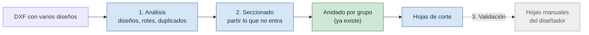

# ANÁLISIS — MUESTRA REAL DE MEGACARTELES (`Muestra Vectores.dxf`)

> Qué trae la primera muestra real de diseño de Megacarteles, qué hace hoy el sistema con ella y por qué, y cómo se ordena el trabajo para que el sistema produzca lo que hoy arma a mano el diseñador.
>
> Índice del proyecto: [`../README.md`](../README.md) · [`REGISTRO.md`](REGISTRO.md) · [`BACKLOG.md`](BACKLOG.md) · [`SPIKE-CDR.md`](SPIKE-CDR.md) · [`PLAN-GRUPOS-DE-CORTE.md`](PLAN-GRUPOS-DE-CORTE.md)
>
> **Versión:** 1.0 · **Fecha:** 2026-09-23
>
> **Cómo leer las afirmaciones.** Cada dato lleva su origen: **medido** (corrida sobre el archivo real), **leído de las imágenes** que compartió Enzo (no medido) o **hipótesis** (interpretación por confirmar). Las dudas abiertas están en [`REGISTRO.md §4`](REGISTRO.md) (`P-20` a `P-26`) y acá solo se referencian por ID.

---

## 1. La muestra, y una corrección a lo documentado

`Muestra Vectores.dxf` es un tablero de presentación donde Megacarteles dibuja varios trabajos a escala real en un mismo archivo. **Medido:**

| Dato | Valor |
|---|---|
| Tamaño | 8,8 MB, una sola capa (`Capa 1`) |
| Entidades | 2.371 `SPLINE`, 188 `LWPOLYLINE` (todas rectángulos cerrados de 5 vértices), 7 `IMAGE`, 2 `ELLIPSE`. **Ningún `TEXT` ni `MTEXT`** |
| Extensión | 324 × 180 unidades |
| Unidad declarada | `$INSUNITS` = 5 (cm) |
| Color | Guardado por entidad (24 combinaciones de tipo y color, sin `true_color`): 1.162 splines por capa, 856 en rojo (ACI 1), 164 rectángulos y 139 splines en gris (ACI 250) |

**La escala real no es la que declara el encabezado.** Dentro del marco de Belgrano hay 8 rectángulos de exactamente 24,4 × 12,2 unidades. Solo son chapas de 2440 × 1220 mm si **1 unidad = 100 mm**, no los 10 mm que dice el encabezado. Es la confirmación más fuerte a favor de que `escala_a_mm` sea obligatorio y sin default en `parsear_dxf`: leerlo del encabezado habría dado chapas de 244 × 122 mm.

**Los rótulos no se pueden leer.** Textos como "Chapa 1.22x2.44 mts" o "chapa cal. 20 1.00 x 1.20" están convertidos a curvas (no hay `TEXT`). El sistema no puede sacar de ahí el formato ni el calibre; hoy la única señal legible del tamaño de chapa es el rectángulo.

### Corrección pendiente a otros documentos

[`SPIKE-CDR.md §3.1`](SPIKE-CDR.md) leyó `Muestra Vectores.cdr` como una hoja de referencia de ~132 × 68 mm, "no un trabajo de chapa", y [`COMO-FUNCIONA-CADA-MOTOR.md`](COMO-FUNCIONA-CADA-MOTOR.md) repite que no está confirmado como trabajo para anidar. Este análisis lo contradice: hay 8 chapas de 2440 × 1220 mm dibujadas, y el círculo de Belgrano mide unos 4,6 m. **Hipótesis:** el spike midió en unidades del `.cdr` sin la escala de dibujo. No se verificó contra el `.cdr`; queda para reconciliar.

---

## 2. Cómo está armada la muestra

Un mismo archivo mezcla **varios diseños**, y cada diseño mezcla **lo que hay que hacer** con **lo que el diseñador ya hizo**.

```
Marco "Belgrano" (medido: 12.027 × 9.443 mm, 117 formas adentro, contadas las 8 hojas)
├─ Diseño ensamblado: círculo de ~4,6 m + "COMPLEJO MANUEL BELGRANO"   (39 formas)
├─ 8 hojas de 2440 × 1220 mm, las chapas del diseñador                  (70 formas)
│    └─ cuñas del anillo y letras, ya partidas, rotadas y acomodadas
└─ Rótulo "Chapa 1.22x2.44 mts"                                          (curvas rojas)
```

- **Medido:** el marco de Belgrano tiene 8 hojas de 2440 × 1220 mm; hay un segundo marco de 10.007 × 6.366 mm y otros marcos grandes (3.588 × 3.207, 3.588 × 2.765 y 1.835 × 3.207 mm, entre otros).
- **Leído de las imágenes:** además de Belgrano aparecen otros trabajos con la misma lógica (Awaduct, Vulcano, Roca, Rotoplas, Honda, Elements), con hojas de "chapa cal. 20 1.00 × 1.20" y tiras de "chapa cal. 22 0.30 × 1.20". Algunos traen una versión pintada rotulada "Pinturas" (`P-24`).
- **Medido (2026-09-25):** las hojas de cal. 20 de la grilla no tienen medida de catálogo: un lado es ~1,20 m y el otro lo consumido por el trabajo (1036, 791, 635, 580, 566, 489 mm), y difieren de su rótulo 14–36 mm (`P-26`).
- **Medido:** de las 188 `LWPOLYLINE`, 128 son tiras finas (91 de 0,2 × 12,0, 32 de 0,2 × 12,14 y 5 de 0,4 × 12,0). En las imágenes se ven como peines junto a las hojas de calibre 22 (`P-23`).

---

## 3. Qué hace hoy el sistema con la muestra

**Medido** con `parsear_dxf` y `escala_a_mm` = 100 (5,5 s):

| Resultado | Valor |
|---|---|
| Piezas detectadas | **2.149** |
| Con `contenida_en_id` (adentro de otra) | **2.071 (96%)** |
| Con agujeros | 604 |
| Que **no entran** en 1220 × 2440 | **24** |
| Contornos no cerrados | 15 |
| Duplicados exactos descartados (`PAR-38`) | 21 |
| Ignoradas | 7 `IMAGE` |

Las mayores: el marco de Belgrano como una pieza de 12.027 × 9.443 mm con 49 agujeros, el segundo marco (10.007 × 6.366 mm, 43 agujeros) y una cadena de contornos cada uno dentro del anterior (4.610, 4.598, 4.433, 3.831 y 3.378 mm), que por la forma del diseño serían los anillos del círculo.

**Por qué pasa.** `_clasificar_piezas_y_agujeros` decide "pieza o agujero" por la **paridad** del anidamiento: par es pieza, impar es agujero. Un marco que rodea todo cambia la paridad de cada forma que tiene adentro. El diseño real se lee como agujeros del marco y, como superan el umbral de tamaño de agujero (`tamano_maximo_agujero_mm`), además se promueven a piezas propias marcadas `contenida_en_id`: de ahí el 96%. El marco, mientras tanto, se lee como una lámina sólida gigante. Los dos síntomas que se ven al cargar (duplicados y piezas enormes) salen de la misma causa.

**Qué pasa con lo que no entra.**
- El motor rectangular falla al anidar: `_validar_todas_colocadas` levanta `ValueError` en vez de descartar en silencio (`DECISIONES-Y-BLOQUEANTES.md §1.2`).
- Para piezas importadas no encontré un aviso previo del tipo "no entra en ningún formato". `advertencia_si_no_entra` (`CART-201`) existe solo para la carga manual.
- No se probó con el motor irregular.

---

## 4. Cuatro problemas distintos

| # | Problema | Señal disponible | Evidencia |
|---|---|---|---|
| **A** | Varios diseños en un mismo DXF | Posición en el plano y marcos | Varios marcos grandes independientes |
| **B** | El mismo diseño en dos formas (ensamblado y hojas) | Congruencia de formas y **región**, no posición | 32 de 64 formas de las hojas tienen gemela |
| **C** | Piezas que no entran en ninguna chapa | Comparar con el catálogo de formatos | 24 piezas |
| **D** | Decidir qué se anida y qué no | Un rol por forma, sugerido y confirmable | Marcos, rótulos, tiras, pinturas, ensamblado |

### La evidencia de B (medido)

Dentro del marco de Belgrano, de las 64 formas de las hojas con más de 5.000 mm²:

- **32 tienen gemela** en el diseño ensamblado, con área y perímetro dentro del 1%. Son las letras y las piezas chicas: se copiaron y se rotaron.
- **32 no la tienen.** Entre ellas hay 8 piezas grandes (4 de 2292 × 1220 mm y 4 de 1941 × 1085 mm). **Hipótesis:** son las que el diseñador **creó cortando** el anillo, y por eso no existen como forma en el ensamblado. Esta lectura falta verificar: el grupo puede incluir letras que la firma simple (área más perímetro) no logró emparejar.

**Dos formas idénticas no bastan para decidir "duplicado".** "COMPLEJO MANUEL BELGRANO" tiene letras repetidas de verdad (la E, la L y la O aparecen tres veces cada una). Lo que distingue una copia real de la misma pieza dibujada dos veces es la **región** (ensamblado u hoja), no la forma. Esto acota `CART-505` ("agrupar contornos idénticos con cantidad N"): agrupar idénticos sirve dentro de una región, pero no entre regiones.

---

## 5. El objetivo real: producir las hojas que hoy arma el diseñador

Lo que consume tiempo del diseñador es lo que en la muestra son las hojas 1 a 8: **partir el diseño en chapas y acomodarlo**. Eso es lo que el sistema tiene que conseguir automáticamente, por diseño.

Ese trabajo tiene dos mitades:

| Mitad | Qué es | Estado en el sistema |
|---|---|---|
| **Acomodar** | Meter las letras y piezas chicas en los huecos de las grandes y anidar por chapa | En buena parte resuelto: `anidado_huecos.py` (`CART-505`, agujeros) y los motores de anidado |
| **Cortar** | Inventar líneas de corte nuevas para que una pieza de 4,6 m entre en chapas de 1220 × 2440 | **No existe.** Es geometría nueva |



En esta muestra las hojas manuales sirven de **vara de medir**: el diseñador usó 8 chapas para Belgrano. Si el sistema produce 8 o menos con un aprovechamiento comparable, funciona.

---

## 6. Tres sub-proyectos y su orden

Son independientes entre sí y cada uno pasa por su propio ciclo de diseño y plan.

| # | Sub-proyecto | Qué entrega | Se apoya en |
|---|---|---|---|
| **1** | **Análisis del DXF** | Agrupa las formas en **diseños** y sugiere un **rol** por forma: `cortar`, `referencia` (ensamblado o pintura), `marco de chapa`, `rótulo`. El usuario confirma y solo lo confirmado como `cortar` llega al anidado. Un diseño confirmado equivale a un Trabajo (`P-25`) | `CART-505`, `CART-506`, `Pieza.descartada`, `GrupoDeCorte` |
| **3** | **Validación contra el diseñador** | Compara las hojas que produce el sistema con las hojas manuales de la muestra: cantidad de chapas y aprovechamiento (`ADR-08`) | Roles del sub-proyecto 1 |
| **2** | **Seccionado automático** | Parte lo que no entra en ninguna chapa y deja las secciones listas para anidar | Roles (1), vara de medir (3), respuestas a `P-21` y `P-22` |

**Orden decidido: 1 → 3 → 2.**
- El análisis deja el archivo usable y separa qué es entrada y qué es resultado.
- La validación da una vara medible antes de construir el algoritmo difícil.
- El seccionado va último porque depende de criterios del diseñador que todavía no se conocen (`P-21`, `P-22`).

**Decisión de producto:** el sistema **propone y el usuario confirma** (no hay clasificación totalmente automática ni una convención de capas obligatoria). La convención de capas (`CART-501`) queda como una señal más que se suma después: si la capa dice algo, gana sobre la heurística.

**Señales que el sub-proyecto 1 puede usar** (a validar contra el corpus de DXF reales antes de fijar reglas):
- Un rectángulo cuya medida coincide con un formato del catálogo y que encierra formas es una hoja. También sirve para **sugerir la escala**, ya que el encabezado no es confiable.
- Lo que no entra en ningún formato y queda fuera de las hojas de un diseño que sí tiene hojas es candidato a `referencia`.
- El color y los rótulos ayudan pero no alcanzan: no hay capas, y el texto está en curvas.

---

## 7. Qué falta confirmar

- **Preguntas abiertas:** `P-20` a `P-26` en [`REGISTRO.md §4`](REGISTRO.md). Las que más condicionan: `P-20` (si las hojas son entrada o resultado en el uso real) y `P-21`/`P-22` (criterio de corte).
- **Supuestos de este análisis:**
  - `Muestra Vectores.dxf` es el archivo de las imágenes (coinciden tamaño, rectángulos y marcas; no se comparó pieza por pieza). Enzo describió las hojas 1 a 8 como el trabajo manual del diseñador, y eso es lo que se toma como resultado esperado.
  - Las formas sin gemela son piezas creadas cortando (§4).
  - Los roles de las tiras de calibre 22 y de las versiones pintadas (§2) son `referencia` o de otro tipo, según `P-23` y `P-24`.
- **Contradicción con el spike** (§1): reconciliar con el `.cdr`.

---

## 8. Cómo se midió

Todo con el código del repositorio y lectura de solo lectura, para poder repetirlo:

1. **Entidades y colores:** `ezdxf.readfile` sobre `Muestra Vectores.dxf`, conteo por tipo, capa, color ACI y `true_color`.
2. **Rectángulos:** las 188 `LWPOLYLINE` con su tamaño, para hallar las tiras y los marcos.
3. **Foto del parser:** `parsear_dxf(ruta, Decimal("100"))` con el tamaño máximo de agujero por defecto. Se contaron piezas, no cerrados, duplicados, `contenida_en_id`, agujeros y las que no entran en 1220 × 2440 en cualquier orientación.
4. **Hojas y gemelas:** dentro del marco `Muestra Vectores-267`, las hojas son rectángulos de 1100 a 1300 mm de lado corto y 2300 a 2800 mm de lado largo. Se cortó la región en el ensamblado y las hojas por la posición horizontal de la primera hoja. Las gemelas se buscaron por área y perímetro dentro del 1% entre formas de más de 5.000 mm².

Los scripts de medición **no están versionados** (se corrieron como pruebas descartables). El corpus real vive fuera del repo (ver `.gitignore`); antes de tocar el parser conviene repetir esta foto sobre los 5 DXF reales.
