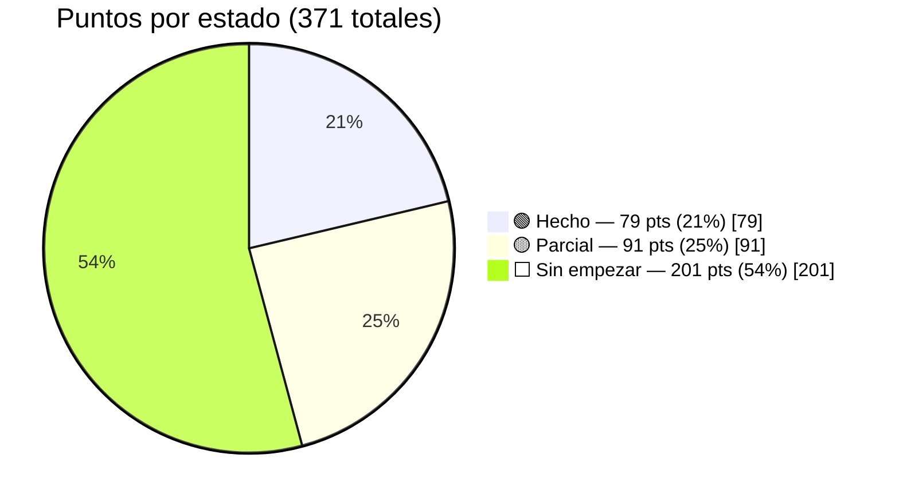
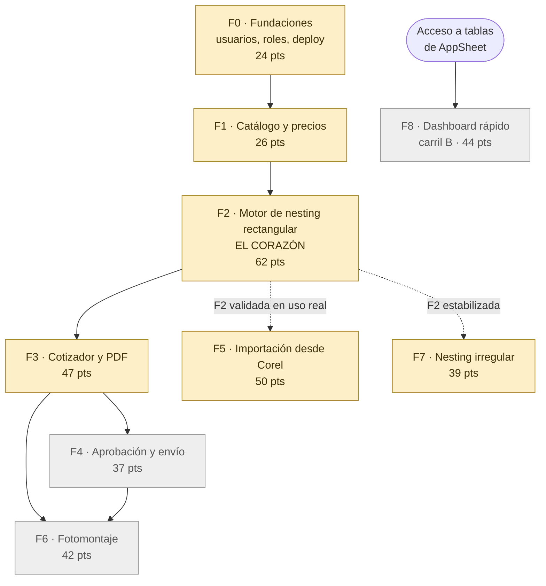
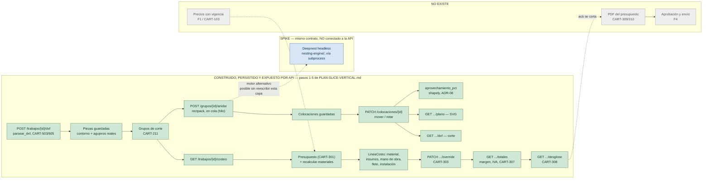
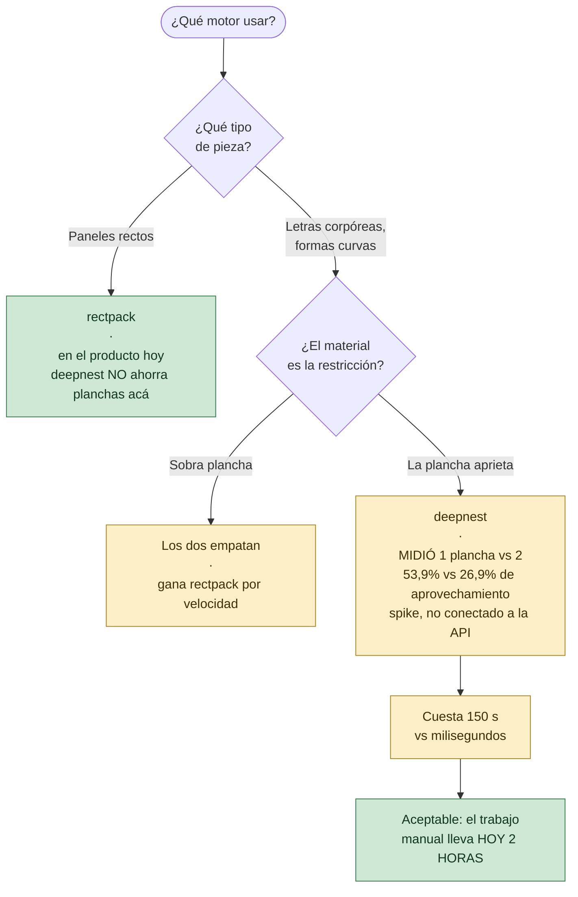
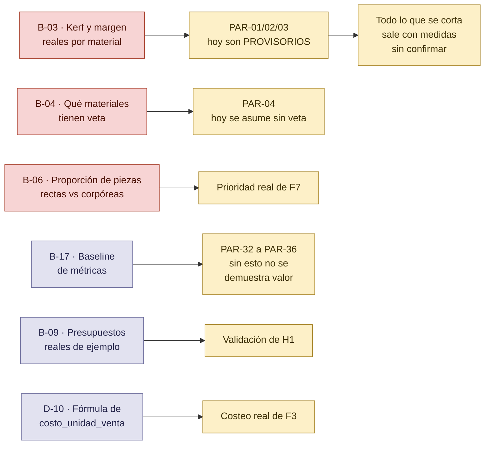
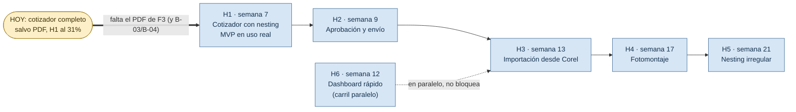

# MAPA DEL PROYECTO — dónde estamos parados

> Vista de conjunto para ubicarse: qué está construido, qué está a medias, qué está bloqueado y qué falta. Los diagramas son Mermaid y se ven directamente en GitHub y en VS Code.
>
> Índice del proyecto: [`../README.md`](../README.md) · [`EPICA.md`](EPICA.md) · [`BACKLOG.md`](BACKLOG.md) · [`REGISTRO.md`](REGISTRO.md) · [`PLAN-SLICE-VERTICAL.md`](PLAN-SLICE-VERTICAL.md) · [`COMO-FUNCIONA-CADA-MOTOR.md`](COMO-FUNCIONA-CADA-MOTOR.md)
>
> **Versión:** 2.2 · **Fecha:** 2026-09-14 · Rama actual: `main`

---

## En una frase

**Los dos planes de slice vertical están completos: `PLAN-SLICE-VERTICAL.md` (motor de nesting persistido, F2) y `PLAN-SLICE-COTIZADOR.md` (presupuesto con costo real, override, líneas libres, margen/IVA/total y desglose, F3).** Lo que queda de esos dos planes es explícitamente lo que quedaron afuera a propósito: PDF (`CART-309`/`310`, sin `WeasyPrint`) y el frontend. Las fundaciones (auth, precios con vigencia) siguen sin arrancar — nada de lo construido las necesitó todavía.

---

## 1. Progreso — 371 puntos, 70 historias

**Metodología:** cada historia de [`BACKLOG.md`](BACKLOG.md) se clasificó leyendo sus criterios de aceptación Gherkin contra lo que hay hoy en `backend/app/` y `nesting-engine/` — 🟢 hecho (los criterios se cumplen), 🟡 parcial (al menos uno no), ⬜ sin empezar. Es una lectura estricta a propósito: contar "casi" como hecho es el mismo tipo de número inflado que corrige `ADR-08` para el aprovechamiento.

| Feature | Pts | 🟢 Hecho | 🟡 Parcial | ⬜ Sin empezar |
|---|---|---|---|---|
| F0 — Fundaciones | 24 | 0 | 5 | 19 |
| F1 — Catálogo y precios | 26 | 3 | 8 | 15 |
| F2 — Nesting rectangular | 62 | 29 | 28 | 5 |
| F3 — Cotizador y PDF | 47 | 18 | 19 | 10 |
| F4 — Aprobación y envío | 37 | 0 | 0 | 37 |
| F5 — Importación Corel | 50 | 16 | 5 | 29 |
| F6 — Fotomontaje | 42 | 0 | 0 | 42 |
| F7 — Nesting irregular | 39 | 13 | 26 | 0 |
| F8 — Dashboard (carril B) | 44 | 0 | 0 | 44 |
| **Total** | **371** | **79 (21%)** | **91 (25%)** | **201 (54%)** |

**Por historias en vez de puntos da un número parecido:** 14/70 hechas (20%), 18/70 parciales (26%), 38/70 sin empezar (54%).

**El número que más importa es el de `H1`** (el punto de validación, no todo el roadmap): `F0+F1+F2+F3` suman 159 puntos, de los cuales **50 están hechos (31%)**, 60 parciales (38%) y 49 sin empezar (31%) — es la primera vez que "sin empezar" deja de ser la categoría más grande. `F3` completó los 6 pasos de `PLAN-SLICE-COTIZADOR.md`: lo único que le falta a `H1` ahora es el PDF (`CART-309`/`310`, sin `WeasyPrint` instalado) y `B-03`/`B-04` (conversación con el taller, no desarrollo).

**F8 (dashboard, carril B) cuenta 0/44 con este criterio estricto** — el prototipo de 9 vistas (`prototipo-dashboard/`) es real y valida diseño con la matriz de permisos real, pero corre sobre datos de muestra, no contra `INVENTARIO`/`COTIZACIONES` reales (`CART-802`), así que ningún criterio de aceptación de `CART-801`-`808` se cumple todavía en sentido estricto.

---

## 2. Las nueve features y cómo dependen entre sí

| Color | Significa |
|---|---|
| 🟩 verde | terminado |
| 🟨 amarillo | en curso, parcial (incluye `F5`/`F7`, adelantadas fuera de orden) |
| ⬜ gris | sin empezar |

**Lo que cambió desde la versión 1.0 de este mapa:** `F0` y `F1` dejaron de estar en cero — no por seguir el orden del roadmap, sino porque `docs/PLAN-SLICE-VERTICAL.md` construyó el mínimo de cada una (config/Alembic de `F0`, catálogo de `F1`) que hacía falta para que `F2` deje de vivir en un script local. Ninguna de las dos está terminada: `F0` sigue sin auth/roles, `F1` sigue sin precios con vigencia.

---

## 3. El flujo real del dato, y dónde se corta hoy

**El corte se movió otra vez.** `PLAN-SLICE-COTIZADOR.md` completó sus 6 pasos: el pipeline hoy llega hasta un desglose completo, con margen, IVA y total ya calculados y redondeados una sola vez. El corte quedó exactamente donde el plan decía que iba a quedar desde el principio: **el PDF** (depende de `WeasyPrint`, todavía no instalado) y la aprobación (`F4`, que necesita el estado `ENVIADO` que no existe).

---

## 4. Qué hay construido, historia por historia

**Parciales que importa entender, y por qué no son "hecho":**

- **`CART-001`** — el backend corre sin Docker (paso 1 de `PLAN-SLICE-VERTICAL.md`), pero la historia real pide `docker compose up` levantando API+base+Redis+worker+frontend con healthcheck. Eso es la versión de producción de `ADR-05`, todavía no construida.
- **`CART-101`** — ABM de `Material` por API, pero sin `tipo`/`unidad_medida` explícitos ni el borrado-como-desactivación que pide la historia (depende de `CART-002`, que no existe).
- **`CART-105`** — el ABM de parámetros de corte es completo, pero el 4º criterio ("si no hay parámetros, usar el default del sistema y avisar") no está: hoy `POST /grupos/{id}/anidar` rechaza con 400 en vez de avisar-y-seguir.
- **`CART-201`** — la carga manual de piezas existe como servicio de dominio (`app/services/piezas/`), probado, pero no tiene endpoint propio — solo se puede crear una `Pieza` subiendo un DXF.
- **`CART-205`** — el comparador de formatos (`comparador.py`) existe y está probado, pero no hay una ruta que compare varios formatos para un mismo grupo antes de elegir uno.
- **`CART-207`** — plano (SVG) y DXF de corte YA se exportan por API. Falta el PDF con encabezado (presupuesto, material, fecha) que pide la historia completa — depende de `F3`.
- **`CART-208`** — el visor interactivo existe y es real, pero es un script local (`scripts/servidor_visor.py`), no la API del producto.
- **`CART-210`** — se puede recalcular con nuevos parámetros creando una nueva ejecución (con su propio snapshot), pero no hay una ruta para "ajustar el kerf de este trabajo puntual sin tocar el material" ni el aviso de que un recálculo descarta ajustes manuales.
- **`CART-507`** — asignar material a piezas importadas funciona (`PATCH /piezas/{id}`), de una por vez; falta la asignación masiva y el bloqueo explícito al anidar si quedan piezas sin asignar en el trabajo.
- **`CART-702`/`703`/`705`** — el spike de Deepnest headless (`nesting-engine/`) funciona, está medido contra `rectpack` (`CART-704`, por eso ese sí está hecho) y tiene manejo de cancelación/timeout a nivel de dominio — pero nada de esto está conectado a `POST /grupos/{id}/anidar`. Es la brecha entre "anda" y "está en el producto".
- **`CART-301`** — crear/listar/leer/actualizar/duplicar presupuesto están hechos (`duplicar` ya copia `LineaCosto` y overrides, corregido en el paso 5). Lo que falta es enteramente de `CART-002`: no hay "diseñador" que mostrar en el presupuesto ni que bloquear si otro lo edita.
- **`CART-304`/`305`/`306`** — la "línea libre" de las tres historias está hecha (`POST /presupuestos/{id}/lineas-costo`), y el subtotal por rubro que pedían sus terceros criterios también (`GET /presupuestos/{id}/desglose`, paso 6). Lo que falta sigue siendo lo que depende de catálogo (`CART-106`, no existe): elegir un insumo de una lista en vez de tipear todo a mano, y en `CART-305` específicamente, un campo `etapa` estructurado (diseño/corte/armado/pintura/instalación) — hoy la etapa, si se quiere registrar, va dentro de `descripcion` como texto libre.
- **`CART-308`** — `GET /presupuestos/{id}/desglose` ya da cliente, líneas agrupadas por rubro (con override visible en cada línea) y totales en una sola respuesta, con `grupo_id`/`ejecucion_id` en cada línea de material para llegar al plano sin otra búsqueda. Sigue parcial por lo que es inherente a no tener frontend: no hay "una sola pantalla" (es JSON), ni "filtrar" las líneas con override (posible del lado del cliente, no es una feature del servidor).

---

## 5. El motor de nesting: dónde quedó la decisión

Detalle completo, con todas las mediciones: [`COMO-FUNCIONA-CADA-MOTOR.md`](COMO-FUNCIONA-CADA-MOTOR.md).

**`D-01` sigue abierto.** Su enunciado en `REGISTRO.md` ("¿`nest2D` o Deepnest?") quedó desactualizado — la comparación real que se hizo fue `rectpack` vs. Deepnest, `nest2D` no llegó a implementarse. Lo que falta decidir de fondo es si los dos motores conviven (las mediciones dicen que no compiten por el mismo trabajo) y, si conviven, conectar Deepnest a `POST /grupos/{id}/anidar` como una segunda opción de `motor`.

**Lo que falta para que Deepnest sea producción:** el servicio en Docker (Fase 1 del plan), `worker_threads` en vez de serie (la mayor parte de esos 150 s), y el trabajo de esta sesión que Deepnest todavía no tiene — un adaptador en `app/cola/` que hable el mismo contrato que ya habla `rectpack`.

---

## 6. Lo que bloquea, y a qué

**Sigue siendo `B-03` lo más urgente**, sin cambios desde la versión anterior de este mapa: todo lo que hoy calcula la API —planchas, aprovechamiento, costo, colocaciones, el DXF que iría a la máquina— usa kerf, margen y separación **provisorios**, cargados a mano vía `PUT /materiales/{id}/parametros-corte` pero inventados por nosotros, no confirmados con el taller. `B-01`/`B-02` ya se resolvieron (`COTIZADOR` de AppSheet); `B-03`/`B-04` siguen siendo una conversación pendiente, no un desarrollo.

`D-10` es nuevo en este mapa: la fórmula real de `costo_unidad_venta` (`%COSTO1`/`%COSTO2`/márgenes de `COTIZADOR`) sigue sin confirmar con administración — `Formato.costo_unidad_venta` se importa tal cual la planilla, nunca se recalcula, y por eso el costeo de `F3` no puede ser más que un preview hasta que se resuelva.

---

## 7. Los hitos contra el calendario

> El calendario es el del plan original. **No refleja el avance real**: el trabajo hecho hasta ahora está repartido entre `F0`, `F1`, `F2`, `F3`, `F5` y `F7` — no en ese orden, y ninguno terminado. Sirve para ver el orden previsto y qué tan lejos está cada hito, no como compromiso de fechas.

---

## 8. Lo que yo haría ahora, en orden

1. **Cerrar `B-03` y `B-04` con el taller.** Sigue siendo lo que más valor desbloquea por hora invertida, y sigue sin hacerse en ninguna de las versiones de este mapa — es una conversación, no un desarrollo.
2. **Cerrar `D-10`** con administración antes de recalcular ningún precio en serio — hoy `costo_unidad_venta` se importa tal cual la planilla, y ese es el techo real de cuánto se puede confiar en un total.
3. **El frontend** (paso 6 de `PLAN-SLICE-VERTICAL.md`). Con `F2` y `F3` completos salvo PDF, ya hay algo entero que mostrar en una pantalla en vez de en `/docs` — es el momento en que más valor da, no antes.
4. **`CART-002`/auth** — recién si el frontend lo necesita para algo concreto (por ahora un solo usuario local no lo necesita). Seguir diferida es la decisión por defecto, no una excepción.
5. **PDF** (`CART-309`/`310`) — instalar `WeasyPrint` y generar el documento tiene más sentido una vez que el frontend defina qué layout mostrar; hacerlo antes es diseñar un PDF sin saber cómo se ve la pantalla que lo pide.

Lo que **no** haría todavía: conectar Deepnest a la API, ni el catálogo de insumos (`CART-106`) solo para completar `CART-304`/`305` del todo, ni la máquina de estados de `F4` — ninguno de los tres tiene un trabajo real esperando, y `F4` en particular no tiene sentido sin que primero exista el frontend que apruebe algo.
