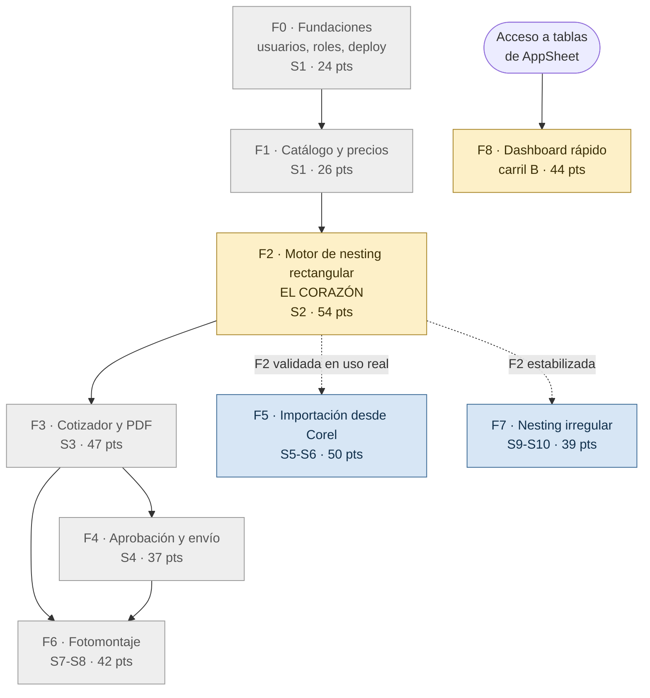
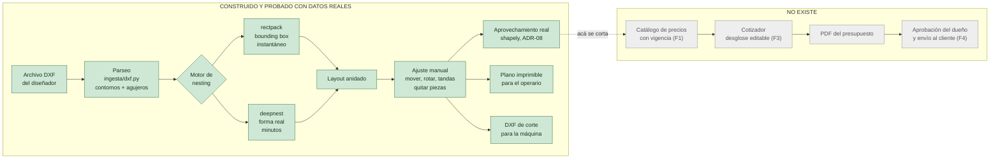
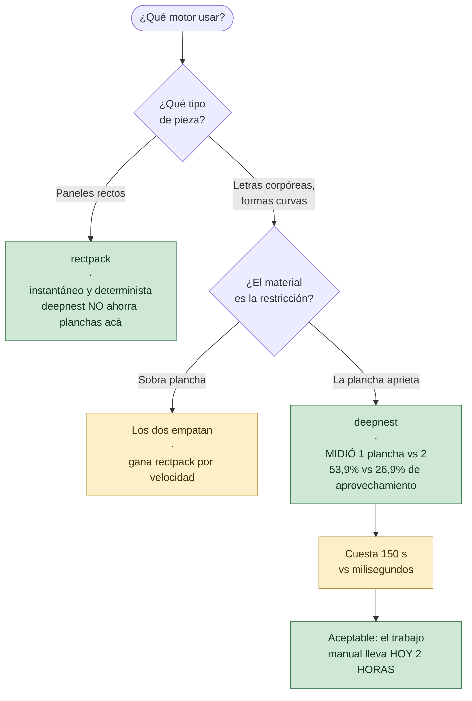
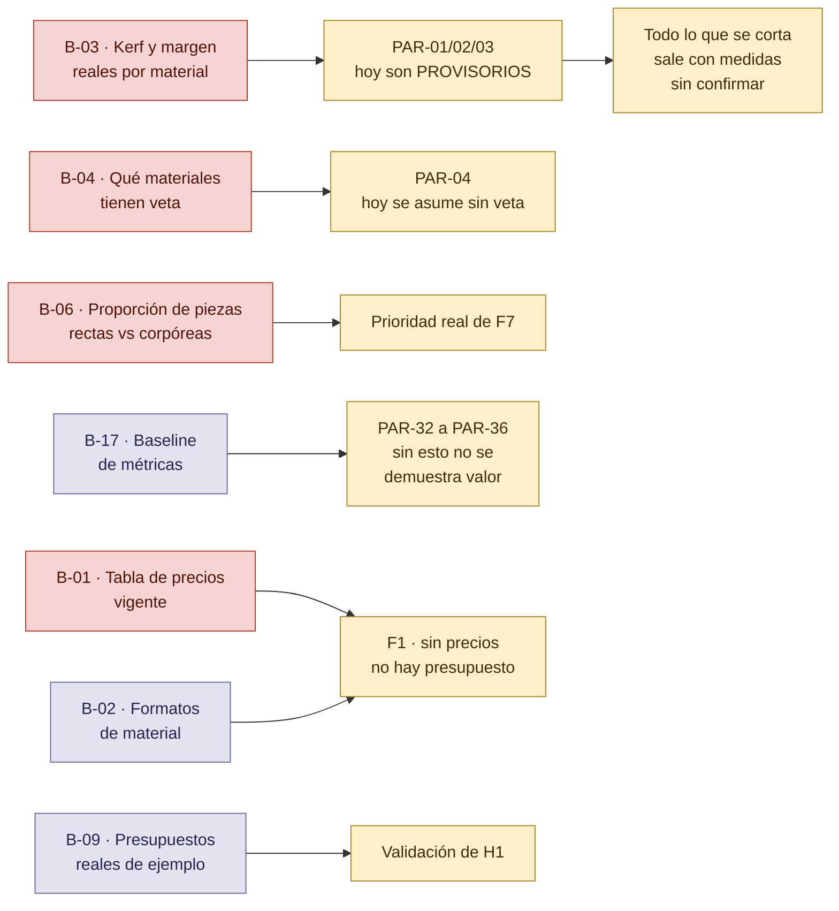
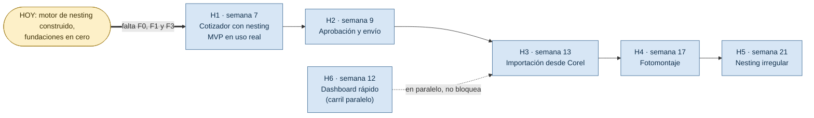

# MAPA DEL PROYECTO — dónde estamos parados

> Vista de conjunto para ubicarse: qué está construido, qué está a medias, qué está bloqueado y qué falta. Los diagramas son Mermaid y se ven directamente en GitHub y en VS Code.
>
> Índice del proyecto: [`../README.md`](../README.md) · [`EPICA.md`](EPICA.md) · [`BACKLOG.md`](BACKLOG.md) · [`REGISTRO.md`](REGISTRO.md) · [`COMO-FUNCIONA-CADA-MOTOR.md`](COMO-FUNCIONA-CADA-MOTOR.md)
>
> **Versión:** 1.0 · **Fecha:** 2026-09-08 · Rama actual: `feat/F2-motor-nesting-rectangular`

---

## En una frase

**Está construido el corazón del dominio —el motor de nesting y todo lo que lo rodea— y no está construida ninguna de las fundaciones.** No hay API, ni base de datos, ni usuarios, ni Docker: el backend son módulos de Python puro que hoy se manejan desde un visor local. Se salteó el orden del roadmap a propósito, para poder probar el nesting con datos reales antes de comprometerse con la infraestructura.

---

## 1. Las nueve features y cómo dependen entre sí

| Color | Significa |
|---|---|
| 🟩 verde | terminado |
| 🟨 amarillo | en curso, parcial |
| 🟦 azul | **adelantada fuera de orden** — se construyó una parte antes de tiempo, porque hacía falta para probar F2 |
| ⬜ gris | sin empezar |

**Lo que salta a la vista: la cadena `F0 → F1 → F2` está invertida.** F2 se construyó primero, sobre nada. Es una decisión defendible (probar el motor con datos reales antes de invertir en infraestructura) pero tiene una consecuencia concreta: **F2 no se puede dar por terminada hasta que exista F1**, porque su fuente de parámetros y precios hoy son archivos sueltos y valores provisorios.

---

## 2. El flujo real del dato, y dónde se corta

**El corte está justo después del aprovechamiento.** Todo lo que va del DXF al plano de corte funciona hoy con archivos reales del cliente. Lo que sigue —convertir eso en un presupuesto— no existe, y es exactamente lo que cierra **H1**.

---

## 3. Qué hay construido, historia por historia

```mermaid
flowchart TB
    subgraph F2b ["F2 · Motor de nesting rectangular"]
        direction TB
        C201["CART-201 · Carga manual de piezas"]
        C202["CART-202 · Motor bin packing"]
        C203["CART-203 · Kerf, margen, separación"]
        C204["CART-204 · Rotación por veta"]
        C205["CART-205 · Comparador de formatos"]
        C206["CART-206 · Aprovechamiento y materiales"]
        C207["CART-207 · Plano para el taller"]
        C208["CART-208 · Visor del anidado"]
        C209["CART-209 · Desarrollo de plegado"]
        C210["CART-210 · Parámetros del trabajo"]
    end

    subgraph F5b ["F5 · Importación (adelantada)"]
        C503["CART-503 · Parsear DXF"]
        C505["CART-505 · Agujeros reales"]
        C501["CART-501 · Convención de capas"]
        C502["CART-502 · Export desde Corel"]
    end

    subgraph F7b ["F7 · Nesting irregular"]
        SPIKE["Spike deepnest headless<br/>ANDA · go técnico"]
        HUECOS["Anidado en huecos"]
        COMPART["Corte de líneas compartidas"]
        SERV["Servicio en Docker"]
    end

    classDef hecho fill:#cfe8d5,stroke:#3d7a52,color:#14351f
    classDef parcial fill:#fdf0c8,stroke:#a8862a,color:#3d3007
    classDef nada fill:#eeeeee,stroke:#999,color:#555

    class C201,C202,C203,C204,C205,C206,C208,C503,C505,SPIKE,HUECOS,COMPART hecho
    class C207,C210 parcial
    class C209,C501,C502,SERV nada
```

**Parciales, y por qué:**

- **`CART-207` (plano para el taller)** — el plano imprimible y el DXF de corte existen y funcionan, pero viven en el visor local, no en el producto. Falta además marcar los cortes compartidos.
- **`CART-210` (parámetros del trabajo)** — se puede ajustar kerf, margen y separación en vivo y re-anidar, pero sin persistencia: no queda registrado con qué parámetros se calculó un trabajo.

---

## 4. El motor de nesting: dónde quedó la decisión

Detalle completo, con todas las mediciones: [`COMO-FUNCIONA-CADA-MOTOR.md`](COMO-FUNCIONA-CADA-MOTOR.md).

**Lo que falta decidir (`D-01`):** si los dos motores conviven o si se elige uno. Las mediciones dicen que no compiten por el mismo trabajo, y eso empuja a que convivan.

**Lo que falta construir para que deepnest sea producción:** el servicio en Docker (Fase 1 del plan) y traducir la capa de paralelismo a `worker_threads` — hoy corre en serie y es la mayor parte de esos 150 segundos.

---

## 5. Lo que bloquea, y a qué

**El más urgente es `B-03`.** Todo lo que el sistema calcula hoy —planchas, aprovechamiento, costo, y el DXF que iría a la máquina— usa kerf, margen y separación **provisorios, inventados por nosotros**. Mientras eso siga así, ningún número es presentable ante el taller. Es una conversación de media hora con el operario, no un desarrollo.

`B-17` mejoró parcialmente: ya sabemos que **el armado manual lleva unas 2 horas**, que es el primer número duro de baseline.

---

## 6. Los hitos contra el calendario

> El calendario es el del plan original. **No refleja el avance real**: el trabajo hecho hasta ahora está repartido entre F2, F5 y F7, y las fundaciones siguen en cero. Sirve para ver el orden previsto y qué tan lejos está cada hito, no como compromiso de fechas.

---

## 7. Lo que yo haría ahora, en orden

1. **Cerrar `B-03` y `B-04` con el taller.** Media hora de conversación que vuelve presentables todos los números que ya calculamos. Es lo que más valor desbloquea por hora invertida.
2. **Construir F0 + F1.** Sin API ni base de datos, todo lo construido depende de un script local que no puede usar nadie más. Es el cuello de botella real, no el nesting.
3. **Decidir `D-01`** con las mediciones que ya están sobre la mesa.
4. **Terminar `CART-207` y `CART-210`** dentro del producto, no en el visor local.
5. **F3**, que es lo único que falta para H1.

Lo que **no** haría todavía: optimizar deepnest. Anda, ya sabemos cuánto rinde y cuánto cuesta, y el paralelismo pendiente es una mejora conocida que se puede hacer cuando haga falta.
