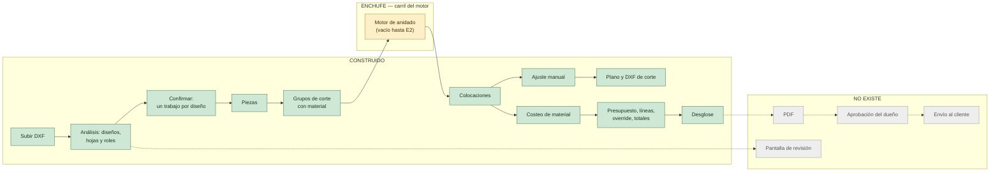

# MAPA DEL PROYECTO — dónde estamos parados

> Qué está construido, qué falta y en qué paso del plan se hace. **Lo que sigue está en [`plan/PLAN-MAESTRO.md`](plan/PLAN-MAESTRO.md)**: este documento dice dónde estamos, el plan dice hacia dónde vamos.
>
> Índice del proyecto: [`../README.md`](../README.md) · [`EPICA.md`](EPICA.md) · [`BACKLOG.md`](BACKLOG.md) · [`REGISTRO.md`](REGISTRO.md) · [`BITACORA.md`](BITACORA.md)
>
> **Versión:** 3.0 · **Fecha:** 2026-10-05 · Reemplaza la 2.2 (2026-09-14), que quedó atrás del frontend y del análisis de DXF

---

## En una frase

**El cotizador funciona de punta a punta en local, por API y en pantalla, hasta el desglose del presupuesto; faltan el PDF, el login, la aprobación del dueño y el envío al cliente.** El motor de anidado está medido pero no construido: desde el 2026-10-05 es un carril aparte (Vale) que se enchufa después, y el resto lo construye Enzo en el orden del plan maestro.

---

## 1. Qué hay construido, por área

La columna «Sigue en» es el paso del plan maestro que lo completa.

| Área | Qué hay | Qué falta | Sigue en |
|---|---|---|---|
| **Importación de DXF** | Parser con curvas, trazos y bloques, y agujeros reales (`CART-503`, `CART-505`). Análisis de un DXF con varios diseños, hojas de chapa ya dibujadas, escala sugerida y rol por pieza (`CART-509` a `CART-511`). API en dos pasos: analizar sin guardar y confirmar | La pantalla de revisión (`CART-506`): ninguna pantalla usa todavía la API en dos pasos. La regla de las islas, a medio hacer. Asignar material a muchas piezas a la vez (`CART-507`) | 2.1 |
| **Catálogo** | Materiales, formatos con el precio importado de la planilla `COTIZADOR` (moneda, unidad, conversión) y parámetros de corte por material | Precios con vigencia, carga masiva, insumos que no son chapa, historial | 2.2 |
| **Trabajos y grupos** | Trabajos, piezas y grupos de corte, cada grupo con su material (`CART-211`) | — | — |
| **Anidado** | Corre en segundo plano con estados, guarda colocaciones, ajuste manual con validación, plano SVG, DXF de corte y aprovechamiento con área real (`ADR-08`). Comparar formatos antes de elegir uno (`CART-205`) | El motor real. El único conectado es `rectpack`, que sale del producto (`EPICA.md`, nota de `ADR-01`) | E1, E2 |
| **Cotizador** | Presupuesto con cliente, líneas por rubro, override con trazabilidad, líneas libres, margen, IVA, total, desglose y duplicar como otra opción (`CART-301` a `CART-308`) | PDF, insumos elegidos de un catálogo, mano de obra por etapa, presupuestos fuera de un trabajo en pantalla | 1.2, 1.3, 2.3 |
| **Frontend** | Lista de trabajos y un espacio de trabajo con cinco pestañas: Piezas, Grupos, Anidado, Ajuste y Costeo | Login, pantalla de presupuestos, pantalla de importar y revisar | 1.1, 1.2, 2.1 |
| **Fundaciones** | SQLite en local y PostgreSQL por configuración, migraciones de Alembic, tests del backend en CI | Servidor, login, roles, usuarios, clientes con email, auditoría, backups | 1.1, 2.5 |
| **Aprobación y envío** | Nada: el presupuesto solo conoce el estado borrador | Todo (`CART-401` a `CART-408`) | 1.4, 1.5, 2.4 |
| **Dashboard** | Prototipo de las 9 vistas con datos de muestra (`prototipo-dashboard/`) | Todo lo real (`CART-801` a `CART-808`) | 3.1 |
| **Fotomontaje** | Nada | Todo (`CART-601` a `CART-607`) | 3.2 |
| **Motor** (carril de Vale) | Deepnest corriendo sin interfaz en `nesting-engine/`. El híbrido medido en Belgrano iguala las chapas del diseñador en minutos (A1 y A2 de `motor/PLAN-RUMBO-ANIDADO-Y-REVISION.md`) | Pasarlo a código de producto (A3) y conectarlo | Carril del motor, E2 |

---

## 2. El flujo del dato, y dónde se corta

```mermaid
flowchart LR
    subgraph hecho ["CONSTRUIDO"]
        direction TB
        DXF["Subir DXF"] --> ANA["Análisis: diseños,<br/>hojas y roles"]
        ANA --> CONF["Confirmar:<br/>un trabajo por diseño"]
        CONF --> PIEZAS["Piezas"]
        PIEZAS --> GRUPOS["Grupos de corte<br/>con material"]
        COLOC["Colocaciones"] --> AJUSTE["Ajuste manual"]
        AJUSTE --> PLANO["Plano y DXF de corte"]
        COLOC --> COSTEO["Costeo de material"]
        COSTEO --> PRESUP["Presupuesto, líneas,<br/>override, totales"]
        PRESUP --> DESG["Desglose"]
    end

    subgraph enchufe ["ENCHUFE — carril del motor"]
        MOTOR["Motor de anidado<br/>(vacío hasta E2)"]
    end

    subgraph falta ["NO EXISTE"]
        direction TB
        REV["Pantalla de revisión"]
        PDF["PDF"]
        APROB["Aprobación del dueño"]
        ENVIO["Envío al cliente"]
    end

    GRUPOS --> MOTOR --> COLOC
    ANA -.-> REV
    DESG -.-> PDF -.-> APROB -.-> ENVIO

    classDef ok fill:#cfe8d5,stroke:#3d7a52,color:#14351f
    classDef enchufeCls fill:#fdf0c8,stroke:#a8862a,color:#3d3007
    classDef no fill:#eeeeee,stroke:#999,color:#555
    class DXF,ANA,CONF,PIEZAS,GRUPOS,COLOC,AJUSTE,PLANO,COSTEO,PRESUP,DESG ok
    class MOTOR enchufeCls
    class REV,PDF,APROB,ENVIO no
```

**Dos cortes, y cada uno tiene su plan.** El de la derecha (PDF, aprobación y envío) lo cierra la etapa 1 del plan maestro con presupuestos que todavía no llevan chapa. El del medio (el motor) lo cierra E2. Mientras tanto, el costo de material de un trabajo figura como pendiente.

---

## 3. Qué frena qué

| Lo que frena | A qué | Quién lo mueve |
|---|---|---|
| Servidor, dominio, cuenta de mail, lugar de los backups (`T-01`, `T-02`, `T-03`, `T-06`) | Etapa 1 | La empresa y Enzo (`PLAN-MAESTRO.md §5`) |
| Logo y formato del presupuesto (`B-13`), quién aprueba (`B-11`), validez y margen (`PAR-11`, `PAR-12`) | 1.2 a 1.4 | El dueño |
| Alta de WhatsApp Business (`B-12`) | 2.4 | La empresa |
| En qué forma llega el motor (`D-14`) | E1 | Vale |
| Qué hacer con los diseños que el motor no toca (`D-13`) | El costo de material de la mayoría de los diseños reales | Se decide en 2.1 |
| Margen de borde y corte hasta el borde (`P-03`, `P-28`); cómo se parte un diseño que no entra en una chapa (`P-21`, `P-22`) | El motor | El taller y el diseñador, carril del motor |
| Kerf, margen y veta reales (`B-03`, `B-04`) | Todo lo que se corte | El taller |

El estado de cada ID está en [`REGISTRO.md §7`](REGISTRO.md).

---

## 4. Sobre el conteo historia por historia

La versión 2.2 de este mapa clasificaba cada historia del backlog como hecha, parcial o sin empezar, leyendo sus criterios contra el código. **No se recalculó en esta versión:** desde entonces el backlog sumó historias (`CART-509` a `CART-511`) y cambió el orden del plan, y un conteo a medias daría un número falso con apariencia de exacto. La versión 2.2 sigue en el historial de git (`git log -- docs/MAPA-DEL-PROYECTO.md`). El avance se sigue ahora por etapa del plan maestro.
