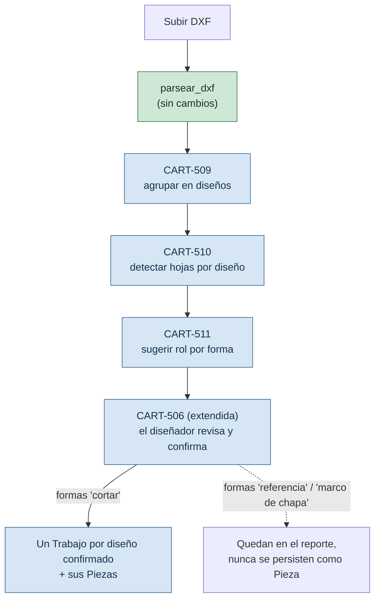
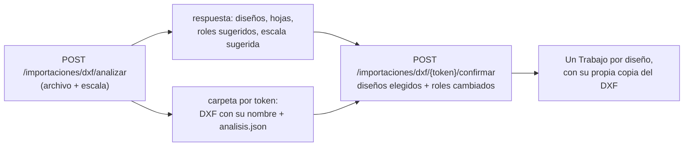
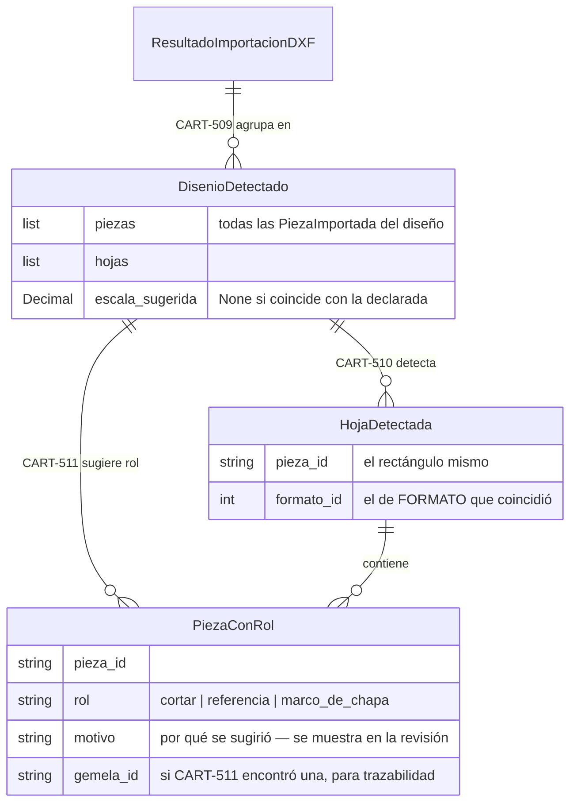

# PLAN: análisis de DXF con varios diseños y hojas ya armadas

> Sub-proyecto 1 de 3 (`ANALISIS-MUESTRA-MEGACARTELES.md §6`, orden 1 → 3 → 2). Cubre `CART-509`, `CART-510`, `CART-511` y la extensión de `CART-506`. Los otros dos sub-proyectos — validar contra las hojas del diseñador, y seccionar automáticamente lo que no entra en una chapa — son planes propios, todavía sin escribir.
>
> Índice del proyecto: [`../README.md`](../README.md) · [`ANALISIS-MUESTRA-MEGACARTELES.md`](ANALISIS-MUESTRA-MEGACARTELES.md) · [`BACKLOG.md`](BACKLOG.md) · [`REGISTRO.md`](REGISTRO.md) · [`CONTRATO-NESTING-ENGINE.md`](CONTRATO-NESTING-ENGINE.md)
>
> **Versión:** 1.0 · **Fecha:** 2026-09-25

---

## Por qué

Hoy `subir_dxf` (`rutas_trabajos.py`) toma lo que devuelve `parsear_dxf` y lo persiste entero como piezas de un único Trabajo. Sobre un DXF con un solo diseño y sin hojas dibujadas, eso alcanza. Sobre la muestra real de Megacarteles no: un archivo trae **varios diseños** y, dentro de cada uno, **el diseño ensamblado y las hojas que el diseñador ya cortó a mano**, mezclados sin ninguna marca que los distinga. El resultado medido (`ANALISIS-MUESTRA-MEGACARTELES.md §3`) fue 2.149 "piezas" para un archivo con 8 trabajos reales, con el 96% marcado como agujero de otra por un efecto de paridad no relacionado con el diseño en sí.

Este plan no corrige el parser (`parsear_dxf` queda igual: sigue leyendo geometría, no significado). Agrega una capa de **análisis** encima de su resultado, que agrupa y sugiere, y una pantalla de **revisión** donde el diseñador confirma antes de que se persista nada. Es la decisión de producto de la sesión de brainstorming: el sistema propone, nunca decide solo.

---

## El flujo que se quiere soportar

**Qué cambia respecto del flujo actual:**

| Antes (`subir_dxf`) | Ahora |
|---|---|
| Un `POST` sube el DXF y persiste piezas en el acto | Dos pasos: **analizar** (no persiste nada) y **confirmar** (recién ahí crea Trabajo y Piezas) |
| Un DXF = un Trabajo | Un DXF puede proponer **N diseños** → N Trabajos, uno por diseño confirmado (`CART-509`) |
| Toda forma cerrada válida se vuelve `Pieza` | Solo las formas confirmadas con rol `cortar` se vuelven `Pieza` |
| `tamano_maximo_agujero_mm` es el único criterio de "esto es una pieza aparte" | Se suma el rol sugerido (`CART-511`), editable, sin reemplazar ese criterio existente |

---

## Modelo: análisis en dos pasos, no un endpoint más grande

**Por qué no un único `POST` que analiza y persiste junto.** El diseñador tiene que poder corregir el rol de una forma antes de que exista ninguna fila en la base — igual que `CART-506` ya preveía para medidas mal detectadas. Meter la corrección en el mismo request que persiste obligaría a mandar de vuelta el DXF entero en cada corrección, o a persistir de más y borrar después. Separar en **analizar** (puro, no toca la base) y **confirmar** (recién ahí escribe) es el mismo patrón que ya usa el nesting: `EjecucionNesting` se calcula y se guarda aparte de si es `es_definitiva`.

**Implementado (2026-09-25), `rutas_importacion.py`.** `analizar` devuelve todo en la misma respuesta (no hizo falta un `GET` aparte) y no escribe en la base. El archivo queda en `importaciones/{token}/` con su nombre original — el parser arma los `id_origen` con ese nombre, que es lo que el diseñador reconoce — junto a `analisis.json` con la escala usada. `confirmar` vuelve a parsear con esa escala (el pipeline es determinista, así que los índices de diseño coinciden), valida todo el pedido antes de crear nada, y crea un Trabajo por diseño con su propia copia del DXF: `eliminar_trabajo` borra el archivo del trabajo, y compartirlo rompería a los demás. El archivo del análisis no se borra al confirmar (el usuario puede volver por otros diseños); su limpieza queda para `D-08`. `POST /trabajos/{id}/dxf` sigue existiendo: el frontend todavía lo usa.

### Datos nuevos, en `app/services/ingesta/`

No se toca `dxf.py`. Se agrega un módulo de análisis que **recibe** `ResultadoImportacionDXF` (lo que `parsear_dxf` ya devuelve) y el catálogo de formatos, y devuelve una estructura más rica — nunca al revés.

`PiezaImportada` (`ingesta/models.py`) no se modifica: el rol vive en una estructura aparte que la referencia por `id`, igual que `contenida_en_id` ya referencia piezas por `id` en vez de anidar objetos. Mantiene la separación que pedía la Sección 1 del diseño: leer geometría y decidir significado son dos capas independientes, comprobables por separado contra el corpus de DXF reales.

---

## CART-509 — Agrupar en diseños

Un diseño es una **componente conexa** del grafo de piezas raíz (nivel 0, sin `contenida_en_id`) donde dos piezas están conectadas si sus bounding boxes están a menos de una distancia umbral (`PAR-xx` nuevo, ver más abajo). Reutiliza el mismo tipo de índice espacial por grilla que `_IndiceDeExtremos` en `dxf.py` — incrementa el número de comparaciones, no la complejidad del código.

**Por qué distancia de bounding box y no una única pieza contenedora.** El marco de Belgrano (`CART-510` lo va a marcar como hoja o como referencia, no importa acá) y el resto del diseño están dentro de la misma región del plano, pero no todas las piezas de un diseño están *contenidas* unas en otras — las 8 hojas están unas al lado de otras, separadas, no anidadas.

---

## CART-510 — Detectar hojas dibujadas

Para cada diseño: de sus piezas raíz, las que son **aproximadamente rectangulares** (área del polígono sobre área de su bounding box ≈ 1, la misma prueba que `_bbox_contiene` ya usa como filtro rápido) y cuya medida coincide con algún `Formato` del catálogo (en cualquier orientación, mismo criterio que `_entra_en_formato` en `piezas/servicio.py`) dentro de una tolerancia (`PAR-xx` nuevo) son candidatas a hoja. Si además contienen el centroide de otras piezas, se confirman como hoja.

**Sugerencia de escala.** Si con la escala dada ningún rectángulo candidato coincide con el catálogo, probar la lista de factores usuales de exportación de Corel (`×10`, `×100`, `÷10`...) y, si alguno hace coincidir un rectángulo con un formato real, sugerirlo — sin aplicarlo solo: el diseñador confirma. Es la corrección directa al caso medido en `ANALISIS-MUESTRA-MEGACARTELES.md §1`.

---

## CART-511 — Sugerir rol

Reglas en el orden del Gherkin de `BACKLOG.md`:

1. Es el rectángulo de una hoja (`CART-510`) → `marco_de_chapa`.
2. Está dentro de una hoja y tiene una **gemela** (misma área y perímetro, tolerancia relativa, `PAR-xx` nuevo) fuera de cualquier hoja del mismo diseño → la de la hoja es `cortar`, la de afuera es `referencia`.
3. No entra en ningún `Formato` del catálogo y queda fuera de toda hoja → `referencia`, con advertencia.
4. Cualquier otro caso → `cortar` (default; nunca se excluye nada en silencio).

**Qué no resuelve esta historia.** Las 32 formas de la muestra sin gemela (`ANALISIS-MUESTRA-MEGACARTELES.md §4`) cuando no hay hoja detectada (diseño sin hojas armadas, `P-20`) o cuando el diseño no tiene un "original" reconocible (letras que el diseñador dibujó directo en la hoja, sin pasar por un ensamblado) siguen la regla 4 y salen `cortar` — es el comportamiento seguro por default, a ajustar cuando haya respuesta a `P-20`/`P-21`.

---

## Lo que NO se toca en este plan

- **`parsear_dxf` y `dxf.py`** — la lectura de geometría queda igual; el análisis es una capa nueva encima.
- **El motor de nesting** — no sabe de roles ni de diseños, sigue anidando piezas de un grupo.
- **El seccionado de piezas que no entran en una chapa** — sub-proyecto 2, plan aparte, después de que exista la vara de medir del sub-proyecto 3.
- **La convención de capas (`CART-501`)** — cuando exista, se suma como una señal más a `CART-511` (si la capa dice algo, gana sobre la heurística); esta historia no depende de ella.
- **El frontend** — la pantalla de revisión extendida (`CART-506`) es un cambio de UI grande por sí solo; este plan cubre el análisis y la API, no las pantallas de React.

---

## Altas en `REGISTRO.md` (a dar de alta cuando arranque la implementación)

- ~~`PAR-xx`~~ **`PAR-41`** (dado de alta 2026-09-25) — distancia máxima entre bounding boxes de piezas raíz para considerarlas del mismo diseño (`CART-509`)
- ~~`PAR-xx`~~ **`PAR-42`** (dado de alta 2026-09-25) — tolerancia de medida para que un rectángulo coincida con un `Formato` del catálogo (`CART-510`)
- **`PAR-43`** (dado de alta 2026-09-25, no estaba previsto) — rectangularidad mínima de una hoja (`CART-510`)

> **Límite conocido de `CART-510` (2026-09-25).** Detecta las hojas con formato de catálogo (las 8 de Belgrano, 3 en "Complejo") pero ninguna de las hojas "a medida" de cal. 20 de la grilla de paneles: miden ~1,20 m por un lado y lo consumido por el otro. Queda así hasta que el taller responda `P-26`.
>
> **Límite conocido de la sugerencia de escala (2026-09-25).** Sobre la muestra parseada con la escala del encabezado (10) sugiere ×10 correctamente; con escala 1 no sugiere nada, porque las hojas (24,4 × 12,2 mm a esa escala) caen bajo el umbral de agujero de `parsear_dxf` y nunca llegan a ser piezas. Se resuelve en el paso `analizar` de la API (volver a parsear sin ese umbral si no aparece ninguna hoja), no en la función de análisis.
>
> **Rótulos y piezas en el borde de la hoja (2026-09-25).** Las 22 letras del rótulo rojo "Chapa 1.22x2.44 mts" (curvas) salían `cortar`. Ahora `parsear_dxf` guarda el color de cada pieza (`color_aci`, foto del corpus idéntica antes/después) y una forma fuera de las hojas con color de rótulo (`PAR-47`) se sugiere `rótulo`. De paso se corrigió la pertenencia a una hoja: además de la contención estricta del parser, cuenta una pieza con al menos `PAR-46` de su área adentro — la cuña roja de Belgrano, apoyada en el borde, se excluía como duplicado de las otras tres cuñas iguales. Resultado en Belgrano: 48 `cortar`, 40 `referencia`, 22 `rótulo`, 8 `marco_de_chapa`.
>
> **Decisión de diseño no prevista en el backlog.** Lo que está adentro de una forma que es `referencia` *por tener gemela* hereda `referencia` (el ojal de una "O" ensamblada). No hereda de una `referencia` por "no entra en ningún formato": un tablero de presentación gigante tiene adentro piezas que sí se cortan.
- ~~`PAR-xx`~~ **`PAR-44`** (dado de alta 2026-09-25) — tolerancia relativa de área/perímetro para considerar dos formas "gemelas" (`CART-511`)
- ~~`PAR-xx`~~ **`PAR-45`** (dado de alta 2026-09-25) — área mínima de una forma para entrar a la comparación de gemelas

---

## Antes de implementar: validar contra el corpus

Cada regla de este plan (agrupar, detectar hoja, sugerir rol) se probó a mano sobre un solo archivo (`Muestra Vectores.dxf`). Antes de darla por buena hace falta correrla sobre los otros DXF reales de prueba (`carrusel.dxf`, `esqueletos.dxf`, `repisas.dxf`, `strat.dxf` — fuera del repo, ver `.gitignore`): ninguno de esos cuatro tiene hojas dibujadas ni varios diseños, así que sirven para confirmar que `CART-509`/`CART-510`/`CART-511` no rompen ni reclasifican mal el caso simple (un diseño, sin hojas) que hoy ya funciona.
