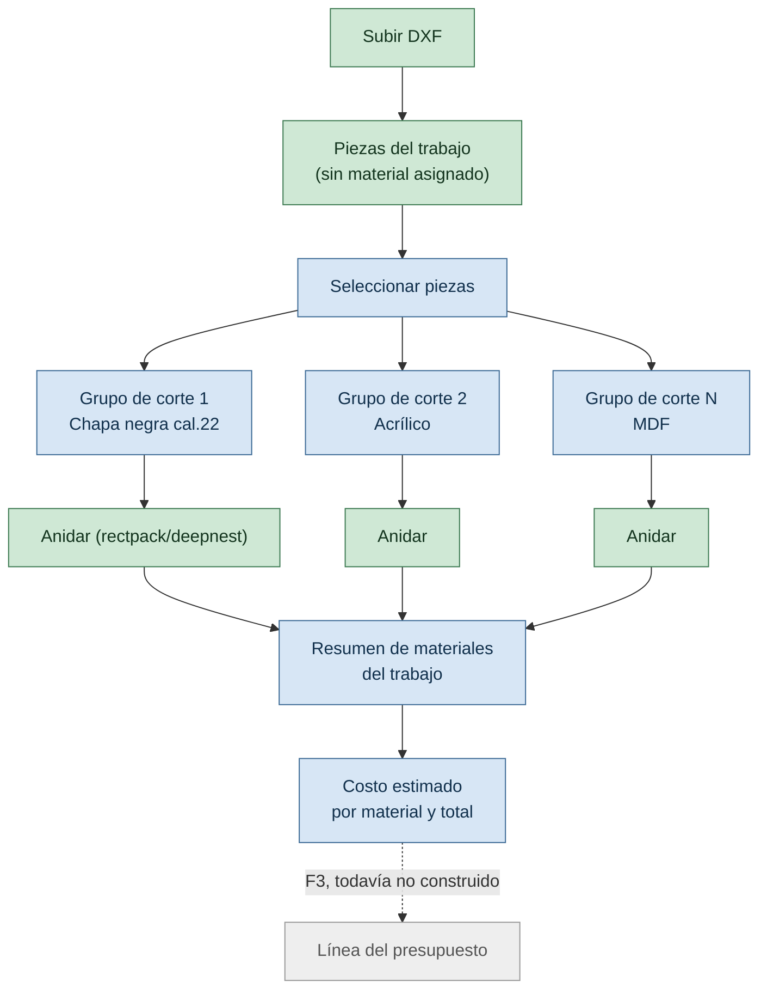
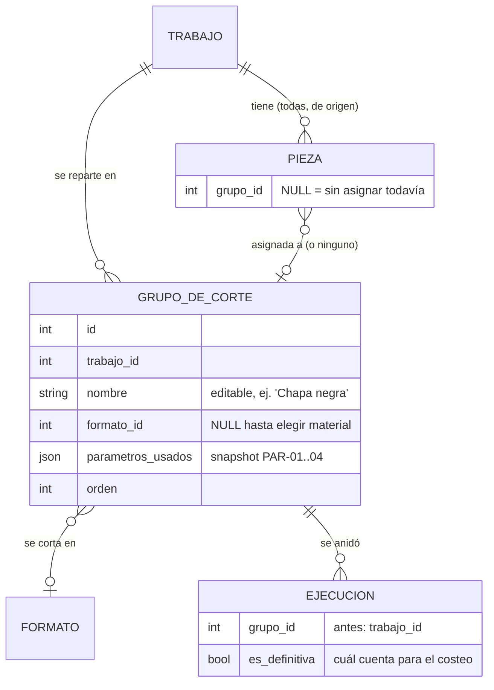

# PLAN: catálogo real + grupos de corte multi-material

> Dos extensiones al slice vertical, decididas juntas porque una depende de la otra: el catálogo pasa a reflejar `COTIZADOR` (precio real, moneda, conversión de unidad), y el modelo de trabajo pasa a soportar que **un mismo proyecto se corte en varios materiales**, cada uno con su propio anidado — que es lo que hace falta para poder "identificar qué materiales se van a usar y cotizarlos".
>
> Índice del proyecto: [`../README.md`](../README.md) · [`PLAN-SLICE-VERTICAL.md`](PLAN-SLICE-VERTICAL.md) · [`RELEVAMIENTO-EXPORT-APPSHEET.md`](RELEVAMIENTO-EXPORT-APPSHEET.md) · [`BACKLOG.md`](BACKLOG.md)
>
> **Versión:** 1.0 · **Fecha:** 2026-09-11

---

## Por qué van juntas

`CART-302` (F3, ya escrito en el backlog antes de esta sesión) dice: *"un presupuesto que usa dos materiales distintos, cada material aparece como línea separada"*. Estaba anticipado del lado del presupuesto, pero **nada describía cómo las piezas de un mismo trabajo terminan repartidas entre esos materiales**. Es el hueco entre F2 (nesting) y F3 (cotizador) que este plan cierra.

Y para que "cotizar lo que se usará" signifique algo, el precio tiene que ser real — con moneda y conversión de unidad, que es justo lo que trajo `COTIZADOR` (`RELEVAMIENTO-EXPORT-APPSHEET.md`).

---

## El flujo que se quiere soportar

**Una pieza puede volver a estar sin asignar** (se la saca de un grupo) o moverse de un grupo a otro — es la generalización de "Tanda 1 / Tanda 2" que ya existía en el visor local, pero con **N grupos**, cada uno con su propio material, no dos tandas fijas del mismo material.

---

## Modelo de datos

**Qué cambia respecto del modelo anterior** (`docs/PLAN-SLICE-VERTICAL.md`):

| Antes | Ahora | Por qué |
|---|---|---|
| `Trabajo.formato_id` | se borra, pasa a `GrupoDeCorte.formato_id` | un trabajo ya no tiene un solo material |
| `Trabajo.parametros_usados` | se borra, pasa a `GrupoDeCorte.parametros_usados` | PAR-01..04 son por material (`CART-105`); cada grupo puede tener kerf/margen distintos |
| `EjecucionNesting.trabajo_id` | pasa a `EjecucionNesting.grupo_id` | una ejecución anida las piezas de UN grupo, no de todo el trabajo |
| `Pieza.trabajo_id` | se mantiene, se agrega `Pieza.grupo_id` (nullable) | la pieza sigue perteneciendo al trabajo (es el origen), y además puede estar asignada a un grupo o no |
| — | `EjecucionNesting.es_definitiva` (nuevo) | un grupo puede tener varias ejecuciones (probar rectpack y deepnest); el costeo necesita saber cuál usar, no adivinar "la última" |

**Por qué `Pieza` no cuelga de `GrupoDeCorte` directamente.** Si perteneciera al grupo, sacar una pieza de un grupo la dejaría sin trabajo dueño. Colgar de `Trabajo` con un `grupo_id` nullable es lo que permite que "sin asignar" sea un estado normal, no un caso especial.

---

## Catálogo: qué se agrega para reflejar `COTIZADOR`

Todo en `Formato`, no en `Material` — porque en la planilla real el precio, la unidad de compra/venta y el factor de conversión son **por SKU** (cada fila de `COTIZADOR`), no por categoría de material. Dos formatos del mismo material (1,00×2,00 y 1,22×2,44) pueden tener factores de conversión distintos porque son áreas distintas.

| Campo nuevo en `Formato` | Qué es | Ejemplo real |
|---|---|---|
| `moneda` | `ARS` \| `USD` | la planilla tiene 48 de 289 insumos en USD |
| `precio_compra` | precio bruto, en `moneda` | $120.540,20 |
| `iva_pct` | | 21% |
| `unidad_compra` | | `PLANCHA` |
| `unidad_venta` | | `M2` |
| `factor_conversion` | unidades de venta que salen de 1 unidad de compra | 2,97 (el área de la plancha) |
| `costo_unidad_venta` | **importado tal cual de la planilla, no recalculado** | $50.732,41 |

**`costo_unidad_venta` se importa, no se calcula.** La fórmula real —qué hacen `%COSTO1`, `%COSTO2` y los cuatro márgenes de venta— es una pregunta abierta para administración (`RELEVAMIENTO-EXPORT-APPSHEET.md §Preguntas`). Inventar una fórmula sin confirmarla rompería la regla de no-hardcode del proyecto: sería un número inventado disfrazado de cálculo. Se guarda el valor que la planilla ya tiene calculado, y el día que se confirme la fórmula real, se implementa como función en vez de campo importado.

**Alta nueva: `CotizacionMoneda`** — tabla chica, `moneda` + `valor_a_ars` + `fecha`. Es lo que le falta a `ADR-04` (precios con vigencia) para ser reproducible con precios en dólares: sin la cotización con la que se convirtió, un presupuesto viejo en USD no se puede reconstruir.

---

## El costeo: qué se construye ahora, qué queda para F3

**Ahora:** un servicio `resumen_materiales(trabajo)` que recorre los grupos del trabajo, toma la ejecución definitiva de cada uno, y arma una línea por grupo: material, formato, planchas usadas, costo. Es un **preview**, no una entidad persistida — calcula sobre lo que ya está guardado.

**No ahora, es F3:** `CART-301` a `CART-310` — crear el `Presupuesto` como entidad propia, con cliente, estado, override manual línea por línea, PDF. El resumen de materiales de este plan es el insumo que esas historias van a consumir cuando se construyan; no las reemplaza ni se adelanta a `CART-301`, que depende de `CART-004` (clientes), que todavía no existe.

---

## Lo que NO se toca en este plan

- **El motor de nesting** (`app/services/nesting/*`) — sigue igual, no sabe de grupos ni de materiales, solo anida piezas contra una plancha.
- **El visor local** (`scripts/servidor_visor.py`) — sigue con su modelo de Tanda 1 / Tanda 2 de un solo material. Migrarlo a N grupos con selección de material por grupo es trabajo de UI aparte, no de este plan.
- **F3 real** — `CART-301` en adelante, sin empezar.

---

## Altas en `REGISTRO.md`

- `PAR-xx` — moneda de referencia del sistema (default `ARS`)
- Tabla `CotizacionMoneda` como insumo nuevo, ligada a la pregunta de administración sobre USD
- `D-xx` — cómo se calcula `costo_unidad_venta` en el futuro (hoy: importado, no calculado)
