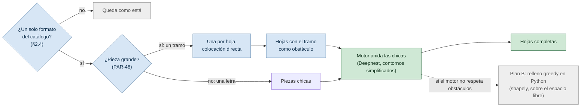

# PLAN: rumbo del anidado para piezas grandes y curvas, y pantalla de revisión

> Cierra lo que quedó abierto en el «Estado al cierre» de [`PLAN-VALIDACION-CORTE-MANUAL.md`](PLAN-VALIDACION-CORTE-MANUAL.md) y propone el orden de trabajo de las próximas sesiones. Son dos carriles independientes: **A** (motor de anidado) y **B** (pantalla de revisión, `CART-506`). Cada paso es chico, termina en algo que se puede probar y espera el visto bueno de Enzo antes del siguiente.
>
> Índice del proyecto: [`../README.md`](../README.md) · [`PLAN-VALIDACION-CORTE-MANUAL.md`](PLAN-VALIDACION-CORTE-MANUAL.md) · [`PLAN-ANALISIS-DXF.md`](PLAN-ANALISIS-DXF.md) · [`ANALISIS-MUESTRA-MEGACARTELES.md`](ANALISIS-MUESTRA-MEGACARTELES.md) · [`COMO-FUNCIONA-CADA-MOTOR.md`](COMO-FUNCIONA-CADA-MOTOR.md) · [`CONTRATO-NESTING-ENGINE.md`](CONTRATO-NESTING-ENGINE.md) · [`REGISTRO.md`](REGISTRO.md) (`D-01`)
>
> **Versión:** 1.0 · **Fecha:** 2026-09-26
>
> **Sobre los valores.** Los números que son parámetros o supuestos se citan por ID (`PAR-xx`, `P-xx`, `B-17`) y viven en `REGISTRO.md`. Lo aprendido en esta sesión quedó cargado ahí en el paso **A0** (2026-09-26); este documento solo lo referencia.

---

## 1. Dónde estamos: los seis temas abiertos, hoy

| Tema | Estado hoy |
|---|---|
| Cuánto tarda el diseñador en armar las hojas (`B-17`) | **Respondido por la empresa**, con un rango. Falta saber si incluye partir el aro o solo acomodar |
| Margen y kerf (`P-03`) | **Se parte en dos.** *Entre piezas vecinas* (`PAR-01` y `PAR-03`): hay una estimación de Enzo, coherente con los provisorios. *Margen de borde* (`PAR-02`): **sin estimación todavía**, y es el que decide el caso de los tramos del aro (§2.3, `P-28`) |
| Chapa cal. 20 «a medida» (`P-26`) | **Respondida en lo que importa al sistema:** se cotiza lo que se usa de la chapa, no la plancha entera como pasa con otras. Efecto sobre `D-02` y `PAR-15` en el registro |
| Rojo como color de cotas (`P-27`) | **Respondida por Enzo: no.** El rojo es texto de referencia para quien lee y ninguna pieza de corte va en rojo fuera de una hoja. A confirmar con diseño en el encuentro 3 |
| Deepnest para piezas grandes y curvas (`D-01`) | Recomendación en la §3: **no optimizarlo sobre el conjunto; sacar los tramos del aro del anidado genérico** |
| Pantalla de revisión (`CART-506`) | Carril B. Nada la bloquea |

**La corrida de ayer confirma la medición previa.** Deepnest con más de 30 minutos sin resultado, contra el estimado de hasta 24 horas con contornos crudos y ~1 hora con contornos simplificados a 2 mm (`PLAN-VALIDACION-CORTE-MANUAL.md`). Ninguna de las dos cabe en el criterio de producto: si tarda más que a mano (`B-17`), no aporta.

**Prioridad (Enzo, 2026-09-26).** Lo importante es **repartir el diseño en las chapas que necesite y anidar las piezas pequeñas en el espacio que sobra**; lo del cotizador y el sistema puede trabajarse después. Por eso el carril A es el camino crítico y este plan no abre preguntas de cotización: lo anotado sobre `P-26` y `D-02` en el registro es solo constancia de lo que se dijo, sin trabajo asociado. Una consecuencia: el **seccionado** (partir el diseño en chapas, sub-proyecto 2) deja de ser «algún día» y pasa a ser el paso siguiente a los spikes (A5). Lo que lo bloquea (`P-21` y `P-22`) es una pregunta de diseño, no de cotización, y conviene llevarla al diseñador antes.

---

## 2. Lo que se aprendió hoy

### 2.1 Qué son los tramos del aro, y cómo los repartió el diseñador

El cartel de Belgrano tiene un emblema circular grande (~4,6 m) con puntas de estrella. Para que entre en chapas de 2440 × 1220 mm el diseñador lo partió en 8 **tramos del aro** (los docs anteriores los llaman «cuñas»): 4 de 2292 × 1220 mm y 4 de 1941 × 1085 mm. Son bandas finas y curvas: su caja abarca casi toda la hoja, pero el material real es una fracción de ella. Las letras («COMPLEJO MANUEL BELGRANO») y las piezas chicas las acomodó en el espacio que dejan.

Se midió cómo repartió las 48 piezas `cortar` entre sus 8 hojas (mismo camino que `comparar_motores.py`, solo lectura; imagen en `backend/local/hojas_belgrano.png`, ignorada por git):

| Hoja | Tramo del aro que contiene | Piezas | Área ocupada de la hoja |
|---|---|---|---|
| 1 | 2292 × 1220 mm | 5 | 44,9 % |
| 2 | 1941 × 1085 mm | 2 | 11,7 % |
| 3 | 2292 × 1220 mm | 5 | 44,6 % |
| 4 | 1941 × 1085 mm | 10 | 40,5 % |
| 5 | 1941 × 1085 mm | 13 | 47,6 % |
| 6 | 2292 × 1220 mm | 4 | 44,4 % |
| 7 | 2292 × 1220 mm | 5 | 43,7 % |
| 8 | 1941 × 1085 mm | 4 | 20,8 % |

Lo que dice la tabla:

- **8 tramos, 8 hojas, uno por hoja.** El número de chapas del diseñador lo fija cómo se partió el aro, no cómo se acomodaron las letras.
- **Cada tramo ocupa entre 10 % y 21 % del área de su hoja.** Los 8 tramos suman 1,24 hojas de área; las otras 40 piezas, 1,74. El total es 2,98 hojas de área repartidas en 8: el 37,3 % del diseñador no es mala anidación, es el costo de partir un aro.
- **Dónde se va el tiempo de Deepnest** ya estaba medido: 71 de los primeros 101 segundos salen de los 6 pares de tramos de 2292 × 1220 entre sí. Ese cálculo responde una pregunta («¿dos tramos pueden compartir hoja?») cuya respuesta probable es no, y que se puede contestar sin pagar el cálculo general.

### 2.2 El rojo es texto para la persona, y por eso la pantalla importa

Hoy `CART-511` manda el rojo a rol `rótulo` y lo descarta del anidado (`PAR-47`). La respuesta de Enzo lo confirma: es texto de referencia para quien lee, no geometría de corte.

Lo que se desprende: como el texto está en curvas, el sistema no lo puede leer, y solo lo lee una persona mirando el dibujo. Por eso la pantalla de revisión tiene que **mostrarlo** en vez de esconderlo: es donde el diseñador ve el rótulo de la chapa y las cotas de espesor que el propio dibujo trae. Que ese texto además sirva para sugerir el material (`CART-507`) es una idea a validar con Enzo (B5), no un dato: el calibre dibujado corresponde a la propuesta principal y el presupuesto puede variarlo, porque un `Trabajo` admite varios `Presupuesto`.

### 2.3 El margen de borde decide si el dibujo del diseñador se puede cortar

Los 4 tramos de 2292 × 1220 mm miden exacto el alto de la chapa. Si el margen de borde es mayor que cero no entran en ningún motor, y el anidado manual tampoco se podría cortar tal cual. O el taller corta hasta el borde en esas piezas, o el diseñador las ajusta. **La estimación de Enzo es entre piezas vecinas, no del borde** (`P-03`), así que esto sigue sin respuesta. Es la pregunta más valiosa para el taller y no estaba escrita: entra como `P-28` (§7).

### 2.4 Alcance: solo los diseños que se cortan en un formato de chapa del catálogo

Regla de Enzo: el anidado que se propone es para los diseños que se cortan completos en **una sola forma de chapa**. Los que traen señalada **otra medida de hoja** (por ejemplo la cal. 20 «a medida», que se cotiza por lo usado, `P-26`) **siguen como están**: el sistema no los re-anida.

Se midió qué diseños del DXF de la muestra caen en cada lado (formatos del catálogo local, misma tolerancia de `CART-510`):

| | Diseños | Qué traen |
|---|---|---|
| **En alcance** | 2 de 23 | Belgrano (8 hojas de 2440 × 1220) y otro con marco de ~10 × 6,4 m (3 hojas de 2440 × 1220) |
| **Siguen como están** | 21 de 23 | Ninguna hoja del catálogo. Sus rectángulos son de ~1,20 m de un lado y largo variable (489, 565, 580, 635, 790 mm…), más marcos grandes |

Consecuencias:

- **El alcance lo propone el sistema y lo confirma la persona**, como el resto de `CART-511`: un diseño con hojas de un único formato del catálogo se sugiere «se re-anida»; cualquier otro, «queda como está», con el motivo a la vista. Se puede cambiar en la revisión.
- **Validar contra pocos casos.** Con 2 diseños en alcance, el criterio de «pieza grande» no se puede ajustar a una muestra amplia: A4 usa esos dos y lo dice.
- **Qué hace el sistema con un diseño que «queda como está»** no está definido: es `D-13` (nueva), a decidir cuando se llegue a B4. Mientras tanto se reconocen y se muestran, sin anidar.

---

## 3. Cómo funciona y por qué este rumbo

### 3.1 Cómo funciona

Son dos partes, y hoy solo una está en marcha.

**Partir el aro: hoy lo hace el diseñador.** El DXF ya trae el aro partido en tramos y el sistema los toma como vienen. Que los parta solo es el seccionado automático (sub-proyecto 2), que espera las respuestas de `P-21` y `P-22`.

**Anidar las letras en los espacios: lo que se construiría ahora.**

1. **Separar las piezas.** Los tramos grandes por un lado, las letras y piezas chicas por otro (`PAR-48`).
2. **Abrir una chapa por tramo.** El tramo se apoya en la chapa y queda fijo, como un obstáculo. Se parte de la orientación que le dio el diseñador; probar otras (media vuelta, esquina de apoyo) es la variante de A2.
3. **Meter las letras una a una.** El motor prueba posiciones y giros con la forma real de cada letra hasta encontrar dónde entra sin tocar el tramo (respetando kerf y separación) ni salirse de la chapa. Primero intenta en los huecos de las chapas ya abiertas, que es el espacio que deja la curva del aro; solo abre una chapa nueva y vacía cuando la letra no entra en ninguna abierta.
4. **Validar antes de aceptar.** El resultado se comprueba con la geometría real, con el control de tolerancia del contrato.

En Belgrano debería entrar todo sin abrir chapas extra: las letras suman 1,74 hojas de área y, con los 8 tramos apoyados, quedan unas 6,8 hojas de área libre, aunque repartida en huecos irregulares. Es lo que hizo el diseñador.

### 3.2 Por qué esta y no las otras dos

| Opción | Qué es | Contra | Veredicto |
|---|---|---|---|
| Seguir optimizando Deepnest sobre todo el conjunto | Simplificar agujeros, paralelizar los NFP con `worker_threads` | El costo no es la cantidad de vértices: es el peor caso de `MinkowskiSum` con arcos cóncavos casi iguales. El addon C++ ya se midió y es más lento. Aun repartido en 8 núcleos queda lejos de `PAR-09` | **No** |
| **Híbrido por tamaño** | La de arriba | Hay que definir «pieza grande» (`PAR-48`) y comprobar que el motor acepta hojas con obstáculos | **Sí**, después de dos spikes chicos (A1 y A2) |
| Seccionar antes de anidar (sub-proyecto 2) | Que el sistema parta el aro en piezas que se anidan mejor | Es **la única forma de bajar de 8 chapas** en Belgrano, pero depende de `P-21` y `P-22` y es un algoritmo nuevo | **Después.** El híbrido no lo bloquea, y lo prepara |

**Qué se logra y qué no.** El híbrido apunta a **igualar las 8 chapas del diseñador en minutos en vez de horas** (`B-17`), no a superarlas: el techo lo fijan los tramos. Superarlas es trabajo del seccionado, porque cómo se parte el aro decide cuántas chapas hacen falta y qué huecos quedan para las letras. Por eso el orden es primero igualar al diseñador con sus cortes y recién después automatizar el corte, ya con una vara para medirlo.

**Qué haría cambiar de opinión.** Que dos tramos pudieran compartir hoja. A1 lo descartó con estos cortes (0 de 28 pares), aunque los 4 tramos de 1941 × 1085 quedaron a solo un 1,9 % de superposición: es el dato que llevaría al seccionado (A5), porque un corte algo distinto podría hacerlos compartir.

**Criterio de tiempo, para decidir (`D-12`, nueva).** La vara es `B-17`, no `PAR-25`. `PAR-09` sigue siendo la meta si alguien espera frente a la pantalla. Propuesta: el anidado irregular corre en segundo plano con aviso, y solo se lo mide contra `B-17`. Lo confirma Enzo.

---

## 4. Carril A — motor

### A0 · Registrar lo aprendido (solo documentación) — hecho 2026-09-26

Cargado en `REGISTRO.md`:

- `B-17`: el rango de la empresa.
- `P-03`: partirla en *entre piezas* (estimación de Enzo, hipótesis) y *margen de borde* (sin dato).
- `P-26`: respondida en lo que importa (se cotiza lo que se usa). **Efecto sobre `D-02`/`PAR-15`:** hoy `PAR-15` es un parámetro de sistema con «plancha entera» como default; esta respuesta es evidencia de que el criterio varía por material o formato («como sucede con algunas»), lo que probablemente lo vuelve un dato del formato. Se anota como evidencia, no se decide. También refuerza `CART-510`: reconocer hojas «a medida» por un solo lado (`PAR-42`).
- `P-27`: respondida por Enzo, a confirmar con diseño; `PAR-47` queda como está.
- Altas: `D-12`, `D-13`, `PAR-48` (criterio de pieza grande, sin valor hasta A3) y `P-28`.

Actualizar el «Estado al cierre» de `PLAN-VALIDACION-CORTE-MANUAL.md` con la tabla del §2.1, el tablero de `REGISTRO.md §7`, y reducir la §1 de este plan a referencias.

**Se verifica:** ningún valor queda escrito en dos lados; los conteos del tablero cuadran.

### A1 · Spike: dos preguntas de sí o no — hecho 2026-09-26: go

**Resultado:** ningún par de tramos comparte hoja (0 de 28) y el motor respeta una plancha con obstáculos, incluso con concavidades. Detalle, método y qué mirar en A2 en `PLAN-VALIDACION-CORTE-MANUAL.md`, «Resultados de A1». Lo de abajo es el planteo original.

1. **¿Dos tramos pueden compartir hoja?** Calcular solo los NFP entre los 8 tramos (28 pares; los 6 ya medidos costaron 71 s en total, así que se espera del orden de minutos) y ver si alguno deja una posición válida dentro de la chapa.
2. **¿El motor respeta una hoja con agujero?** El código lo contempla (`nesting-engine/vendor/placement.js`, `hasMaterialOutsideSheet` revisa `sheet.children`, y `motor.js` ya recibe un arreglo de planchas), pero hay que probarlo: test sintético con una hoja con un agujero y una pieza que solo entra ahí.

**Entrega:** las dos respuestas y un go / no-go para el híbrido, en `PLAN-VALIDACION-CORTE-MANUAL.md`. Scripts descartables, sin versionar.

### A2 · Spike: las letras contra hojas ocupadas

Armar 8 hojas, cada una con su tramo como obstáculo, más hojas limpias de reserva; sumar las 40 piezas chicas con contornos simplificados **hacia afuera** (la técnica ya medida: el simplificado contiene al original, así que una posición válida para él lo es para la real).

Dos corridas:

1. Margen, kerf y separación en 0, igual que la comparación anterior, para que los números sean comparables.
2. Kerf y separación en sus valores provisorios, con margen de borde 0: es lo más cercano a lo que se cortaría hasta que `P-28` se conteste.

**Variante, después de las dos corridas:** la orientación de cada tramo sobre su hoja como opción (media vuelta y, si el material lo admite, espejo) y en qué esquina se apoya, quedándose con la que deje mejor lugar para las letras o el sobrante más útil. Sale de una observación de Enzo: un tramo se puede invertir para aprovechar sus concavidades. En Belgrano sobra espacio (§3.1), así que se espera poco efecto; en trabajos más justos puede pesar. El espejo puede servir en chapa y no en materiales con cara pintada (Enzo): si se usa, solo para chapa. No se le dedica más tiempo por ahora.

**Se mide:** tiempo, chapas usadas, piezas colocadas, aprovechamiento.
**Éxito:** las 40 chicas colocadas dentro de las 8 hojas de los tramos (paridad con el diseñador). El tiempo se decide con Enzo contra `PAR-09` y `B-17`, no antes. Se espera del orden de minutos y no de horas porque desaparecen los 6 pares patológicos, pero es una hipótesis: para eso es el spike. Si el tiempo queda cerca, la palanca de paralelizar los NFP sigue disponible.
**Si falla:** plan B en Python (relleno greedy sobre el espacio libre, con `shapely`).

### A3 · Construirlo (solo si A1 y A2 dan go)

Cada inciso es un commit y espera el visto bueno:

- **a.** `clasificar_piezas_grandes` en `backend/app/services/nesting/`, con `PAR-48`. **Esta función es una decisión de diseño, y se la dejo a Enzo** (5 a 10 líneas): por área falla, porque un tramo de 1941 × 1085 ocupa 10 % de la hoja y una letra de 874 × 860 ocupa 11 %; por extensión sola también falla, porque una tira de 20 × 1200 abarca todo el lado corto y no es una pieza grande. Los cuatro casos de prueba salen de la muestra: tramo 2292 × 1220, tramo 1941 × 1085, letra 874 × 860, tira 20 × 1200.
- **b.** «¿Está en alcance?» (§2.4): un diseño se re-anida solo si todas sus hojas reconocidas son de un mismo formato del catálogo. Con tests sobre los casos medidos.
- **c.** Colocación directa de las grandes, una por hoja. Si una grande no entra en ningún formato, falla ruidoso (`DECISIONES-Y-BLOQUEANTES.md §1.2`), nunca se descarta en silencio.
- **d.** Contrato v1.1: `planchas` con `obstaculos_mm` en `CONTRATO-NESTING-ENGINE.md`, y su lado en `nesting-engine/src` y `deepnest_cliente.py`.
- **e.** Motor híbrido que compone grandes y chicas en un `ResultadoAnidado`, con tests.

### A4 · Medir y decidir

Agregar el híbrido como tercera fila de `comparar_motores.py` y correr Belgrano: diseñador contra rectpack contra híbrido. Repetir sobre el otro diseño en alcance de la muestra (§2.4). Son solo dos: cuando lleguen más DXF de diseños en alcance (`B-14`) se repite el chequeo del criterio de «grande». Actualizar `COMO-FUNCIONA-CADA-MOTOR.md` y darle a `D-01` su segundo dato con piezas reales.

### A5 · Después: plan del seccionado (sub-proyecto 2)

Con A2 medido, escribir el plan de **repartir un diseño en las chapas que necesite**: partir lo que no entra en ninguna y dejar las secciones listas para el anidado híbrido. Necesita `P-21` y `P-22` respondidas por el diseñador; cómo arrancar sin ellas se decide entonces. Es un plan aparte, con su propio ciclo.

---

## 5. Carril B — pantalla de revisión (`CART-506`)

**Punto de partida.** La API en dos pasos ya existe (`POST /importaciones/dxf/analizar` y `.../{token}/confirmar`, `rutas_importacion.py`), pero **nada del frontend la usa**: `PiezasTab.tsx` sigue con el import de una sola vez. Y `PiezaAnalizada` no trae contorno a propósito («un archivo real tiene miles de piezas»). Para dibujar hace falta un endpoint aparte, no engordar el análisis.

Identidad visual: la ya definida en `docs/superpowers/specs/2026-09-15-frontend-cotizador-design.md §4`. Para B2 y B3 se usa el skill `frontend-design`.

### B1 · Backend: la geometría para dibujar

`GET /importaciones/dxf/{token}/disenios/{indice}/geometria`: contornos simplificados de las piezas y hojas de un diseño. La tolerancia de simplificación la manda el cliente (depende del zoom), sin default en el código.

**Se verifica:** tests del endpoint (token inexistente, índice fuera de rango, área simplificada dentro de la tolerancia pedida, tamaño de respuesta acotado con los 9.435 vértices de Belgrano).

### B2 · Frontend: pantalla «Importar» — primer hito visual

Ruta `/importar`: subir el DXF, escala (con `escala_sugerida_a_mm` como botón «usar esta escala», nunca aplicada sola), y una tarjeta por diseño con miniatura, cantidad de hojas y conteo de piezas por rol. Cada tarjeta lleva la marca **«se re-anida» / «queda como está»** con su motivo (§2.4). Solo lectura.

**Lo que Enzo prueba:** subir `Muestra Vectores.dxf` con escala 100 y ver los 23 diseños, con Belgrano y el otro marcados como «se re-anida».

### B3 · Frontend: el visor de un diseño — segundo hito visual

Plano SVG con zoom y paneo. Piezas coloreadas por rol (`cortar`, `referencia`, `marco de chapa`, `rótulo`), hojas como marcos, texto rojo visible como rótulo (§2.2), hover con el `motivo` que dio el análisis, leyenda con conteos. Click en una pieza para cambiar su rol (estado local, todavía sin guardar).

**Lo que Enzo prueba:** ver qué entendió el sistema de Belgrano y corregir un rol a mano.

### B4 · Frontend: confirmar — tercer hito, el ciclo completo

Elegir diseños, ponerles nombre, confirmar y caer en el workspace del trabajo creado. Al terminar, el import viejo de `PiezasTab.tsx` deja de hacer falta y se retira. Acá se decide `D-13` (qué se hace con los diseños que quedan como están).

### B5 y B6 · Después

- **B5.** Rótulos a material: al elegir una hoja o pieza, mostrar ampliado el texto rojo cercano para que la persona lo lea, y ofrecer sugerir el material (`CART-507`). Se valida con Enzo antes de construirlo (§2.2).
- **B6.** Fusionar piezas y editar medidas (resto de `CART-506`); mostrar en `AnidadoTab` el resultado del híbrido, con el tramo y sus letras por hoja.

---

## 6. Orden

| # | Paso | Qué queda a la vista | Depende de |
|---|---|---|---|
| 1 | A0 | Registro al día | — |
| 2 | B1 | Endpoint de geometría con tests | — |
| 3 | B2 | **Primera pantalla: los diseños del DXF, con su alcance** | B1 |
| 4 | A1 | Go / no-go del híbrido | — |
| 5 | B3 | **El visor con roles** | B1 |
| 6 | A2 | Tiempo y chapas del híbrido, medidos | A1 |
| 7 | B4 | **Ciclo completo: subir, revisar, confirmar** | B2, B3 |
| 8 | A3 → A4 | Híbrido construido y comparado | A1, A2 |
| 9 | A5 | Plan del seccionado: repartir el diseño en las chapas que necesite | A2, `P-21`, `P-22` |

Los carriles alternan a propósito: hay avance que se ve en pantalla en cada vuelta, y los spikes del carril A son cortos e independientes. A2 decide si vale invertir en A3 **antes** de escribir código de producto.

---

## 7. Preguntas que siguen abiertas

Por impacto. Se responden en el encuentro que corresponda de `REGISTRO.md §6`.

1. **`P-28` (nueva).** Un tramo de 2292 × 1220 mm sobre una chapa de 1220 de alto: ¿se corta tal cual, hasta el borde, o el diseñador lo ajusta? Decide si el anidado manual de la muestra se puede cortar como está dibujado.
2. **`P-03`, margen de borde.** Es la mitad que falta: entre piezas vecinas ya hay una estimación (§1); del borde no hay ninguna.
3. **`B-17`.** El rango de la empresa, ¿incluye partir el aro en tramos o solo acomodarlos?
4. **`P-21` y `P-22`.** Cómo decide el diseñador por dónde partir lo que no entra en una chapa, y si las secciones llevan uniones. Con la prioridad de la §1 pasan al camino crítico: son las que hay que llevar primero al diseñador.
5. **`D-13` (nueva).** Qué hace el sistema con un diseño que «queda como está» (§2.4). Puede esperar a B4.

**Respondidas por Enzo, a confirmar con quien corresponda:** `P-26` (se cotiza lo usado, taller / administración), `P-27` (rojo = texto de referencia, diseño), la distancia entre piezas vecinas de `P-03` (taller) y el alcance de la §2.4 (diseño).

---

## 8. Riesgos

- ~~El motor no respeta obstáculos en la hoja.~~ **Resuelto en A1:** los respeta, incluso con concavidades. El plan B en Python queda descrito por si A2 encuentra un problema de tiempo, y no se construye hasta que haga falta.
- **Muestra chica.** Solo 2 diseños de la muestra están en alcance, y uno es Belgrano. El criterio de «grande» puede quedar ajustado a él; A4 lo dice y `B-14` lo resuelve cuando lleguen más archivos.
- **Contornos simplificados hacia afuera.** Vuelven las letras un poco más grandes de lo real. El resultado se revalida contra los polígonos reales (`PAR-29`, según el contrato) antes de aceptarlo.
- **`B-17` es un rango ancho** y puede incluir partir el aro. Hasta contestarlo, «igualar las 8 chapas en minutos» se compara contra la parte de acomodar, no contra el trabajo completo.

## 9. Cómo se midió

Todo con scripts de solo lectura, **no versionados** (misma política que las otras mediciones del spike), sobre `Muestra Vectores.dxf` con escala 100:

- **Reparto por hoja (§2.1).** Reusa `_piezas_a_cortar_de_un_disenio` de `comparar_motores.py` con chapa 2440 × 1220 y `--disenio-de "Muestra Vectores-267"`. Agrupa las piezas `cortar` por la hoja que las contiene (`_hoja_de_cada_pieza`) y suma el área de cada una con `shapely`.
- **Alcance (§2.4).** `agrupar_en_disenios` sobre el resultado de `parsear_dxf` y `detectar_hojas` de cada diseño contra los formatos del catálogo local. Para los diseños sin hojas del catálogo se listaron los rectángulos grandes con piezas adentro.
