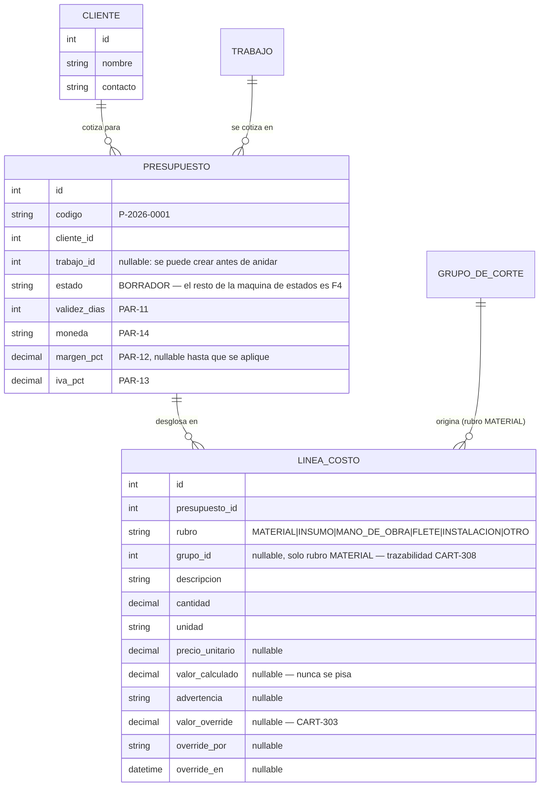

# PLAN: slice vertical del cotizador (F3)

> Mismo método que [`PLAN-SLICE-VERTICAL.md`](PLAN-SLICE-VERTICAL.md) usó para F2: meter en la API real lo mínimo de `F3` que hace falta para que un anidado ya calculado se convierta en un presupuesto persistido, con desglose editable — sin esperar a `F0` (auth) ni a que `F1` tenga precios con vigencia completos.
>
> Índice del proyecto: [`../README.md`](../README.md) · [`MAPA-DEL-PROYECTO.md`](MAPA-DEL-PROYECTO.md) · [`EPICA.md`](EPICA.md) · [`BACKLOG.md`](BACKLOG.md) · [`PLAN-SLICE-VERTICAL.md`](PLAN-SLICE-VERTICAL.md)
>
> **Versión:** 1.7 · **Fecha:** 2026-09-14 · **Estado:** pasos 1-5 ejecutados (`CART-301`-`307`), paso 6 (desglose completo) sigue

---

## Por qué ahora y por qué así

`MAPA-DEL-PROYECTO.md §1` mide `H1` (el hito de validación) en 20% hecho / 29% parcial / 51% sin empezar sobre `F0+F1+F2+F3`. Ese 51% es casi enteramente `F3`: es la única feature de `H1` en cero. Y es la que menos infraestructura nueva necesita — `costeo.py` (`app/costeo.py`) ya calcula el costo de material desde un anidado real, `GrupoDeCorte` ya resuelve "un presupuesto con dos materiales distintos" (`CART-302`, 3er criterio). Lo que falta es persistirlo como presupuesto, no calcularlo.

**La misma regla dura que en el slice de F2, aplicada acá:** todo lo que se persiste cuelga de un `Presupuesto`, nunca de un usuario autenticado. `CART-301` pide "diseñador autenticado" y "rechazar si otro diseñador edita, salvo ADMIN" — ninguna de las dos cosas se construye todavía, por la misma razón que `CART-002` sigue diferida: nada de lo que existe hoy la necesita, y agregar un candado de permisos sin roles reales de por medio sería simular seguridad que no existe.

---

## Qué se construye ahora y qué se difiere

| Se construye ahora | Se difiere |
|---|---|
| `CART-301` — Presupuesto y su código legible, **sin** el candado de autenticación/rol | Auth real (`CART-002`) — igual que en el slice de F2 |
| Un `Cliente` mínimo (nombre + contacto) — lo que `CART-301` necesita para existir | El ABM completo de `CART-004` (permisos, historial, edición) |
| `CART-302` — costo de material, generado desde `costeo.py` y persistido como líneas | `CART-103`/`104` — precios **con vigencia** (tabla versionada). Cada línea congela el precio que usó al calcularse, pero `Formato.precio_compra` sigue siendo un valor único, no un historial |
| `CART-303` — override manual con trazabilidad (quién, cuándo, valor calculado vs. manual) | — es el corazón del plan, no se difiere nada de esto |
| `CART-304`/`305`/`306` como **líneas libres** (descripción + cantidad + precio) | La variante "elegir del catálogo de insumos" — depende de `CART-106`, que no existe |
| `CART-307` — margen, IVA, redondeo único al final | — |
| `CART-308` — el desglose completo, **por API** (JSON), no la pantalla | La pantalla en sí — es frontend, paso 6 |
| — | `CART-309`/`310` (PDF) — no hay `WeasyPrint` instalado y depende de qué tan lejos esté el frontend cuando se llegue ahí |
| — | La máquina de estados (`CART-401`, F4) y el snapshot inmutable al enviar (`ADR-04`, segunda mitad) — sin estado `ENVIADO` todavía, no hay nada que congelar más allá de lo que cada línea ya congela sola |

**Por qué no esperar a `CART-103`.** `ADR-04` tiene dos mecanismos: precios versionados y snapshot inmutable al enviar. El segundo es literalmente imposible sin `F4` (no existe el estado `ENVIADO`). El primero importa cuando un presupuesto **vive mucho tiempo en trámite** mientras el precio cambia debajo — un riesgo real, pero de una feature que todavía no tiene ningún presupuesto real corriendo. Cada `LineaCosto` guarda su propio `precio_unitario` y `valor_calculado` como copia, no como referencia a `Formato` — es el mismo criterio que ya usa `EjecucionNesting.parametros` (copia, no referencia, `CART-210`). El día que `CART-103` exista, estas líneas no cambian: seguirían apuntando al precio que usaron, que es exactamente lo que pide `ADR-04`. Lo que falta sin `CART-103` es la vista de "cómo evolucionó el precio" (`CART-107`), no la integridad del presupuesto ya armado.

---

## El modelo de datos



**Cuatro decisiones que no son obvias, mismo espíritu que el plan de F2:**

- **`valor_calculado` (y `precio_unitario`) son nullable.** `costeo.resumen_materiales` ya tiene la regla "sin material, sin anidar o sin precio de referencia → el costo queda en `None` con una advertencia, nunca en cero" (probado así en `tests/test_costeo.py`). Si `LineaCosto.valor_calculado` fuera obligatorio, `recalcular-materiales` tendría que inventar un `0` en esos casos — justo lo que `costeo.py` prohíbe. `advertencia` guarda el motivo (`"sin precio de referencia"`, `"no tiene un anidado terminado"`...) para no perderlo al persistir.
- **`LineaCosto.valor_calculado` nunca se pisa.** El override (`CART-303`) agrega `valor_override` al lado, no lo reemplaza — "volver al valor calculado" (3er criterio de `CART-303`) tiene que poder recuperar el número original sin volver a calcular nada. El valor efectivo de una línea es `valor_override if valor_override is not None else valor_calculado` — nunca al revés.
- **Las líneas de rubro `MATERIAL` no se editan a mano, se regeneran.** Igual que el DXF de un trabajo (`POST /trabajos/{id}/dxf` reemplaza las piezas), un `POST /presupuestos/{id}/recalcular-materiales` borra las líneas `MATERIAL` viejas y las reconstruye desde `costeo.resumen_materiales` — la única forma de "editar" el costo de un material es un override, nunca tocar `descripcion`/`cantidad` a mano (esos números vienen del anidado real, no son de negocio).
- **`Presupuesto.trabajo_id` es nullable.** `CART-301` no pide un trabajo para crear el presupuesto (solo cliente); `CART-302` sí lo necesita para calcular material. Un presupuesto sin trabajo asociado todavía puede existir — por ejemplo, para cargar solo mano de obra e insumos de un trabajo que no pasa por nesting (un cartel sin chapa, todo vinilo). Se valida en el servicio, no en el modelo — mismo criterio que `GrupoDeCorte.formato_id` nullable.

---

## Estructura nueva en el backend

```
backend/app/
  modelos/
    presupuesto.py     ← nuevo: Cliente, Presupuesto, LineaCosto
  api/
    esquemas_presupuesto.py
    rutas_presupuesto.py
  costeo.py             ← casi no se toca: `LineaMaterial` gana dos campos
                           (precio_unitario, unidad_venta) que ya se calculaban
                           adentro y se descartaban — ningún cálculo cambia
```

**Ajuste sobre la versión anterior de este plan:** decía "`costeo.py` no se toca". En los hechos, `LineaMaterial` no exponía el `precio_unitario` ni la `unidad` que usó para llegar a `costo_estimado` — los calculaba `_linea_de_grupo` puertas adentro y los tiraba. Sin esos dos campos, `recalcular-materiales` (paso 2) tendría que volver a consultar el `Formato` por su cuenta para armar una `LineaCosto` completa, duplicando una cuenta que `costeo.py` ya hizo. La corrección es agregar los dos campos al dataclass — no cambia ningún valor que ya se calcula, solo deja de descartarlo.

Una migración de Alembic (`alembic revision --autogenerate -m "presupuesto, cliente y lineas de costo"`), revisada a mano antes de aplicarla — mismo criterio de `CONVENCIONES.md §5`.

---

## Orden de trabajo

1. **`Cliente` + `Presupuesto`.** ABM mínimo de `Cliente` (nombre, contacto — nada de `CART-004` completo) y de `Presupuesto` (crear con cliente + trabajo opcional, código autogenerado `P-{año}-{secuencial:04d}`, listar, leer, duplicar). Termina con poder crear un presupuesto vacío contra un trabajo ya anidado.
2. **`LineaCosto` de rubro `MATERIAL`, generadas.** `POST /presupuestos/{id}/recalcular-materiales` llama a `costeo.resumen_materiales` y convierte cada `LineaMaterial` en una `LineaCosto` — 400 si el presupuesto no tiene `trabajo_id` todavía. Vuelve a llamarlo reemplaza las líneas `MATERIAL` anteriores, no las acumula. Un grupo sin costo (sin material, sin anidar, sin precio) genera igual su línea, con `valor_calculado=None` y su `advertencia` — nunca inventa un cero. Prueba end-to-end: crear presupuesto sobre un trabajo con grupos ya anidados y costeados, recalcular, ver las líneas.
3. **Override manual (`CART-303`).** `PATCH /lineas-costo/{id}` con `valor_override` y `override_por`; mandar `valor_override: null` revierte al calculado y limpia quién/cuándo. Sin usuarios reales, `override_por` es un string libre por ahora (no una FK a `Usuario`, que no existe), documentado como simplificación. **Revisión necesaria a `recalcular-materiales` (paso 2):** tal como quedó, borra todas las líneas `MATERIAL` y las recrea — perdería cualquier override al primer recálculo, justo lo que el 4° criterio de `CART-303` prohíbe ("los overrides se conservan y el sistema advierte cuáles quedaron desactualizados"). Pasa de "borrar y recrear" a "upsert por `grupo_id`": conserva el override si ya existía, actualiza los campos calculados, y si el nuevo `valor_calculado` difiere del que había cuando se overrideó, agrega una advertencia de que ese override puede estar desactualizado. Las líneas de grupos que ya no existen se eliminan.
4. **Líneas libres (`CART-304`/`305`/`306`).** `POST /presupuestos/{id}/lineas-costo` crea una línea con rubro `INSUMO`/`MANO_DE_OBRA`/`FLETE`/`INSTALACION`/`OTRO` (nunca `MATERIAL`, exclusivo de `recalcular-materiales`) — `valor_calculado = cantidad × precio_unitario`, calculado por el servidor, nunca confiado del cliente. `PATCH /lineas-costo/{id}` se extiende para editar `descripcion`/`cantidad`/`precio_unitario` en líneas libres (recalcula `valor_calculado`); `DELETE /lineas-costo/{id}` las elimina. Las dos rutas rechazan con 409 si la línea es de rubro `MATERIAL` — esas solo se tocan por `recalcular-materiales` o por override.
5. **Margen, IVA, total (`CART-307`).** `margen_pct`/`iva_pct` se agregan a `Presupuesto` (nullable, sin default el margen porque `PAR-12` sigue sin confirmar; `iva_pct` sí arranca en 21%, `PAR-13` está confirmado) y se editan por el `PATCH /presupuestos/{id}` que ya existía — no hizo falta una ruta `PUT /margen` aparte. `GET /presupuestos/{id}/totales` suma por rubro, aplica margen, aplica IVA y redondea **una sola vez**, al final. **Ajuste encontrado al construirlo:** sumar líneas a ciegas mezclaría monedas si un grupo `MATERIAL` está en USD y el presupuesto en ARS (`COTIZADOR` real tiene formatos así) — se agrega `moneda` a `LineaCosto` y el endpoint excluye del total cualquier línea en una moneda distinta a la del presupuesto, con advertencia, en vez de sumarlas a ciegas. De paso se corrigió `duplicar_presupuesto` (paso 1), que nunca había llegado a copiar `LineaCosto` desde que esa tabla existe (paso 2).
6. **Desglose completo (`CART-308`).** `GET /presupuestos/{id}` devuelve cliente, líneas agrupadas por rubro, cuáles tienen override, y los totales del paso 5 — todo en una sola respuesta, que es lo que la historia pide ("en una sola pantalla"), solo que la pantalla todavía no existe.

Cada paso deja algo probable solo, sin esperar al siguiente — mismo criterio que el plan de F2.

---

## Riesgos

| Riesgo | Mitigación |
|---|---|
| `PAR-12` (margen) y `PAR-11` (validez) siguen sin confirmar con el dueño | Se piden explícitos en cada `POST`/`PUT`, sin default silencioso — igual que `escala_a_mm` en `parsear_dxf` |
| Sin `CART-103`, "reconstruir qué precio se usó" depende de que la línea ya lo tenga copiado | Es la decisión central del plan (ver arriba); si falla, es un bug de esta implementación, no un límite aceptado |
| `override_por` como string libre, sin usuario real detrás | Aceptable mientras se trabaja solo; el día que exista `CART-002` es una migración de datos (llenar la FK desde el string), no un cambio de diseño |
| `D-02`/`P-10` (¿plancha entera o m² aprovechados?) sigue sin confirmar | `costeo.py` ya factura plancha entera (`PAR-15` default) — este plan no lo cambia; si la respuesta es la otra, el cambio es en `costeo.py`, no acá |

---

## Qué NO resuelve este plan

- No hay PDF (`CART-309`/`310`) ni pantalla (`CART-308` es JSON).
- No hay máquina de estados: todo presupuesto queda en `BORRADOR` para siempre en esta API — `F4` es quien construye `ENVIADO`/`APROBADO`/`RECHAZADO`.
- No hay catálogo de insumos no dimensionales (`CART-106`): las líneas de mano de obra/insumos/flete son siempre libres, nunca elegidas de un catálogo.
- No hay precios con vigencia real (`CART-103`/`104`): un cambio en `Formato.precio_compra` no genera historial, solo afecta al próximo recálculo.
- No hay autenticación ni permisos por rol.
- No hay historial completo de overrides (auditoría transversal, `CART-006`, F0): lo que se persiste es el estado actual (si hay override activo, de quién y cuándo es *ese* override), no una bitácora de cada vez que se overrideó y se revirtió una línea.
