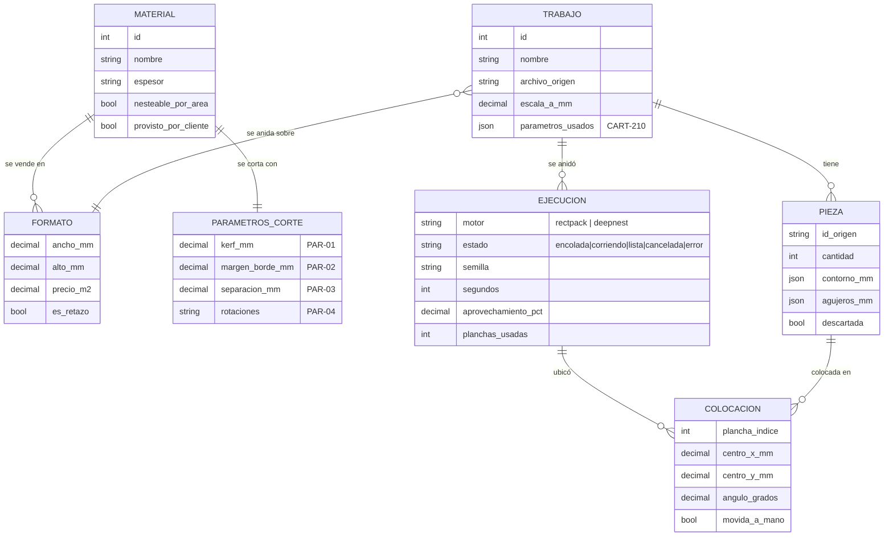
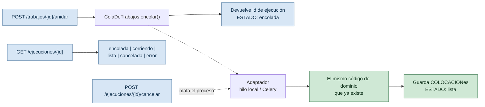

# PLAN: slice vertical — sacar el nesting del script local

> Meter lo que ya funciona (parseo DXF, los dos motores, ajuste manual, exportación) adentro de una aplicación real: API, persistencia y trabajos en cola. Es lo mínimo para que exista algo contra lo que un frontend pueda hablar, y para que el trabajo de UX/UI no haya que rehacerlo.
>
> Índice del proyecto: [`../README.md`](../README.md) · [`MAPA-DEL-PROYECTO.md`](MAPA-DEL-PROYECTO.md) · [`EPICA.md`](EPICA.md) · [`BACKLOG.md`](BACKLOG.md)
>
> **Versión:** 1.0 · **Fecha:** 2026-09-10

---

## Qué se construye y qué se difiere

| Se construye ahora | Se difiere |
|---|---|
| `CART-001` — esqueleto y entorno reproducible **sin Docker** | `CART-002/003/004` — auth, roles, usuarios, clientes |
| `CART-102` — formatos de material (incluye los que no son chapa) | `CART-006` — auditoría transversal |
| `CART-105` — parámetros de corte por material | `CART-101/106` — catálogo completo de insumos |
| Trabajos de nesting persistidos (nuevo, no estaba en el backlog) | `CART-103/104/107` — precios con vigencia, carga masiva, historial |
| El nesting como trabajo en cola, con estado consultable | `CART-005` — layout y navegación por rol |

**Por qué se difiere la autenticación.** No hace falta para construir ni para pulir la interfaz, y son 8 puntos. El riesgo real de dejarla para después es que se cuele lógica que asume "un solo usuario"; se evita con una sola regla: **todo lo que se persiste cuelga de un `trabajo`**, nunca de un estado global. Eso es lo que hoy hace mal `servidor_visor.py` y lo que este slice viene a corregir.

---

## Sin Docker: qué cambia y qué no

`ADR-05` define PostgreSQL + Celery/Redis + Docker Compose. **Este plan no lo toca.** Define un modo de desarrollo local que corre sin instalar nada pesado, y deja el cambio a producción como configuración, no como reescritura.

| Pieza | `ADR-05` (producción) | Local, ahora | Cómo se cambia |
|---|---|---|---|
| Base | PostgreSQL | **SQLite** (viene con Python) | `DATABASE_URL` |
| Cola | Celery + Redis | **En proceso**, hilos | Cambiar el adaptador de `ColaDeTrabajos` |
| Orquestación | Docker Compose | `uvicorn` a mano / un `.cmd` | — |
| API | FastAPI | FastAPI | igual |

### Las cinco reglas que hacen barato el cambio

1. **Nada específico de PostgreSQL en el schema.** Sin `JSONB`, sin `ARRAY`, sin tipos de PG. Se usa el `JSON` genérico de SQLAlchemy, que funciona en los dos.
2. **Alembic desde el primer día**, aunque la base sea SQLite. Cuando aparezca PostgreSQL las migraciones ya existen. Sin esto, migrar es empezar de cero.
3. **La cola detrás de una interfaz.** El código de negocio pide "encolá este nesting y avisame cómo va"; no sabe si atrás hay un hilo o Celery. Hoy hay un adaptador en proceso; mañana uno de Celery.
4. **Nada de SQL crudo.** Todo por SQLAlchemy, que traduce a los dos dialectos.
5. **`Decimal` nunca toca un `FLOAT`.** Ver abajo — es la regla que más caro sale romper.

### El decimal en SQLite: el detalle que hay que resolver bien

SQLite **no tiene tipo decimal**. Si se usa `Numeric` sin más, SQLAlchemy guarda `float` y avisa que se pierde precisión. Para un proyecto cuya convención central es *"milímetros en `Decimal`, dinero en `Decimal`"* (`CONVENCIONES §6`), eso es exactamente el bug que nadie ve hasta que el taller mide la chapa.

**Se resuelve con un tipo propio que guarda el `Decimal` como texto** y lo reconstruye al leer. Es exacto, ordena mal (no se puede `ORDER BY` numérico sobre él) y eso está bien: ninguna de estas columnas se ordena. En PostgreSQL ese mismo tipo puede pasar a `NUMERIC` nativo sin tocar el código que lo usa.

---

## El modelo de datos



**Tres decisiones del modelo que no son obvias:**

- **`TRABAJO.parametros_usados` guarda una copia**, no una referencia a `PARAMETROS_CORTE`. Es `CART-210`: un presupuesto viejo tiene que poder reproducirse con los parámetros con los que se calculó, aunque después alguien cambie el material. Mismo criterio que el snapshot inmutable de `ADR-04`.
- **`EJECUCION` es una tabla, no un campo del trabajo.** Un trabajo se anida muchas veces: con un motor y con otro, con una plancha y con otra. Guardar solo la última impide comparar, que es justamente lo que hace falta para decidir.
- **`COLOCACION.angulo_grados` es un ángulo libre**, no un booleano de 90°. Es lo que ya usan `anidado_huecos.py` y el motor irregular; guardar `rotada_90` perdería la posición real.

---

## La cola de trabajos



**El nesting nunca corre dentro del request.** Deepnest tarda de 2 a 6 minutos: ningún navegador ni proxy aguanta eso. Esto no es una concesión al modo local — es la arquitectura definitiva, y por eso conviene construirla ahora aunque el adaptador sea un hilo.

**Cancelar mata el proceso**, no descarta el resultado. Ya está resuelto en `deepnest_cliente.py` (`registrar_proceso`), y el adaptador lo reusa.

---

## Estructura del backend

```
backend/app/
  services/        ← YA EXISTE, no se toca. Es el dominio: parser, motores,
                     anidado en huecos, validación manual, visor, exportación.
  modelos/         ← nuevo: tablas SQLAlchemy
  repositorios/    ← nuevo: guardar y traer, sin lógica de negocio
  cola/            ← nuevo: interfaz + adaptador en proceso
  api/             ← nuevo: routers FastAPI, esquemas Pydantic
  config.py        ← nuevo: DATABASE_URL, cola, rutas
alembic/           ← nuevo: migraciones
```

**`services/` no se toca, y eso es la mitad del valor de este plan.** Es código de dominio que no sabe de HTTP, de base ni de framework: entra tal cual. Lo que se descarta es `scripts/servidor_visor.py`, que era el andamio.

---

## Orden de trabajo

1. **Config + base + Alembic + el tipo `Decimal`.** Sin esto no hay dónde guardar nada. Termina con `alembic upgrade head` creando las tablas.
2. **Materiales, formatos y parámetros de corte** (`CART-102`, `CART-105`) — ABM mínimo por API. Es donde van a caer los valores reales de [`PLANILLA-PARAMETROS-TALLER.md`](PLANILLA-PARAMETROS-TALLER.md).
3. **Trabajos y piezas**: subir un DXF, parsearlo y guardar las piezas.
4. **La cola y el anidado**: encolar, consultar, cancelar. Persistir las colocaciones.
5. **Ajuste manual y exportación** por API: mover, rotar, descartar, plano y DXF.
6. **Recién ahí, el frontend.**

Cada paso deja algo que se puede probar solo, sin esperar al siguiente.

---

## Riesgos

| Riesgo | Mitigación |
|---|---|
| SQLite y concurrencia: con el anidado escribiendo desde otro hilo aparecen bloqueos | Modo WAL, transacciones cortas, y un solo escritor por ejecución. Si molesta, es una razón más para pasar a PostgreSQL, no un problema de diseño |
| `Decimal` perdiendo precisión en SQLite | Tipo propio que guarda texto. Con un test que lo demuestre, no con confianza |
| Diferir la autenticación deja lógica que asume un solo usuario | Regla dura: todo cuelga de un `trabajo`, nunca de estado global |
| Reimplementar sin querer lo que ya funciona | `services/` no se toca. Si algo hay que cambiar ahí, es señal de que la capa nueva se está metiendo donde no va |
| El modo local se vuelve permanente y nunca se pasa a producción | Las cinco reglas de arriba, y Alembic desde el día uno. El costo del cambio se mantiene bajo a propósito |

---

## Qué NO resuelve este plan

- No hay usuarios, roles ni permisos: cualquiera que llegue a la API puede todo. **No se expone fuera de `localhost`** hasta que exista `CART-002`.
- No hay precios con vigencia (`ADR-04`): el precio del formato es un número, sin historial. El presupuesto real (`F3`) lo va a necesitar.
- No hay PDF ni presupuesto: eso es `F3`.
- No hay despliegue. Corre en la máquina de quien lo levanta.
