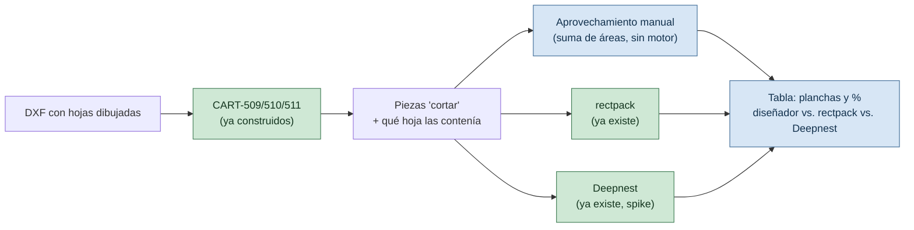

# PLAN (spike): medir el corte manual del diseñador contra los dos motores

> Sub-proyecto 3 de 3 (`ANALISIS-MUESTRA-MEGACARTELES.md §6`, orden 1 → 3 → 2). Corre el benchmark que ya estaba esperado: [`COMO-FUNCIONA-CADA-MOTOR.md`](COMO-FUNCIONA-CADA-MOTOR.md) tiene un banner desde 2026-09-08 que dice *"el benchmark real espera a tener geometría de corte real del cliente"*, y [`SPIKE-CDR.md`](SPIKE-CDR.md) da `Muestra Vectores.cdr` por "no confirmado como trabajo para anidar". El análisis de `ANALISIS-MUESTRA-MEGACARTELES.md` confirma que sí lo es — 8 chapas reales de 2440×1220 mm.
>
> **Es un spike, como su antecesor `nesting-engine/`: no agrega historias a `BACKLOG.md`, no persiste nada, no toma la decisión `D-01` por sí solo** — la informa. Ese es el encuadre elegido para este plan.
>
> Depende de que exista, aunque sea como función suelta (no hace falta la API ni la pantalla de revisión), la clasificación de `CART-509`/`CART-510`/`CART-511` — sin eso no hay manera de saber qué piezas cayeron en qué hoja.
>
> Índice del proyecto: [`../README.md`](../README.md) · [`ANALISIS-MUESTRA-MEGACARTELES.md`](ANALISIS-MUESTRA-MEGACARTELES.md) · [`PLAN-ANALISIS-DXF.md`](PLAN-ANALISIS-DXF.md) · [`COMO-FUNCIONA-CADA-MOTOR.md`](COMO-FUNCIONA-CADA-MOTOR.md) · [`SPIKE-CDR.md`](SPIKE-CDR.md) · [`REGISTRO.md`](REGISTRO.md) (`D-01`)
>
> **Versión:** 1.0 · **Fecha:** 2026-09-25

---

## Qué resuelve, en una frase

Agregar una tercera columna — **"diseñador (manual)"** — a la comparación que `comparar_motores.py` ya hace entre `rectpack` y Deepnest, y correrla sobre las piezas reales de Megacarteles en vez de sobre `carrusel.dxf`/`repisas.dxf` (contenido genérico bajado de internet, según el propio banner del documento).

**Qué no resuelve.** Esta comparación solo cubre las piezas que **ya son `cortar`** según `CART-511` — las que el diseñador dejó dentro de una hoja. No dice nada sobre si el sistema podría haber hecho el seccionado del círculo completo (eso es sub-proyecto 2, y necesita responder primero `P-21`/`P-22`). Es una vara de medir para "acomodar", no para "cortar" (`ANALISIS-MUESTRA-MEGACARTELES.md §5`).

---

## Qué ya existe (no se toca)

| Pieza | Dónde | Qué hace |
|---|---|---|
| Motor rectangular | `nesting/engine.py` | Anida por bounding box, determinista |
| Motor Deepnest | `nesting-engine/` + `nesting/deepnest_cliente.py` | Anida por polígono real, spike de Fase 0 de `PLAN-MOTOR-NESTING-DEEPNEST.md` |
| `calcular_aprovechamiento` | `nesting/aprovechamiento.py` | Área real / área total de planchas, ya usada por ambos motores |
| Script comparativo | `backend/scripts/comparar_motores.py` | Corre los dos motores sobre el mismo DXF, misma pieza, y arma la tabla + HTML lado a lado |

Ninguno de los cuatro sabe hoy qué piezas vinieron ya anidadas a mano por un humano — es lo único que falta.

---

## Lo nuevo: medir el aprovechamiento manual

**No se ejecuta ningún motor para el lado "diseñador".** Los datos ya están en el DXF: para cada hoja que detecte `CART-510` dentro de un diseño, sumar el área real (`PiezaImportada.area_real_mm2`, ya la calcula `parsear_dxf`) de las piezas `cortar` (`CART-511`) que cayeron dentro de esa hoja, y dividirlo por el área de las hojas usadas. Es la misma fórmula que `ReporteAprovechamiento.porcentaje_aprovechamiento` ya define — se arma un `ReporteAprovechamiento` con esos números en vez de con los de un `ResultadoAnidado`.

---

## Qué se corrige cuando termine

- **`COMO-FUNCIONA-CADA-MOTOR.md`**: se retira o se actualiza el banner que espera este benchmark, con la tabla real en vez de la advertencia.
- **`SPIKE-CDR.md` §3.1**: corregir "no es un trabajo de chapa" — si el `.cdr` se remide con la escala correcta (`ANALISIS-MUESTRA-MEGACARTELES.md §1`), coincide con las 8 hojas del `.dxf`.
- **`REGISTRO.md` `D-01`**: este spike no cierra la decisión (sigue el flujo de PR normal, según `BITACORA.md` 2026-09-01 (4)), pero le suma el primer dato sobre piezas reales del cliente, no genéricas.

---

## Cómo correrlo

Extiende `comparar_motores.py` con un flag nuevo (p. ej. `--comparar-manual`) que, en vez de leer todas las piezas del DXF sin criterio, usa la clasificación de `CART-509`/`CART-510`/`CART-511` para: (a) tomar solo las piezas `cortar` de un diseño, (b) calcular el aprovechamiento manual de sus hojas de origen, y (c) correr ambos motores sobre ese mismo conjunto contra el mismo formato de catálogo que usaron las hojas. La salida agrega una fila a la tabla y a la comparación HTML que el script ya produce.

**Orden de ejecución:** este plan no puede correr antes de que `CART-509`/`CART-510`/`CART-511` existan, aunque sea como funciones sin API — es la razón del orden 1 → 3 acordado.
