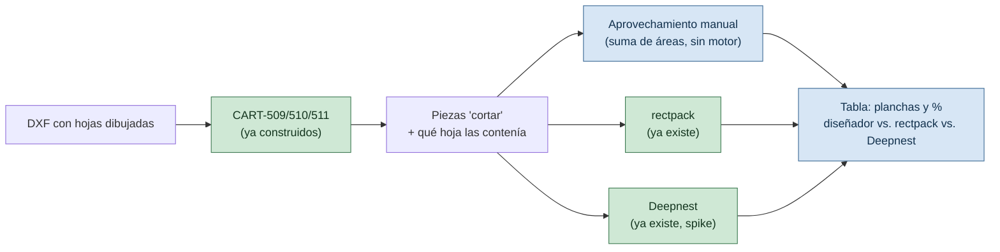

# PLAN (spike): medir el corte manual del diseñador contra los dos motores

> Sub-proyecto 3 de 3 (`ANALISIS-MUESTRA-MEGACARTELES.md §6`, orden 1 → 3 → 2). Corre el benchmark que ya estaba esperado: [`COMO-FUNCIONA-CADA-MOTOR.md`](COMO-FUNCIONA-CADA-MOTOR.md) tiene un banner desde 2026-09-08 que dice *"el benchmark real espera a tener geometría de corte real del cliente"*, y [`SPIKE-CDR.md`](SPIKE-CDR.md) da `Muestra Vectores.cdr` por "no confirmado como trabajo para anidar". El análisis de `ANALISIS-MUESTRA-MEGACARTELES.md` confirma que sí lo es — 8 chapas reales de 2440×1220 mm.
>
> **Es un spike, como su antecesor `nesting-engine/`: no agrega historias a `BACKLOG.md`, no persiste nada, no toma la decisión `D-01` por sí solo** — la informa. Ese es el encuadre elegido para este plan.
>
> Depende de que exista, aunque sea como función suelta (no hace falta la API ni la pantalla de revisión), la clasificación de `CART-509`/`CART-510`/`CART-511` — sin eso no hay manera de saber qué piezas cayeron en qué hoja.
>
> Índice del proyecto: [`../README.md`](../README.md) · [`ANALISIS-MUESTRA-MEGACARTELES.md`](ANALISIS-MUESTRA-MEGACARTELES.md) · [`PLAN-ANALISIS-DXF.md`](PLAN-ANALISIS-DXF.md) · [`COMO-FUNCIONA-CADA-MOTOR.md`](COMO-FUNCIONA-CADA-MOTOR.md) · [`SPIKE-CDR.md`](SPIKE-CDR.md) · [`REGISTRO.md`](REGISTRO.md) (`D-01`)
>
> **Versión:** 1.0 · **Fecha:** 2026-09-25

---

## Qué resuelve, en una frase

Agregar una tercera columna — **"diseñador (manual)"** — a la comparación que `comparar_motores.py` ya hace entre `rectpack` y Deepnest, y correrla sobre las piezas reales de Megacarteles en vez de sobre `carrusel.dxf`/`repisas.dxf` (contenido genérico bajado de internet, según el propio banner del documento).

**Qué no resuelve.** Esta comparación solo cubre las piezas que **ya son `cortar`** según `CART-511` — las que el diseñador dejó dentro de una hoja. No dice nada sobre si el sistema podría haber hecho el seccionado del círculo completo (eso es sub-proyecto 2, y necesita responder primero `P-21`/`P-22`). Es una vara de medir para "acomodar", no para "cortar" (`ANALISIS-MUESTRA-MEGACARTELES.md §5`).

---

## Qué ya existe (no se toca)

| Pieza | Dónde | Qué hace |
|---|---|---|
| Motor rectangular | `nesting/engine.py` | Anida por bounding box, determinista |
| Motor Deepnest | `nesting-engine/` + `nesting/deepnest_cliente.py` | Anida por polígono real, spike de Fase 0 de `PLAN-MOTOR-NESTING-DEEPNEST.md` |
| `calcular_aprovechamiento` | `nesting/aprovechamiento.py` | Área real / área total de planchas, ya usada por ambos motores |
| Script comparativo | `backend/scripts/comparar_motores.py` | Corre los dos motores sobre el mismo DXF, misma pieza, y arma la tabla + HTML lado a lado |

Ninguno de los cuatro sabe hoy qué piezas vinieron ya anidadas a mano por un humano — es lo único que falta.

---

## Lo nuevo: medir el aprovechamiento manual

**No se ejecuta ningún motor para el lado "diseñador".** Los datos ya están en el DXF: para cada hoja que detecte `CART-510` dentro de un diseño, sumar el área real (`PiezaImportada.area_real_mm2`, ya la calcula `parsear_dxf`) de las piezas `cortar` (`CART-511`) que cayeron dentro de esa hoja, y dividirlo por el área de las hojas usadas. Es la misma fórmula que `ReporteAprovechamiento.porcentaje_aprovechamiento` ya define — se arma un `ReporteAprovechamiento` con esos números en vez de con los de un `ResultadoAnidado`.



---

## Qué se corrige cuando termine

- **`COMO-FUNCIONA-CADA-MOTOR.md`**: se retira o se actualiza el banner que espera este benchmark, con la tabla real en vez de la advertencia.
- **`SPIKE-CDR.md` §3.1**: corregir "no es un trabajo de chapa" — si el `.cdr` se remide con la escala correcta (`ANALISIS-MUESTRA-MEGACARTELES.md §1`), coincide con las 8 hojas del `.dxf`.
- **`REGISTRO.md` `D-01`**: este spike no cierra la decisión (sigue el flujo de PR normal, según `BITACORA.md` 2026-09-01 (4)), pero le suma el primer dato sobre piezas reales del cliente, no genéricas.

---

## Cómo correrlo

Extiende `comparar_motores.py` con un flag nuevo (p. ej. `--comparar-manual`) que, en vez de leer todas las piezas del DXF sin criterio, usa la clasificación de `CART-509`/`CART-510`/`CART-511` para: (a) tomar solo las piezas `cortar` de un diseño, (b) calcular el aprovechamiento manual de sus hojas de origen, y (c) correr ambos motores sobre ese mismo conjunto contra el mismo formato de catálogo que usaron las hojas. La salida agrega una fila a la tabla y a la comparación HTML que el script ya produce.

**Orden de ejecución:** este plan no puede correr antes de que `CART-509`/`CART-510`/`CART-511` existan, aunque sea como funciones sin API — es la razón del orden 1 → 3 acordado.

---

## Resultados — Belgrano (2026-09-25)

Corrida con `--disenio-de "Muestra Vectores-267"` sobre `Muestra Vectores.dxf` (escala 100), chapa 2440 × 1220 mm. El diseño tiene 8 hojas y 48 piezas `cortar`, todas dentro de alguna hoja.

| | Chapas | Aprovechamiento real | Compacidad | Mayor sobrante (hoja menos ocupada) |
|---|---|---|---|---|
| **Diseñador (a mano)** | **8** | **37,3 %** | 41,5 % | 740 × 820 mm (20,4 %) |
| rectpack (motor actual) | 12 | 24,9 % | 27,4 % | 740 × 760 mm (18,9 %) |
| Deepnest (spike) | **sin resultado** | | | contornos crudos: > 24 h estimadas; simplificado a 2 mm: ~1 h estimada. Ambas corridas se cortaron (ver el diagnóstico) |

**Lectura.** rectpack necesita 4 chapas más que el diseñador (+50 % de material). No es una sorpresa: anida la caja de cada pieza (`ADR-01`), y las cuñas del anillo son arcos cuya caja está mayormente vacía; el diseñador las encastró una contra otra.

**Margen y kerf (`P-03`).** Con los provisorios `PAR-01` (kerf 2 mm) y `PAR-02` (margen 10 mm), **ningún motor puede colocar las 4 cuñas grandes**: miden 2.292 × 1.220 mm, exactamente el alto de la chapa. El diseñador las anidó sin margen en ese borde. La tabla de arriba se corrió con kerf, margen y separación en 0 para comparar contra lo que muestra el dibujo. Hay que confirmar con el taller qué margen dejan de verdad; si es mayor que cero, el propio anidado manual de la muestra no se podría cortar tal cual.

**Deepnest en geometría real.** Las 48 piezas suman 9.435 vértices (mediana 145, máximo 771: splines aplanadas con `PAR-07` = 0,1 mm). La primera evaluación del motor —NFP de todos los pares, secuencial porque el spike quitó la capa paralela (`PLAN-MOTOR-NESTING-DEEPNEST.md §2.1`)— tardó más de 12 minutos, y `--tiempo-max-ms` no la corta: el tope solo se revisa *entre* evaluaciones. En carrusel/repisas respondía en segundos. Simplificar contornos baja los vértices ×2,1 a 0,5 mm (área ±0,56 %) y ×3,1 a 2 mm (±3,5 %): no cambia el orden de magnitud. Es evidencia directa para `D-01` y `PAR-25`.

### Por qué Deepnest es tan lento acá (diagnóstico, 2026-09-25)

**Causa.** El motor recibe los contornos crudos del parser. El Deepnest original siempre los simplifica al importar (`simplifyPolygon`, con `curveTolerance`), pero esa función vive en `@deepnest/svg-preprocessor`, que se excluyó por licencia AGPL (`PLAN-MOTOR-NESTING-DEEPNEST.md §1`); en `nesting-engine/src/config.js` quedó `simplify: false`. Con piezas chicas (carrusel, repisas) no se notaba; con arcos de megacartel, sí. Además, `--tiempo-max-ms` no protege: el reloj solo se revisa *entre* evaluaciones, y la primera ya es la cara.

**Medición de un par de NFP** (`MinkowskiSum` de Clipper, como `calcularNfpExterior`), muestra de 41 pares repartidos entre los 1.128, contornos simplificados **hacia afuera** (`buffer(t)` + `simplify(t)`: el simplificado contiene al original, así que una posición válida para él lo es para la pieza real):

| Contornos | Vértices | Por par | 1.128 pares, una rotación |
|---|---|---|---|
| Crudos | 8.064 | 78 s | ~24 h |
| 0,3 mm | 3.788 | 4,5 s | 84 min |
| 0,5 mm | 3.079 | 0,95 s | 18 min |
| 1 mm | 2.269 | 0,32 s | 6 min |
| 2 mm | 1.683 | 0,11 s | 2 min |

Simplificar hacia afuera 1–2 mm casi no cuesta material: `prepararPieza` ya agranda cada pieza medio kerf + separación (3,5 mm por lado con los provisorios), y la tolerancia entra en ese margen.

**Pero no alcanza sola.** La corrida completa a 2 mm avanzó el cálculo de NFP de la primera evaluación a ~1,3 % por minuto (9 % a los 7 min): unas 27 veces más lento que la muestra, porque el motor arranca por los pares de las piezas más grandes y suma NFPs interiores de los huecos (sin simplificar en esta variante). `PAR-09` pide 120 s.

**Palancas que quedan**, de más barata a más cara:
1. Simplificar también los agujeros (hacia adentro, para que el hueco disponible nunca crezca).
2. Paralelizar los NFP: la máquina tiene 8 núcleos y el spike usa 1 (la capa paralela del original no corre en Node, §2.1 del plan de Deepnest).
3. ~~Usar el addon C++ `@deepnest/calculate-nfp` para los NFP exteriores.~~ **Descartada, medido:** en los pares de cuñas el addon tarda 75–178 s contra 11 s de Clipper, con el mismo NFP (área idéntica).

**Dónde está el costo de verdad (medido en el orden del motor).** Los primeros 80 pares tardan 101 s solo en NFP exteriores, y 71 s de esos salen de **6 pares: las 4 cuñas del anillo entre sí** (10–15 s cada uno, con ~115 vértices por cuña ya simplificada). No es cantidad de vértices: es el peor caso del método. `MinkowskiSum` genera un cuadrilátero por par de aristas (~13.000) y después los une; con dos arcos cóncavos casi iguales, esos cuadriláteros se superponen masivamente y la unión explota. El resto (~140 s en la corrida real) son los NFP interiores de los huecos.

Criterio de producto (Enzo, 2026-09-25): si el anidado automático tarda más que hacerlo a mano, no aporta. `PAR-09` (120 s) es la vara.

**Cómo repetirlo.**

```powershell
python -X utf8 scripts/comparar_motores.py --dxf "<ruta>/Muestra Vectores.dxf" --escala-a-mm 100 --plancha-mm 2440 1220 --kerf-mm 0 --margen-mm 0 --separacion-mm 0 --disenio-de "Muestra Vectores-267" --out local/belgrano.html
```

---

## Estado al cierre (2026-09-26)

**Qué quedó respondido.** En Belgrano, con las 48 piezas `cortar` y una chapa de 2440 × 1220 mm, el diseñador usó **8 chapas** y el motor actual (rectpack) necesita **12**: +50 % de material. Es el primer número real contra el que medir cualquier motor nuevo.

**Qué no quedó respondido.** Si Deepnest iguala o mejora las 8 chapas: en esta máquina y con este código no llega a devolver un resultado en un tiempo razonable, y el criterio de producto es que el anidado automático no tarde más que hacerlo a mano.

**Qué queda abierto para decidir** (ninguno se dio de alta en `REGISTRO.md` todavía):
- ¿Cuánto tarda el diseñador en armar las hojas de un trabajo como Belgrano? Sin ese número, "no tarda más que a mano" no tiene con qué compararse; hoy solo está `PAR-09` (120 s) como vara.
- `P-03`: margen y kerf reales del taller. Si son mayores que cero, el propio anidado manual de la muestra no se podría cortar tal cual.
- Rumbo técnico para piezas grandes y curvas: las mismas 4 cuñas de 2.292 × 1.220 mm son las que no entran con el margen provisorio y las que hacen explotar el cálculo de Deepnest. Una alternativa a evaluar es tratarlas aparte del anidado genérico (letras y piezas chicas al motor; cuñas con reglas propias), que se conecta con el sub-proyecto 2 (seccionado).

**Sin tocar:** el spike no cambió `nesting-engine/` ni `D-01`. Los scripts de medición del diagnóstico (NFP por par, variantes simplificadas) fueron descartables y no están versionados.
