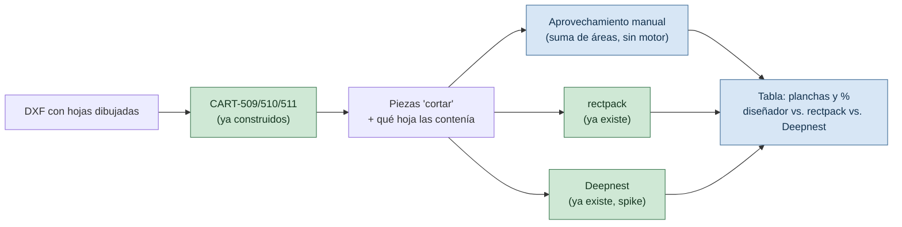

# PLAN (spike): medir el corte manual del diseñador contra los dos motores

> Sub-proyecto 3 de 3 (`ANALISIS-MUESTRA-MEGACARTELES.md §6`, orden 1 → 3 → 2). Corre el benchmark que ya estaba esperado: [`COMO-FUNCIONA-CADA-MOTOR.md`](COMO-FUNCIONA-CADA-MOTOR.md) tiene un banner desde 2026-09-08 que dice *"el benchmark real espera a tener geometría de corte real del cliente"*, y [`SPIKE-CDR.md`](SPIKE-CDR.md) da `Muestra Vectores.cdr` por "no confirmado como trabajo para anidar". El análisis de `ANALISIS-MUESTRA-MEGACARTELES.md` confirma que sí lo es — 8 chapas reales de 2440×1220 mm.
>
> **Es un spike, como su antecesor `nesting-engine/`: no agrega historias a `BACKLOG.md`, no persiste nada, no toma la decisión `D-01` por sí solo** — la informa. Ese es el encuadre elegido para este plan.
>
> Depende de que exista, aunque sea como función suelta (no hace falta la API ni la pantalla de revisión), la clasificación de `CART-509`/`CART-510`/`CART-511` — sin eso no hay manera de saber qué piezas cayeron en qué hoja.
>
> Índice del proyecto: [`../README.md`](../README.md) · [`ANALISIS-MUESTRA-MEGACARTELES.md`](ANALISIS-MUESTRA-MEGACARTELES.md) · [`PLAN-ANALISIS-DXF.md`](PLAN-ANALISIS-DXF.md) · [`COMO-FUNCIONA-CADA-MOTOR.md`](COMO-FUNCIONA-CADA-MOTOR.md) · [`SPIKE-CDR.md`](SPIKE-CDR.md) · [`REGISTRO.md`](REGISTRO.md) (`D-01`)
>
> **Versión:** 1.0 · **Fecha:** 2026-09-25

---

## Qué resuelve, en una frase

Agregar una tercera columna — **"diseñador (manual)"** — a la comparación que `comparar_motores.py` ya hace entre `rectpack` y Deepnest, y correrla sobre las piezas reales de Megacarteles en vez de sobre `carrusel.dxf`/`repisas.dxf` (contenido genérico bajado de internet, según el propio banner del documento).

**Qué no resuelve.** Esta comparación solo cubre las piezas que **ya son `cortar`** según `CART-511` — las que el diseñador dejó dentro de una hoja. No dice nada sobre si el sistema podría haber hecho el seccionado del círculo completo (eso es sub-proyecto 2, y necesita responder primero `P-21`/`P-22`). Es una vara de medir para "acomodar", no para "cortar" (`ANALISIS-MUESTRA-MEGACARTELES.md §5`).

---

## Qué ya existe (no se toca)

| Pieza | Dónde | Qué hace |
|---|---|---|
| Motor rectangular | `nesting/engine.py` | Anida por bounding box, determinista |
| Motor Deepnest | `nesting-engine/` + `nesting/deepnest_cliente.py` | Anida por polígono real, spike de Fase 0 de `PLAN-MOTOR-NESTING-DEEPNEST.md` |
| `calcular_aprovechamiento` | `nesting/aprovechamiento.py` | Área real / área total de planchas, ya usada por ambos motores |
| Script comparativo | `backend/scripts/comparar_motores.py` | Corre los dos motores sobre el mismo DXF, misma pieza, y arma la tabla + HTML lado a lado |

Ninguno de los cuatro sabe hoy qué piezas vinieron ya anidadas a mano por un humano — es lo único que falta.

---

## Lo nuevo: medir el aprovechamiento manual

**No se ejecuta ningún motor para el lado "diseñador".** Los datos ya están en el DXF: para cada hoja que detecte `CART-510` dentro de un diseño, sumar el área real (`PiezaImportada.area_real_mm2`, ya la calcula `parsear_dxf`) de las piezas `cortar` (`CART-511`) que cayeron dentro de esa hoja, y dividirlo por el área de las hojas usadas. Es la misma fórmula que `ReporteAprovechamiento.porcentaje_aprovechamiento` ya define — se arma un `ReporteAprovechamiento` con esos números en vez de con los de un `ResultadoAnidado`.


```mermaid
flowchart LR
    DXF["DXF con hojas dibujadas"] --> AN["CART-509/510/511<br/>(ya construidos)"]
    AN --> M["Piezas 'cortar'<br/>+ qué hoja las contenía"]
    M --> MAN["Aprovechamiento manual<br/>(suma de áreas, sin motor)"]
    M --> RECT["rectpack<br/>(ya existe)"]
    M --> DEEP["Deepnest<br/>(ya existe, spike)"]
    MAN --> TABLA["Tabla: planchas y %<br/>diseñador vs. rectpack vs. Deepnest"]
    RECT --> TABLA
    DEEP --> TABLA

    classDef nuevo fill:#d7e6f5,stroke:#3d6b96,color:#12314d
    classDef listo fill:#cfe8d5,stroke:#3d7a52,color:#14351f
    class MAN,TABLA nuevo
    class AN,RECT,DEEP listo
```

---

## Qué se corrige cuando termine

- **`COMO-FUNCIONA-CADA-MOTOR.md`**: se retira o se actualiza el banner que espera este benchmark, con la tabla real en vez de la advertencia.
- **`SPIKE-CDR.md` §3.1**: corregir "no es un trabajo de chapa" — si el `.cdr` se remide con la escala correcta (`ANALISIS-MUESTRA-MEGACARTELES.md §1`), coincide con las 8 hojas del `.dxf`.
- **`REGISTRO.md` `D-01`**: este spike no cierra la decisión (sigue el flujo de PR normal, según `BITACORA.md` 2026-09-01 (4)), pero le suma el primer dato sobre piezas reales del cliente, no genéricas.

---

## Cómo correrlo

Extiende `comparar_motores.py` con un flag nuevo (p. ej. `--comparar-manual`) que, en vez de leer todas las piezas del DXF sin criterio, usa la clasificación de `CART-509`/`CART-510`/`CART-511` para: (a) tomar solo las piezas `cortar` de un diseño, (b) calcular el aprovechamiento manual de sus hojas de origen, y (c) correr ambos motores sobre ese mismo conjunto contra el mismo formato de catálogo que usaron las hojas. La salida agrega una fila a la tabla y a la comparación HTML que el script ya produce.

**Orden de ejecución:** este plan no puede correr antes de que `CART-509`/`CART-510`/`CART-511` existan, aunque sea como funciones sin API — es la razón del orden 1 → 3 acordado.

---

## Resultados — Belgrano (2026-09-25)

Corrida con `--disenio-de "Muestra Vectores-267"` sobre `Muestra Vectores.dxf` (escala 100), chapa 2440 × 1220 mm. El diseño tiene 8 hojas y 48 piezas `cortar`, todas dentro de alguna hoja.

| | Chapas | Aprovechamiento real | Compacidad | Mayor sobrante (hoja menos ocupada) |
|---|---|---|---|---|
| **Diseñador (a mano)** | **8** | **37,3 %** | 41,5 % | 740 × 820 mm (20,4 %) |
| rectpack (motor actual) | 12 | 24,9 % | 27,4 % | 740 × 760 mm (18,9 %) |
| Deepnest (spike) | **sin resultado** | | | contornos crudos: > 24 h estimadas; simplificado a 2 mm: ~1 h estimada. Ambas corridas se cortaron (ver el diagnóstico) |

> **Corrección (2026-09-26): los números de rectpack y de Deepnest de esta sección contaban dos veces las «islas».** 17 de las 48 piezas llenan al 100 % el agujero de otra (el centro de la O, la B, la P y la isla de cada tramo) y se pasaron a los motores como cajas sueltas. Sin contarlas aparte, rectpack necesita **11 chapas, no 12** (27,1 % de aprovechamiento), o sea +37,5 % de material y no +50 %. Detalle y qué hacer con las islas en «Resultados de A2», al final.

**Lectura.** rectpack necesita 4 chapas más que el diseñador (+50 % de material, corregido a +37,5 % arriba). No es una sorpresa: anida la caja de cada pieza (`ADR-01`), y las cuñas del anillo son arcos cuya caja está mayormente vacía; el diseñador las encastró una contra otra.

**Margen y kerf (`P-03`).** Con los provisorios `PAR-01` (kerf 2 mm) y `PAR-02` (margen 10 mm), **ningún motor puede colocar las 4 cuñas grandes**: miden 2.292 × 1.220 mm, exactamente el alto de la chapa. El diseñador las anidó sin margen en ese borde. La tabla de arriba se corrió con kerf, margen y separación en 0 para comparar contra lo que muestra el dibujo. Hay que confirmar con el taller qué margen dejan de verdad; si es mayor que cero, el propio anidado manual de la muestra no se podría cortar tal cual.

**Deepnest en geometría real.** Las 48 piezas suman 9.435 vértices (mediana 145, máximo 771: splines aplanadas con `PAR-07` = 0,1 mm). La primera evaluación del motor —NFP de todos los pares, secuencial porque el spike quitó la capa paralela (`PLAN-MOTOR-NESTING-DEEPNEST.md §2.1`)— tardó más de 12 minutos, y `--tiempo-max-ms` no la corta: el tope solo se revisa *entre* evaluaciones. En carrusel/repisas respondía en segundos. Simplificar contornos baja los vértices ×2,1 a 0,5 mm (área ±0,56 %) y ×3,1 a 2 mm (±3,5 %): no cambia el orden de magnitud. Es evidencia directa para `D-01` y `PAR-25`.

### Por qué Deepnest es tan lento acá (diagnóstico, 2026-09-25)

**Causa.** El motor recibe los contornos crudos del parser. El Deepnest original siempre los simplifica al importar (`simplifyPolygon`, con `curveTolerance`), pero esa función vive en `@deepnest/svg-preprocessor`, que se excluyó por licencia AGPL (`PLAN-MOTOR-NESTING-DEEPNEST.md §1`); en `nesting-engine/src/config.js` quedó `simplify: false`. Con piezas chicas (carrusel, repisas) no se notaba; con arcos de megacartel, sí. Además, `--tiempo-max-ms` no protege: el reloj solo se revisa *entre* evaluaciones, y la primera ya es la cara.

**Medición de un par de NFP** (`MinkowskiSum` de Clipper, como `calcularNfpExterior`), muestra de 41 pares repartidos entre los 1.128, contornos simplificados **hacia afuera** (`buffer(t)` + `simplify(t)`: el simplificado contiene al original, así que una posición válida para él lo es para la pieza real):

| Contornos | Vértices | Por par | 1.128 pares, una rotación |
|---|---|---|---|
| Crudos | 8.064 | 78 s | ~24 h |
| 0,3 mm | 3.788 | 4,5 s | 84 min |
| 0,5 mm | 3.079 | 0,95 s | 18 min |
| 1 mm | 2.269 | 0,32 s | 6 min |
| 2 mm | 1.683 | 0,11 s | 2 min |

Simplificar hacia afuera 1–2 mm casi no cuesta material: `prepararPieza` ya agranda cada pieza medio kerf + separación (3,5 mm por lado con los provisorios), y la tolerancia entra en ese margen.

**Pero no alcanza sola.** La corrida completa a 2 mm avanzó el cálculo de NFP de la primera evaluación a ~1,3 % por minuto (9 % a los 7 min): unas 27 veces más lento que la muestra, porque el motor arranca por los pares de las piezas más grandes y suma NFPs interiores de los huecos (sin simplificar en esta variante). `PAR-09` pide 120 s.

**Palancas que quedan**, de más barata a más cara:
1. Simplificar también los agujeros (hacia adentro, para que el hueco disponible nunca crezca).
2. Paralelizar los NFP: la máquina tiene 8 núcleos y el spike usa 1 (la capa paralela del original no corre en Node, §2.1 del plan de Deepnest).
3. ~~Usar el addon C++ `@deepnest/calculate-nfp` para los NFP exteriores.~~ **Descartada, medido:** en los pares de cuñas el addon tarda 75–178 s contra 11 s de Clipper, con el mismo NFP (área idéntica).

**Dónde está el costo de verdad (medido en el orden del motor).** Los primeros 80 pares tardan 101 s solo en NFP exteriores, y 71 s de esos salen de **6 pares: las 4 cuñas del anillo entre sí** (10–15 s cada uno, con ~115 vértices por cuña ya simplificada). No es cantidad de vértices: es el peor caso del método. `MinkowskiSum` genera un cuadrilátero por par de aristas (~13.000) y después los une; con dos arcos cóncavos casi iguales, esos cuadriláteros se superponen masivamente y la unión explota. El resto (~140 s en la corrida real) son los NFP interiores de los huecos.

Criterio de producto (Enzo, 2026-09-25): si el anidado automático tarda más que hacerlo a mano, no aporta. `PAR-09` (120 s) es la vara.

**Cómo repetirlo.**

```powershell
python -X utf8 scripts/comparar_motores.py --dxf "<ruta>/Muestra Vectores.dxf" --escala-a-mm 100 --plancha-mm 2440 1220 --kerf-mm 0 --margen-mm 0 --separacion-mm 0 --disenio-de "Muestra Vectores-267" --out local/belgrano.html
```

---

## Estado al cierre (2026-09-26)

**Qué quedó respondido.** En Belgrano, con las 48 piezas `cortar` y una chapa de 2440 × 1220 mm, el diseñador usó **8 chapas** y el motor actual (rectpack) necesita **12** (corregido el 2026-09-26: **11**, sin contar las islas como cajas sueltas): +50 % de material (+37,5 % ya corregido). Es el primer número real contra el que medir cualquier motor nuevo.

**Qué no quedó respondido.** Si Deepnest iguala o mejora las 8 chapas: en esta máquina y con este código no llega a devolver un resultado en un tiempo razonable, y el criterio de producto es que el anidado automático no tarde más que hacerlo a mano.

**Qué quedaba abierto para decidir.** Actualizado el 2026-09-26: los tres puntos ya están dados de alta en `REGISTRO.md`, y el rumbo y el orden de trabajo están en [`PLAN-RUMBO-ANIDADO-Y-REVISION.md`](PLAN-RUMBO-ANIDADO-Y-REVISION.md).
- ¿Cuánto tarda el diseñador en armar las hojas de un trabajo como Belgrano? Sin ese número, "no tarda más que a mano" no tiene con qué compararse; hoy solo está `PAR-09` (120 s) como vara. **Resuelto:** la empresa dio un rango, cargado en `B-17`; falta saber si incluye partir el aro.
- `P-03`: margen y kerf reales del taller. Si son mayores que cero, el propio anidado manual de la muestra no se podría cortar tal cual. **Actualizado:** se partió en *entre piezas vecinas* (hay una estimación) y *margen de borde* (sin dato). El borde es el que decide el caso: pregunta nueva `P-28`.
- Rumbo técnico para piezas grandes y curvas: las mismas 4 cuñas de 2.292 × 1.220 mm son las que no entran con el margen provisorio y las que hacen explotar el cálculo de Deepnest. Una alternativa a evaluar es tratarlas aparte del anidado genérico (letras y piezas chicas al motor; cuñas con reglas propias), que se conecta con el sub-proyecto 2 (seccionado). **Actualizado:** las «cuñas» son 8 tramos del aro grande de Belgrano, **uno por hoja** (4 de 2292 × 1220 y 4 de 1941 × 1085), y cada uno ocupa entre 10 % y 21 % del área de su hoja. El número de chapas del diseñador lo fija cómo se partió el aro, no cómo se acomodaron las letras: el 37,3 % de aprovechamiento es el costo de esas bandas finas. La recomendación es sacarlas del anidado genérico y anidar solo las letras en los huecos; detalle y tabla por hoja en `PLAN-RUMBO-ANIDADO-Y-REVISION.md §2.1` y `§3`.

**Sin tocar:** el spike no cambió `nesting-engine/` ni `D-01`. Los scripts de medición del diagnóstico (NFP por par, variantes simplificadas) fueron descartables y no están versionados.

---

## Resultados de A1: go para el anidado híbrido (2026-09-26)

Las dos preguntas de sí o no del paso A1 de [`PLAN-RUMBO-ANIDADO-Y-REVISION.md`](PLAN-RUMBO-ANIDADO-Y-REVISION.md). Kerf, separación y margen en 0, igual que la comparación de Belgrano de arriba. Scripts descartables, sin versionar.

### 1. ¿Dos tramos del aro pueden compartir hoja? No: 0 de 28 pares

**Método.** Se fija un tramo y se mueve el otro (girado 0, 90, 180 y 270°) por todas las posiciones en que las dos cajas juntas entran en una hoja de 2440 × 1220, en las dos orientaciones, midiendo cuánto se superponen. Barrido a 5 mm y afinado a 1 y 0,25 mm en los pares más cercanos. No hace falta el NFP de Deepnest: la ventana de posiciones posibles es chica (296 × 0 mm entre dos tramos de 2292 × 1220), así que se barre entera en 124 s.

- **Los 4 tramos de 2292 × 1220** no se acercan: la mínima superposición va de 9 % a 13 % del menor.
- **Los 4 de 1941 × 1085** son los que más se acercan. Entre ellos la mínima superposición es **1,9 % del menor** (~5.700 mm²) y no baja con la grilla más fina: la fija el alto de la hoja (135 mm de holgura) contra el espesor de la banda. Son casi gemelos, así que con un corte algo distinto podrían compartir hoja: dato para el seccionado (A5).
- **Media vuelta y espejo** (observación de Enzo: un tramo del aro se puede invertir para aprovechar concavidades). La prueba ya giraba el segundo tramo 0, 90, 180 y 270°, y los mejores casos usan justamente la media vuelta. Se probó además el **espejo** (darlo vuelta como una hoja) en las 8 orientaciones: tampoco hay ningún par que comparta hoja (0 de 28) y la mínima superposición baja de 1,90 % a 1,85 %. Entre los tramos de 2292 × 1220 el espejo ayuda algo (de ~13 % a ~9 %) sin acercarse a entrar.
- **Lo que significa:** el piso de 8 chapas se sostiene con estos cortes. Y el cálculo de los 6 pares de tramos que se llevaba 71 de los primeros 101 s de Deepnest no hace falta.

### 2. ¿El motor respeta una plancha con obstáculos? Sí

El código lo contemplaba: `getInnerNfp` resta el NFP de cada `sheet.children` de la región válida (`nesting-engine/vendor/placement.js`, líneas 727-752). Se probó llamando a `anidar()` directo, porque el contrato `nest()` arma todas las planchas idénticas y sin obstáculos (`nesting-engine/src/index.js`). Dos escenarios, con 3 semillas cada uno, **todos verdes**:

- **Obstáculo cuadrado de 900 × 900** en una plancha de 1000 × 1000: solo la pieza de 80 entró en la hoja con obstáculo, en la franja libre. Las de 200 y 500 fueron a la hoja limpia. Ninguna pisó el obstáculo.
- **Obstáculo en «C»**, con una concavidad de 600 × 400 dentro de su propia caja: las dos piezas de 200 entraron en la concavidad y la de 500, que no cabe, fue a la hoja limpia. Es el caso real de un tramo curvo.

**Dos cosas a mirar en A2**, ambas leídas del código y por confirmar con la corrida real:

- La métrica de compacidad del motor cuenta solo las piezas colocadas, no el obstáculo. Las letras podrían agruparse hacia una esquina en vez de buscar el hueco del tramo. Siguen siendo válidas, pero conviene ver si el resultado es el que se quiere.
- Cómo se cuentan las hojas que el motor no llega a abrir. Cada hoja tiene su tramo, así que cuenta igual aunque no lleve letras: la composición del resultado tiene que sumarlas.

**Veredicto: go.** El anidado híbrido no tiene bloqueos técnicos hasta acá. Sigue A2 (las letras contra hojas ocupadas, con el tiempo medido). En el contrato solo cambia que `planchas` admita `obstaculos_mm` (A3, inciso d), y los dos escenarios de arriba sirven de tests cuando llegue ese paso.

---

## Resultados de A2: las letras contra hojas ocupadas (2026-09-26)

El paso A2 de [`PLAN-RUMBO-ANIDADO-Y-REVISION.md`](PLAN-RUMBO-ANIDADO-Y-REVISION.md). Ocho hojas de 2440 × 1220 mm, cada una con su tramo del aro como obstáculo, en la posición que le dio el diseñador; el motor coloca las piezas chicas con su búsqueda por defecto (3 generaciones, población 10, 28 evaluaciones), en un solo núcleo y con los NFP en serie. Los contornos que ve el motor van simplificados **hacia afuera** a 2 mm (los vértices bajan de 6.693 a ~1.480), y el resultado se **valida después contra los polígonos reales**, no contra los simplificados. Se llamó a `anidar()` del núcleo directo: el contrato `nest()` todavía no admite obstáculos. Scripts descartables, sin versionar.

### Las islas: 17 de las 48 piezas no son piezas sueltas

Las primeras corridas, con las 48 piezas, dieron resultados que hubo que descartar. Mirando por qué, se vio que **17 piezas llenan al 100 % el agujero de otra, con separación 0**: el centro de la O, la B y la P (9 casos) y la isla oscura dentro de la punta de cada tramo (8 casos, uno por tramo). El diseñador las deja en su lugar y no ocupan espacio propio. Sumadas valen 2,02 m² (22,8 % del área de las 48).

- **Efecto sobre lo medido antes.** Colocarlas como piezas sueltas contaba dos veces su área. Con las 48 como cajas, rectpack usaba 12 chapas; con las islas dentro de su letra o su tramo, **11** (27,1 %). Las corridas de Deepnest con 40 piezas sueltas (de 36 a 57 minutos, y una de ellas con 9 hojas al pedir hueco entre piezas) no son comparables y no se usan como conclusión; solo sirven para el tiempo.
- **Efecto sobre el sistema.** Hoy `CART-511` marca esas 17 como `cortar`, y cualquier motor las anida como piezas independientes. Hace falta una regla: una forma que llena el agujero de otra es una **contra-pieza** que viaja con su madre y no se anida sola (paso A3 del plan).
- **Duda para diseño (`P-29`).** ¿Las islas se usan o son descarte? Sin ellas el aprovechamiento del diseñador no es 37,3 % sino 28,8 %.

### Resultado, con las islas viajando con su letra o su tramo

23 piezas a anidar, más las 17 islas que van dentro. Tres corridas: sin hueco entre piezas, y con el hueco provisorio de `PAR-01` más `PAR-03` con dos semillas distintas. Margen de borde 0.

| | Diseñador | Híbrido, sin hueco | Híbrido, con hueco provisorio |
|---|---|---|---|
| Chapas | 8 | **8** | **8** y **8** (dos semillas) |
| Piezas colocadas | 48 | 23 de 23 | 23 de 23, las dos |
| Aprovechamiento real | 37,3 % | 37,3 % | 37,3 % |
| Hueco mínimo real | — | 2,2 mm | 9,2 y 8,8 mm (exigido: `PAR-01` + `PAR-03`) |
| Validación contra polígonos reales | — | OK | OK, las dos |
| Tiempo | 1,5 a 3 h (`B-17`) | 961 s | 845 s y 815 s |
| Mayor sobrante (hoja menos ocupada) | 740 × 820 mm (20,4 %) | 480 × 1220 mm (19,7 %) | 480 × 1220 mm (19,7 %) |

**Lectura.**

- **Paridad con el diseñador, robusta.** 8 chapas en las tres corridas, con y sin hueco entre piezas, con dos semillas: no es suerte de la búsqueda. El aprovechamiento coincide por construcción (mismo material en las mismas 8 hojas): la métrica solo distingue motores cuando cambia la cantidad de chapas (`COMO-FUNCIONA-CADA-MOTOR.md`, «la trampa de la métrica»).
- **Tiempo: 13,6 a 16 minutos**, contra 1,5 a 3 horas a mano (`B-17`), en un solo núcleo y con los NFP en serie. Está lejos de la meta interactiva de `PAR-09`, y es coherente con la propuesta de `D-12`: anidado irregular en segundo plano con aviso. Quedan sin usar dos palancas: paralelizar los NFP (la máquina tiene 8 núcleos) y bajar la cantidad de evaluaciones.
- **Forma del sobrante.** El motor junta las letras en 6 hojas y deja 2 con solo el tramo, así que el sobrante es una tira entera de 480 × 1220 mm, de área parecida al bloque del diseñador pero de otra forma. Qué forma conviene es una decisión de producto, no del motor (`COMO-FUNCIONA-CADA-MOTOR.md`, «el sobrante útil»).
- **Tolerancia de simplificación.** A 1 mm en vez de 2 mm no mejora la cantidad de chapas y tarda más (57 minutos contra 36 en las corridas de 40 piezas). Con 2 mm alcanza.
- **Con hueco provisorio, rectpack no puede colocar** las 4 piezas de 2292 × 1220 (miden el alto de la chapa, `P-28`). El híbrido sí, porque respeta la posición que el diseñador le dio al tramo: no es una ventaja del motor sino del planteo, y no reemplaza contestar `P-28`.

**Lo que no prueba.**

- **Un solo diseño.** Falta el otro diseño en alcance de la muestra (`PLAN-RUMBO-ANIDADO-Y-REVISION.md §2.4`).
- **Las letras se anidaron macizas**, con los agujeros rellenos: conservador. El anidado en huecos no hizo falta acá.
- **La variante de orientación del tramo** (media vuelta, espejo) no se probó: en Belgrano todo entra sin ella.
- **Contornos agrandados hasta 2 mm** hacia afuera: conservador, y por eso se valida contra la geometría real.

**Veredicto de A2: cumple el criterio de éxito.** Las piezas chicas entran en las 8 hojas de los tramos, con paridad de chapas, en minutos y no en horas. Sigue A3, con un inciso previo para las islas.
