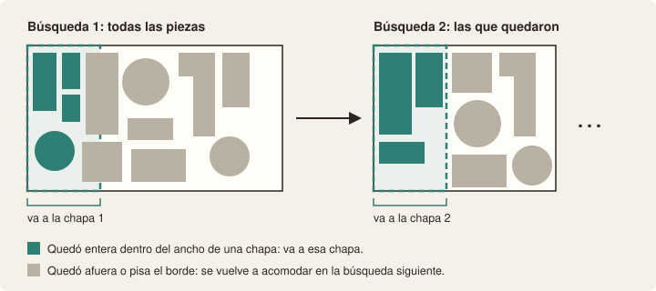
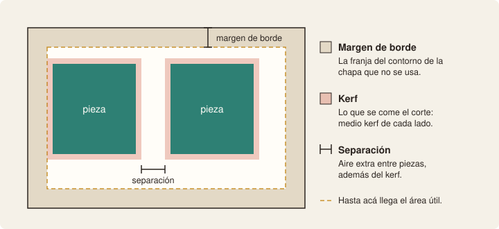
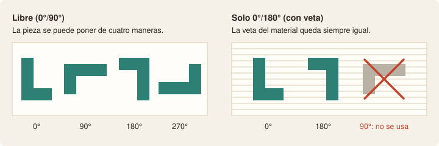
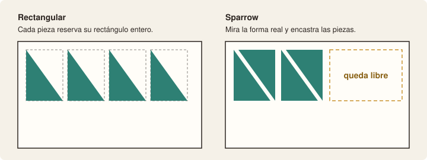
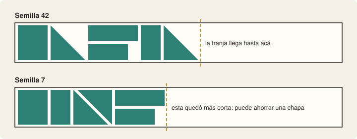
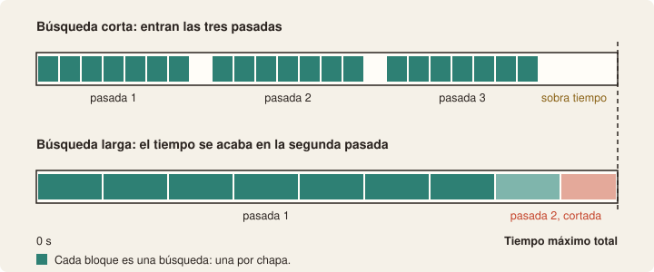
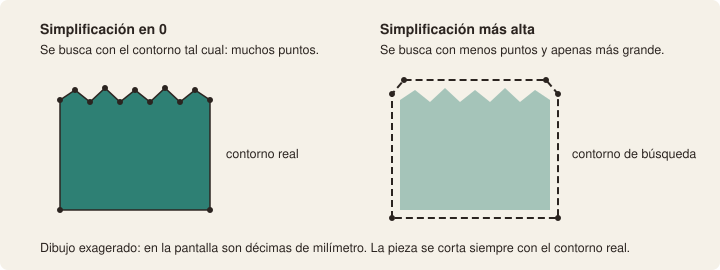
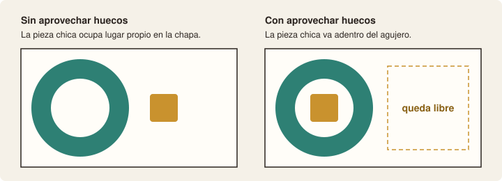

# GUÍA DE USO: LOS PARÁMETROS DEL ANIDADO

> Qué significa cada campo de la pestaña **Anidado**, cuándo conviene tocarlo y qué pasa si lo cambiás. Está escrita para quien usa la pantalla, no para quien programa.
>
> Describe la aplicación como está hoy. El motor Sparrow figura en la pantalla como «prueba»: lo que esta guía dice sobre él puede cambiar.
>
> Índice del proyecto: [`README.md`](../../README.md) · [`REGISTRO.md`](../REGISTRO.md) · la versión técnica de este tema: [`GUIA-SPARROW-PRUEBAS.md`](../GUIA-SPARROW-PRUEBAS.md)
>
> **Versión:** 1.0 · **Fecha:** 2026-10-09

---

## 1. Lo mínimo para empezar

Si no querés leer todo, con esto alcanza para sacar un anidado:

1. **Elegí el motor.** «Sparrow irregular» si las piezas tienen forma (letras, curvas, aros). «Rectangular» si son paneles rectos o si querés una respuesta al instante.
2. **Dejá los cuatro campos de Sparrow como vienen.** Están pensados para un primer intento.
3. **Revisá kerf, margen de borde y separación.** Tienen que ser los de la máquina y el material que vas a cortar.
4. **Apretá «Anidar» y esperá.** Con Sparrow puede tardar hasta el tiempo máximo que figura en la pantalla.
5. **Mirá el resultado en el historial:** cuántas chapas usó y qué porcentaje aprovechó.

Para probar otra cosa, cambiá **una sola cosa por vez** y volvé a anidar. Cada intento queda guardado en el historial y no pisa al anterior.

---

## 2. Cómo trabaja el anidado

Unas pocas palabras que se repiten en toda la guía:

- **Chapa:** la plancha de material que se va a cortar. La pantalla a veces dice «plancha»; es lo mismo.
- **Anidado:** el acomodo de todas las piezas de un grupo sobre una o más chapas.
- **Búsqueda:** cada vez que el programa le pide a Sparrow que acomode un conjunto de piezas.
- **Pasada:** el recorrido completo, de la primera chapa a la última.

Sparrow no acomoda chapa por chapa. Acomoda las piezas en una **franja**: una tira del alto de la chapa y del largo que haga falta, que intenta dejar lo más corta posible. Después el programa mira esa tira y se queda con el tramo, del ancho de una chapa, que mejor se llenó. Esas piezas van a la primera chapa. Las que quedaron afuera se vuelven a acomodar desde cero, y así hasta que no queda ninguna.

De acá salen tres cosas que explican el resto de la guía:

- **Hay una búsqueda por cada chapa.** Por eso el campo se llama «Búsqueda por chapa».
- **El programa hace hasta tres pasadas** y se queda con la mejor. Cada pasada usa una semilla distinta.
- **«La mejor» es la que usa menos chapas.** Si empatan, gana la que deja los retazos más grandes.

Sparrow busca probando, y corta cuando se le acaba el tiempo. No garantiza el mejor acomodo posible: da el mejor que encontró.

---

## 3. Los parámetros de corte

Son los cuatro campos que están debajo del motor. Vienen cargados con los valores del material del grupo.

### Kerf (mm)

Es el ancho de material que se come el corte. El programa lo usa para que el corte de una pieza no muerda a la de al lado.

- **Si lo subís,** las piezas quedan más separadas y entran menos por chapa.
- **Si lo ponés más bajo que el real,** el anidado se ve mejor en pantalla pero las piezas pueden salir comidas.
- **Cuándo tocarlo:** solo cuando cambia la máquina, el material o el espesor. No sirve para ganar lugar.

### Margen de borde (mm)

Es la franja de todo el contorno de la chapa que no se usa. Lo que queda adentro es el **área útil**.

- **Si lo subís,** el área útil se achica. Una pieza que entraba justa puede dejar de entrar.
- **Si lo bajás,** las piezas llegan más cerca del borde de la chapa.
- **Cuándo tocarlo:** cuando el borde de la chapa no se puede cortar bien o hace falta lugar para sujetarla.

### Separación (mm)

Es el aire extra que se deja entre piezas, **además** del kerf. En cero, lo único que separa dos piezas es el corte.

- **Si la subís,** hay más distancia entre piezas y entran menos por chapa.
- **Cuándo tocarla:** cuando las piezas salen demasiado pegadas para trabajarlas cómodo.

Con los tres juntos, el programa garantiza dos distancias: entre dos piezas queda como mínimo el kerf más la separación, y entre una pieza y el borde de la chapa queda el margen más medio kerf.

### Rotación

Dice de cuántas maneras puede girar el programa cada pieza.

- **Libre (0°/90°):** el programa puede poner la pieza de cuatro maneras. Es lo que más lugar ahorra.
- **Solo 0°/180° (con veta):** para materiales que tienen una dirección (veta, cepillado, dibujo). La pieza solo se puede dar vuelta, nunca acostar.

### Cómo se aplican los cambios

Cambiar uno de estos cuatro campos no hace nada hasta que apretás **«Aplicar y recalcular»**. Ese botón guarda los valores y anida de nuevo.

- **El cambio vale solo para ese grupo.** La pantalla lo avisa con el texto «override de este grupo» y ofrece «volver a los valores del material».
- **Si el anidado definitivo tiene piezas movidas a mano,** el programa pregunta antes, porque el anidado nuevo no conserva esos ajustes. El anterior queda en el historial.

Los valores con los que viene cada material son provisorios hasta confirmarlos con el taller (`PAR-01` a `PAR-04` del [registro](../REGISTRO.md)).

---

## 4. El motor

| | Rectangular | Sparrow irregular (prueba) |
|---|---|---|
| Cómo ve cada pieza | Como el rectángulo que la contiene | Con su forma real |
| Cuánto tarda | Un instante | Desde unos segundos hasta el tiempo máximo |
| Da siempre lo mismo | Sí | No siempre: ver «Semilla» |
| Para qué conviene | Paneles rectos, o una primera idea rápida | Letras, curvas y formas que encastran |

Cuando elegís Rectangular, los cuatro campos de Sparrow desaparecen de la pantalla: no se usan.

Ninguno de los dos motores mete piezas adentro de los agujeros de otras por su cuenta. Para eso está la casilla «Aprovechar huecos» (sección 6).

---

## 5. Los cuatro campos de Sparrow

### Semilla

Sparrow acomoda probando, y esas pruebas las elige con azar. La semilla es el número que fija ese azar: con la misma semilla recorre el mismo camino, y con otra semilla recorre uno distinto.

- **No hay semillas mejores que otras.** No se puede saber de antemano cuál va a dar el mejor acomodo: hay que probar.
- **La misma semilla no asegura el mismo resultado.** Sparrow corta por tiempo. Si la computadora está ocupada, llega menos lejos por el mismo camino.
- **El programa ya prueba tres por su cuenta:** la que pusiste y dos más que calcula a partir de esa.
- **Cuándo tocarla:** cuando el resultado quedó cerca de ahorrar una chapa, por ejemplo con una chapa casi vacía. Probá dos o tres números distintos y compará en el historial.

### Búsqueda por chapa (s)

Son los segundos que tiene Sparrow en cada búsqueda. Como hay una búsqueda por chapa, un trabajo que ocupa muchas chapas hace muchas búsquedas.

- **Si lo subís,** cada búsqueda es más cuidadosa, pero el tiempo total se gasta más rápido y entran menos pasadas.
- **Si lo bajás,** entran más pasadas en el mismo tiempo, cada una menos trabajada.
- **Cuándo tocarlo:** casi nunca. En el trabajo en que lo medimos, con 2, 10 y 30 segundos salió la misma cantidad de chapas.

### Tiempo máximo total (s)

Es el tope de todo el anidado. Cuando se cumple, el programa corta y se queda con el mejor resultado completo que tenga.

Una cuenta gruesa para saber si alcanza: los segundos de búsqueda, por las chapas que esperás usar, por las tres pasadas. La cuenta real da un poco más, porque comprobar cada resultado también lleva tiempo.

- **Si lo subís,** el programa tiene más margen para terminar sus pasadas. Hoy, si termina antes, no espera al tope.
- **Si lo bajás demasiado,** puede no alcanzar ni para una pasada. En ese caso el programa da error y no guarda nada.
- **Cuándo tocarlo:** cuando el trabajo tiene muchas piezas o muchas chapas y aparece el aviso de que se alcanzó el límite.

### Simplificación (mm)

Antes de buscar, el programa puede suavizar el contorno de cada pieza: le saca puntos y lo deja apenas más grande, nunca más chico. La idea es que con contornos más simples Sparrow pruebe más acomodos en el mismo tiempo.

- **En cero,** busca con el contorno exacto.
- **Si la subís,** la búsqueda es más liviana, pero cada pieza reserva un poco más de lugar del que necesita.
- **Lo que no cambia:** el resultado se comprueba con el contorno real y el archivo de corte sale con el contorno real. Si la pieza suavizada no entrara en la chapa, el programa usa la original.
- **Cuándo tocarla:** con piezas de curvas muy detalladas, si la búsqueda rinde poco. Todavía no medimos cuánto ayuda en trabajos reales: si la cambiás, anotá qué pasó.

---

## 6. Aprovechar huecos

Es la casilla que está al lado del botón «Anidar». Funciona con los dos motores.

Cuando está marcada, el programa hace un paso más al terminar el anidado: busca piezas chicas y las mete adentro de los agujeros de piezas más grandes, para que no ocupen lugar propio. El resultado se vuelve a comprobar entero.

- **Cuándo marcarla:** cuando el trabajo tiene piezas con agujeros grandes (aros, marcos, letras huecas) y piezas chicas que podrían entrar ahí.
- **Qué no promete:** ahorrar una chapa. Libera lugar, y a veces ese lugar no alcanza para sacar una chapa entera.

---

## 7. Qué hago si…

| Lo que pasa | Qué probar |
|---|---|
| Necesito una respuesta ya | Motor Rectangular. |
| Quiero ver si baja una chapa | Motor Sparrow, dos o tres semillas distintas, y «Aprovechar huecos» si hay piezas con agujeros. |
| Aparece «Se alcanzó el límite de búsqueda» | El resultado está completo y vale. Si querés darle más margen, subí el tiempo máximo total. |
| Aparece «Sparrow excedió el tiempo máximo; no se guardó un plano parcial» | No alcanzó el tiempo ni para una pasada. Subí el tiempo máximo total o bajá la búsqueda por chapa. |
| Aparece «Piezas que no entran con el kerf y margen actuales» | Esa pieza no entra en el área útil de la chapa. Usá una chapa más grande, seccioná la pieza o revisá el margen de borde. |
| Anidé dos veces igual y dio distinto | Es normal con Sparrow. Comparalos en el historial y marcá como definitivo el que prefieras. |
| Tarda demasiado | Apretá «Cancelar» y bajá el tiempo máximo total. |

El programa nunca deja piezas afuera en silencio. Si algo no entra o no se pudo comprobar, avisa y no guarda un anidado a medias.

---

## 8. Cómo probar un cambio sin perderse

El historial de cada grupo guarda todos los anidados, con el motor, la semilla, el tiempo que tardó, las chapas y el aprovechamiento. Desde ahí se puede ver cada uno, marcar uno como definitivo o borrarlo.

El historial **no muestra** la búsqueda por chapa, el tiempo máximo, la simplificación ni si estaba marcado «Aprovechar huecos». Si vas a comparar, anotalos aparte. Esta tabla sirve:

| Anidado | Motor | Semilla | Búsqueda | Tiempo máx. | Simplif. | Huecos | Chapas | Aprov. | Tardó |
|---|---|---|---|---|---|---|---|---|---|
| #… | | | | | | | | | |

Tres cuidados para que la comparación valga:

- **Cambiá una sola cosa por vez.** Si cambiás dos, no vas a saber cuál hizo la diferencia.
- **Repetí antes de sacar una conclusión.** Con Sparrow, una sola corrida puede ser suerte.
- **Cuidá la computadora mientras anida.** Sparrow aprovecha el tiempo que tiene: con la máquina ocupada o en ahorro de energía llega menos lejos, y si la máquina se suspende, el tiempo sigue corriendo y la búsqueda no.

---

## 9. Lo que hoy no se toca desde la pantalla

- **Las tres pasadas.** La cantidad está fija.
- **Los hilos del procesador** que usa Sparrow. Están fijos en dos.
- **La comparación de formatos**, en la pestaña Grupos, tiene los mismos cuatro campos de Sparrow. Ahí el tiempo máximo vale para cada formato que se compara, no para el total.

Está planificada una etapa nueva que usa el tiempo que sobra para intentar vaciar la chapa menos cargada, repartiendo sus piezas en las demás. Todavía no está en la aplicación. Cuando esté, esta guía se actualiza.

---

## 10. Los valores con los que viene la pantalla

Este es el único lugar de la guía donde están los números. Si cambian en la aplicación, se corrigen acá.

| Campo | Viene en | Acepta | Registro |
|---|---|---|---|
| Motor | Sparrow irregular (prueba) | Rectangular o Sparrow | — |
| Semilla | 42 | 0 en adelante | — |
| Búsqueda por chapa | 2 s | 1 a 30 s | — |
| Tiempo máximo total | 120 s | 5 a 300 s | `PAR-09` |
| Simplificación | 0,3 mm | 0 a 2 mm | — |
| Aprovechar huecos | sin marcar | marcada o sin marcar | — |
| Kerf | el del material | — | `PAR-01` |
| Margen de borde | el del material | — | `PAR-02` |
| Separación | la del material | — | `PAR-03` |
| Rotación | la del material | Libre o con veta | `PAR-04` |
