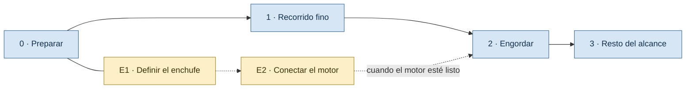

# PLAN MAESTRO — el ciclo de cotización, con el motor de anidado como pieza enchufable

> **Este es el plan vigente.** Ordena todo lo que no es el motor de anidado: en qué etapas se construye, qué queda andando al final de cada una y dónde se conecta el motor cuando esté listo. No detalla tareas: cada sub-proyecto tiene después su propio diseño y su propio plan, en una carpeta de `docs/plan/` (§12).
>
> Índice del proyecto: [`README.md`](../../README.md) · [`MAPA-DEL-PROYECTO.md`](../MAPA-DEL-PROYECTO.md) · [`EPICA.md`](../EPICA.md) · [`BACKLOG.md`](../BACKLOG.md) · [`REGISTRO.md`](../REGISTRO.md) · [`motor/PLAN-RUMBO-ANIDADO-Y-REVISION.md`](../motor/PLAN-RUMBO-ANIDADO-Y-REVISION.md) · [`motor/CONTRATO-NESTING-ENGINE.md`](../motor/CONTRATO-NESTING-ENGINE.md) · [`historico/frontend-cotizador/diseno.md`](../historico/frontend-cotizador/diseno.md)
>
> **Versión:** 1.0 · **Fecha:** 2026-10-05
>
> **Sobre los valores.** Los parámetros, supuestos, insumos y decisiones se citan por ID (`PAR-xx`, `B-xx`, `T-xx`, `D-xx`) y viven en `REGISTRO.md`. Este documento no repite ningún valor. Las decisiones marcadas «nueva» se dan de alta en el registro en la etapa 0 (§5).

---

## 1. Qué se decidió

Decisiones de Enzo del 2026-10-05, que reemplazan la prioridad del 2026-09-26 («motor antes que cotización», `PLAN-RUMBO-ANIDADO-Y-REVISION.md §1`):

| Tema | Decisión |
|---|---|
| Qué se planifica | Todo lo que no es el motor de anidado. El motor se conecta después |
| Qué usa primero la empresa | El ciclo de cotización completo: armar el presupuesto, generar el PDF, aprobación del dueño y envío al cliente |
| El paso de anidado, mientras no haya motor | Queda vacío. El costo de material figura como pendiente |
| `rectpack` | No es parte del producto. Queda en el código como motor de prueba, deshabilitado en el servidor |
| Quién usa el sistema | La empresa, con sus roles, en un servidor |
| Quién construye | Enzo, un solo carril. Vale sigue con el motor |
| En qué orden | Recorrido fino de punta a punta primero; después se engorda cada paso |

**Por qué el recorrido fino.** Con el anidado vacío no puede salir un presupuesto real con chapa hasta que llegue el motor, se construya en el orden que se construya. Ese tiempo rinde más dejando todo el circuito instalado y probado por los roles reales que terminando una sola parte. Además, lo que más tarda no es código: servidor, dominio, cuenta de mail y el alta de WhatsApp Business.

---

## 2. Punto de partida

`MAPA-DEL-PROYECTO.md` (versión 2.2) quedó atrás de lo construido. El estado real al 2026-10-05:

| Parte | Estado |
|---|---|
| API del cotizador | Presupuesto, líneas de costo por rubro, override, margen, IVA, totales y desglose. Falta el PDF |
| Frontend | Lista de trabajos y un espacio de trabajo con cinco pestañas: Piezas, Grupos, Anidado, Ajuste y Costeo. Sin login |
| Importación de DXF | El análisis (diseños, hojas dibujadas, roles) y la API en dos pasos existen. Ninguna pantalla usa la API en dos pasos todavía |
| Catálogo | Materiales, formatos y parámetros de corte. Sin precios con vigencia |
| Fundaciones | Sin login, sin roles, sin servidor |
| Aprobación y envío | Nada. El presupuesto solo conoce el estado borrador |
| Motor | Medido, no construido: los spikes A1 y A2 de `PLAN-RUMBO-ANIDADO-Y-REVISION.md` igualan las chapas del diseñador en Belgrano. El paso A3 (pasarlo a código de producto) no está hecho |

El trabajo de Vale sobre el motor no está en este repositorio a esta fecha. Relevarlo es parte de E1 (§4.5).

**Dónde llama hoy el producto a `rectpack`.** En dos lugares, y los dos pasan por el enchufe:

- `_ejecutar_anidado` en `backend/app/api/rutas_nesting.py`, detrás de `POST /grupos/{id}/anidar`.
- `comparar_formatos` en `backend/app/services/nesting/comparador.py`, detrás de `POST /grupos/{id}/comparar-formatos`, que usa la pestaña Grupos.

---

## 3. Forma general

Cuatro etapas en fila, porque hay un solo carril, y un carril aparte para el motor.



| Etapa | Qué queda andando al terminar | Sub-proyectos, en orden |
|---|---|---|
| **0. Preparar** | Documentación al día y trámites lentos iniciados | Registro, mapa y backlog; pedidos a la empresa (§5) |
| **1. Recorrido fino** | Un diseñador entra con su usuario, arma un presupuesto con líneas a mano y lo manda a aprobar; el dueño aprueba desde el celular y al cliente le llega el PDF por mail | 1.1 Servidor y login · 1.2 Presupuesto sin anidado · 1.3 PDF mínimo · 1.4 Aprobación mínima · 1.5 Envío por mail |
| **2. Engordar** | El mismo recorrido, con datos y pantallas completos | 2.1 Importar y revisar · 2.2 Catálogo y precios · 2.3 Cotizador completo · 2.4 Aprobación y envío completos · 2.5 Fundaciones completas |
| **3. Resto del alcance** | Lo que no es el ciclo de cotización | 3.1 Dashboard · 3.2 Fotomontaje |

**Carril del motor (Vale):**

- **E1. Definir el enchufe.** Un documento con qué recibe el motor y qué devuelve. Sale primero para que el motor se construya contra eso.
- **E2. Conectarlo.** Cuando el motor esté listo. Es el único paso que junta los dos carriles y puede caer en cualquier etapa.

**Tres reglas de orden:**

1. **Importar y revisar abre la etapa 2, antes que precios.** Es lo que le entrega al motor las piezas revisadas y agrupadas por material. Los precios pueden esperar porque el costeo ya funciona con el precio de referencia importado (`D-10`).
2. **En la etapa 1 el recorrido se prueba con presupuestos sin trabajo asociado**, solo con líneas a mano. El modelo lo permite: `Presupuesto.trabajo_id` es opcional.
3. **Cada sub-proyecto tiene su propio ciclo** de diseño, plan y construcción, con el visto bueno de Enzo en cada paso.

---

## 4. El enchufe del motor

### 4.1 Dónde está el borde

```
        EL RESTO (Enzo)                MOTOR (Vale)               EL RESTO (Enzo)
importar → revisar → agrupar  →  [ grupo listo → resultado ]  →  guardar → ajustar → plano y DXF → costeo
```

Un **grupo listo** es un grupo de corte con formato asignado, parámetros de corte y al menos una pieza sin descartar. Es lo que ya valida `_datos_para_anidar` antes de encolar.

### 4.2 Qué cruza

| | Qué es | Hoy en el código |
|---|---|---|
| **Entra** | La chapa (ancho y alto del formato), los parámetros de corte (`PAR-01` a `PAR-04`) y las piezas del grupo con contorno, agujeros y cantidad | `_datos_para_anidar` arma chapa y parámetros, pero al motor le pasa solo la caja de cada pieza. Los contornos van aparte, por `_geometrias_del_grupo` |
| **Sale** | Por cada instancia de pieza: en qué chapa quedó, dónde y con qué ángulo. Más la cantidad de chapas y los avisos | `ResultadoAnidado`, en `backend/app/services/nesting/models.py` |
| **Regla** | Ninguna pieza se descarta en silencio. Si no entra, vuelve como aviso o como error | `DECISIONES-Y-BLOQUEANTES.md §1.2` |

**Detalle que E1 tiene que dejar escrito.** El identificador de cada posición viaja como `"<id de pieza>#<instancia>"`, y `_ejecutar_anidado` lo separa al guardar. Un motor que no lo respete falla recién en ese punto.

### 4.3 Qué hace el producto, sea cual sea el motor

Ya lo hace hoy:

- Revisa que el grupo esté listo antes de encolar.
- Corre el anidado en segundo plano, con estados (encolada, corriendo, lista, error, cancelada).
- Calcula él mismo el aprovechamiento con el área real (`ADR-08`). Así dos motores se comparan con la misma vara.
- Guarda las colocaciones y una copia de los parámetros usados.

Pasa a hacerlo en E2:

- Validar el resultado contra la forma real de cada pieza, con la tolerancia `PAR-29`. Hoy esa comprobación vive solo dentro del adaptador de Deepnest (`deepnest_cliente.py`); tiene que valer para cualquier motor.

Aguas abajo nadie conoce al motor: `costeo.py` solo lee la cantidad de chapas de la ejecución marcada como definitiva, y el plano y el DXF de corte leen las colocaciones guardadas.

### 4.4 Cambios en el producto para que el enchufe exista

1. **Una lista de motores con nombre.** `_ejecutar_anidado` y `comparar_formatos` eligen el motor por nombre en vez de instanciar `rectpack` directo.
2. **Motores habilitados por configuración**, igual que ya se elige la base y la cola en `backend/app/config.py`. En el servidor arranca sin ninguno: «Anidar» y «Comparar formatos» responden que no hay motor conectado.
3. **Las piezas viajan con su forma**, no solo con su caja.
4. **Corridas largas sin sorpresas.** Cancelar corta el proceso de verdad, y al reiniciar el servidor las corridas que quedaron a medias se marcan como error. Hoy quedarían «corriendo» para siempre (`backend/app/cola/__init__.py`).

Los cambios 1 y 2 se hacen en la etapa 1, porque son los que dejan a `rectpack` fuera del producto. Los cambios 3 y 4 son parte de E2.

**Qué se ve en pantalla mientras no haya motor.** Las pestañas Anidado y Ajuste no se borran. Anidado muestra «no hay motor conectado», Ajuste no tiene nada que ajustar, Grupos no ofrece comparar formatos y Costeo muestra el material como pendiente, con el aviso que `costeo.py` ya genera.

**`rectpack` como motor de prueba.** Sigue en el código y en los tests, registrado en la lista de motores y habilitado solo en desarrollo. Es lo que permite probar el enchufe sin esperar al motor real.

### 4.5 Qué cae justo en el borde

Los incisos de A3 en `PLAN-RUMBO-ANIDADO-Y-REVISION.md §4` se reparten así:

| Tema | Lado | Por qué |
|---|---|---|
| Regla de las islas: una forma que llena el agujero de otra viaja con ella (A3, inciso 0) | El resto, en 2.1 | Vive en el análisis y decide qué piezas existen. Quedó a medio hacer en `backend/app/services/ingesta/analisis.py` |
| Alcance «se re-anida / queda como está» (A3, inciso b) | El resto, en 2.1 | Lo muestra y lo corrige la pantalla de revisión |
| Separar piezas grandes de chicas, colocación directa, chapas con obstáculos e híbrido (A3, incisos a, c, d y e) | El motor | Es estrategia de anidado. El producto no necesita saberlo |

**La regla de las islas es requisito de E2.** Sin ella el motor recibe piezas de más. Si el motor llega antes que 2.1, ese inciso se adelanta solo.

### 4.6 E1 y E2

**E1 — Definir el enchufe.** Entrega: un documento de contrato entre el producto y el motor, aparte de `CONTRATO-NESTING-ENGINE.md`, que describe el contrato entre Python y Node dentro de un motor en particular. Responde `D-14` (nueva): en qué forma llega el motor de Vale. Sin código.

**E2 — Conectar el motor.** Entrega: el motor registrado y habilitado, las piezas viajando con su forma, la validación del resultado hecha por el producto (§4.3), corridas largas resueltas y la pestaña Anidado mostrando el resultado. Cierra `D-12` (espera en segundo plano) y `D-02` (cómo se cobra la chapa). Requisitos: E1, la regla de las islas y un grupo listo.

---

## 5. Etapa 0 — Preparar

Sin código de producto. Dos partes.

**Documentación:**

- Altas en `REGISTRO.md`: `D-14` a `D-18` (§8).
- Corrección de `CART-402` en `BACKLOG.md` y nota sobre `ADR-05` en `EPICA.md` (§9).
- `MAPA-DEL-PROYECTO.md` al día con el estado del §2.
- Entrada en `BITACORA.md`.

**Pedidos, ordenados por cuánto tardan:**

| Qué | Lo destraba | Quién lo mueve |
|---|---|---|
| Alta de WhatsApp Business (`B-12`) | 2.4 | La empresa |
| Servidor y dominio (`T-01`, `T-02`) | 1.1 | La empresa los contrata |
| Cuenta de mail y lugar de los backups (`T-03`, `T-06`) | 1.1, 1.4 y 1.5 | Enzo |
| Logo, datos fiscales y formato actual del presupuesto (`B-13`) | 1.3 | La empresa |
| Quién aprueba y por qué canal (`B-11`, `PAR-20`) | 1.4 | El dueño |
| Validez y margen por defecto (`PAR-11`, `PAR-12`) | 1.2 | El dueño |
| En qué forma llega el motor (`D-14`) | E1 | Vale |

**Listo cuando:** el registro y el mapa reflejan este plan, y cada pedido de la tabla está hecho a quien corresponde.

---

## 6. Etapa 1 — Recorrido fino

**Hito.** Con el sistema en el servidor: un diseñador entra con su usuario, crea un presupuesto con un cliente y líneas cargadas a mano, y lo manda a aprobar. El dueño recibe un mail con un link, abre el presupuesto en el celular y lo aprueba. El cliente recibe el PDF por mail. El presupuesto queda congelado como enviado.

| Sub-proyecto | Lo mínimo para el recorrido | Se posterga a la etapa 2 | Historias que toca | Necesita de afuera |
|---|---|---|---|---|
| **1.1 Servidor y login** | Todo levantado en el servidor con PostgreSQL y HTTPS, sin credenciales en el repositorio (`ADR-10`), con backup diario. Usuarios con contraseña y el permiso «puede aprobar». Todas las rutas exigen sesión. Los usuarios se crean por línea de comandos. Lista de motores con ninguno habilitado (§4.4, cambios 1 y 2) | Pantalla de usuarios, menú por rol, auditoría general | `CART-001`, `CART-002` | `T-01`, `T-02`, `T-06` |
| **1.2 Presupuesto sin anidado** | Lista de presupuestos fuera del espacio de trabajo: cliente, líneas a mano por rubro, margen, IVA y total. El material figura «pendiente de anidado» | Insumos elegidos de un catálogo, mano de obra por etapa | `CART-301`, `CART-304` a `CART-308` | `PAR-11`, `PAR-12` |
| **1.3 PDF mínimo** | Una plantilla: logo, cliente, código, fecha, validez, ítems y total. Sin costos internos ni márgenes | Documento interno, plano de corte adentro, fotomontaje | `CART-309` | `B-13` |
| **1.4 Aprobación mínima** | Estados borrador, pendiente, observado y aprobado. Aviso al dueño por mail con link firmado (`PAR-17`). El dueño aprueba u observa sin iniciar sesión. Historial de quién cambió qué estado | Vencimiento automático, anulación, resumen agrupado de avisos | `CART-401` a `CART-404` | `B-11`, `T-03` |
| **1.5 Envío por mail** | Al aprobar sale el PDF al cliente y el presupuesto queda como enviado, con el PDF y las líneas congelados. Se puede aprobar sin enviar. El cliente tiene un email cargado | WhatsApp, reintentos, respuesta del cliente por link | `CART-405`, `CART-406`, `CART-004` | `T-03` |

**Regla para mandar a aprobar.** El presupuesto tiene cliente, al menos una línea de costo y ningún material pendiente. **Material pendiente** es una línea de rubro material sin valor efectivo: ni calculado ni cargado por override. Si falta algo, el sistema lo rechaza diciendo qué falta.

**Punto abierto de 1.2 (`D-18`, nueva).** El override manual de `ADR-07` ya existe y hoy alcanza a cualquier línea, también a una de material sin anidado. Eso permitiría completar a mano el costo de la chapa y emitir el presupuesto antes de que llegue el motor. Si se permite o se bloquea en ese caso se decide en el diseño de 1.2.

**Qué congela 1.5.** El PDF y las líneas de costo. Todavía no la versión de cada precio, porque los precios con vigencia llegan en 2.2. Alcanza para esta etapa, donde las líneas se cargan a mano.

---

## 7. Etapas 2 y 3 — alcance y orden

Se detallan cuando les toque, cada una con su diseño.

| Sub-proyecto | Alcance | Historias | Depende de |
|---|---|---|---|
| **2.1 Importar y revisar** | El carril B de `PLAN-RUMBO-ANIDADO-Y-REVISION.md §5` (pasos B1 a B6): pantalla de importación, visor con roles y confirmación. Más la regla de las islas, el alcance de cada diseño y la asignación de material | `CART-506`, `CART-507` | `D-13` |
| **2.2 Catálogo y precios** | Precios con vigencia, carga desde la planilla de la empresa, insumos que no son chapa, historial. Completa lo que falta de materiales y parámetros de corte | `CART-101`, `CART-103` a `CART-107` | `D-10` |
| **2.3 Cotizador completo** | Insumos desde catálogo, mano de obra por etapa, documento interno, PDF completo | `CART-304`, `CART-305`, `CART-309`, `CART-310` | 2.2 |
| **2.4 Aprobación y envío completos** | WhatsApp, reintentos, respuesta del cliente, vencimientos, congelado con versiones de precio | `CART-401`, `CART-403`, `CART-405`, `CART-407`, `CART-408` | 2.2, `B-12`, `D-04`, `D-07`, `D-17` |
| **2.5 Fundaciones completas** | Pantallas de usuarios y clientes, menú por rol, auditoría general | `CART-003` a `CART-006` | — |
| **3.1 Dashboard** | Las vistas relevadas en `DASHBOARD-VISTAS.md` | `CART-801` a `CART-808` | `D-09` |
| **3.2 Fotomontaje** | Composición del cartel sobre la foto del local (`ADR-03`) | `CART-601` a `CART-607` | 2.3 |

**Lo que no entra en ninguna etapa de este plan**, y por qué:

| Historias | Motivo |
|---|---|
| `CART-701` a `CART-705`, y el seccionado (paso A5) | Son el motor. Carril de Vale |
| `CART-205`, `CART-207`, `CART-208`, `CART-210` | Dependen de que haya un resultado de anidado. Se retoman después de E2 |
| `CART-201` | La carga manual de piezas existe como servicio, sin ruta propia. Si hace falta se decide en el diseño de 2.1 |
| `CART-501`, `CART-502`, `CART-504` | Dependen de acordar una convención de capas con diseño (`SUP-05`, `B-15`, `D-11`) |
| `CART-209`, `CART-508` | Plegado. Dependen de `D-03` |

---

## 8. Decisiones abiertas

Cada una avanza con su valor por defecto hasta que se cierre.

| ID | Decisión | Por defecto, mientras tanto | Se cierra en |
|---|---|---|---|
| `D-13` | Qué hace el sistema con un diseño que «queda como está» | Se muestra sin anidar | 2.1 |
| `D-14` (nueva) | En qué forma llega el motor de Vale | Una función de Python en `backend/app/services/nesting/` que devuelve un `ResultadoAnidado`, como `deepnest_cliente.py` | E1 |
| `D-15` (nueva) | Aprobación del presupuesto entero, o ítem por ítem como modela AppSheet en `COT_APROBACIONES` | Entero | 1.4 |
| `D-16` (nueva) | Herramienta para generar el PDF | Sin elegir. `ADR-05` nombra WeasyPrint | 1.3 |
| `D-17` (nueva) | Al aceptar el cliente, ¿se crea sola la nota de pedido en AppSheet? | Se carga a mano, como hoy | 2.4 |
| `D-18` (nueva) | ¿El override manual puede completar una línea de material sin anidado? | `ADR-07` sigue vigente: el override alcanza a cualquier línea | 1.2 |
| `D-10` | Fórmula del costo por unidad de venta | Se importa el valor de la planilla | 2.2 |
| `D-04` | WhatsApp directo o por un intermediario | Solo mail | 2.4 |
| `D-07` | Presupuesto vencido: se reajusta o solo se marca | Solo se marca | 2.4 |
| `D-02` | Se cobra la chapa entera o lo que se usa | `PAR-15` | E2 |
| `D-12` | El anidado corre con alguien esperando o en segundo plano | En segundo plano, con aviso | E2 |
| `D-09` | Dashboard de solo lectura o con escrituras | Solo lectura (`ADR-06`) | Antes de 3.1 |

**`D-13` cambió de peso.** Con el anidado vacío hasta el motor, los diseños que el motor no toca no tendrían costo de material nunca, ni siquiera con el motor conectado. Son la mayoría de la muestra medida en `PLAN-RUMBO-ANIDADO-Y-REVISION.md §2.4`. Hay que cerrarla en 2.1.

---

## 9. Correcciones a documentos existentes

Se aplican en la etapa 0.

- **`CART-402` exige «al menos una pieza» para mandar a aprobar.** Choca con el modelo, que admite presupuestos sin chapa, y con la regla 2 del §3. Pasa a regir la regla del §6.
- **`ADR-05` nombra Next.js, Celery y Redis.** Lo construido es Vite con React y una cola de hilos, y este plan sigue con eso. Celery entra solo si las corridas largas del motor lo piden (E2). Next.js se reconsidera al diseñar el dashboard (3.1), que era su justificación.
- **`ADR-01` y `EPICA.md §8` ponen el anidado rectangular como base del primer hito.** Con `rectpack` fuera del producto, el primer hito de este plan es el recorrido fino del §6, sin anidado.
- **`PLAN-RUMBO-ANIDADO-Y-REVISION.md §1`** dice que el carril A es el camino crítico. Deja de serlo para Enzo: el carril A pasa a ser el de Vale y el carril B pasa a ser 2.1.

---

## 10. Riesgos

| Riesgo | Efecto | Qué se hace |
|---|---|---|
| El servidor lo contrata la empresa y puede demorar | 1.1 no se puede publicar | Se arma y se prueba en local con Docker. El resto de la etapa 1 sigue |
| WeasyPrint es incómodo de instalar en Windows, donde se desarrolla | 1.3 se traba en el entorno | La herramienta se elige en el diseño de 1.3 (`D-16`) |
| El alta de WhatsApp Business tarda semanas | 2.4 se atrasa | Se pide en la etapa 0. El mail cubre todo el recorrido |
| No se sabe en qué forma llega el motor | E2 puede necesitar un adaptador que nadie planificó | E1 lo pregunta primero (`D-14`) |
| Sin motor no se emite ningún presupuesto con chapa | La empresa prueba el circuito pero no lo usa para trabajos reales | Es consecuencia aceptada del §1. `D-18` es la única vía que lo cambiaría |
| Cada paso se construye dos veces, fino y completo | Retrabajo en pantallas | Las migraciones de Alembic están desde el primer commit, así que el modelo crece sin rehacerse |
| El motor llega antes que 2.1 | E2 no tiene piezas revisadas ni regla de las islas | Se adelanta ese inciso (§4.5) |

---

## 11. Cómo se verifica

- **Etapa 0:** revisión de Enzo sobre el registro y el mapa.
- **E1:** el documento de contrato, leído y aceptado por Vale.
- **Etapa 1:** el hito del §6, hecho en el servidor por tres personas distintas (diseñador, dueño y un cliente de prueba). Cada sub-proyecto con tests automatizados para su lógica; la máquina de estados es obligatoria según `EPICA.md §14`.
- **E2:** un grupo listo se anida con el motor real, el resultado pasa la validación contra la forma real y la línea de material del presupuesto se llena sola.
- **Etapas 2 y 3:** se define en el diseño de cada sub-proyecto.

---

## 12. Qué sigue y dónde se escribe

1. Etapa 0, parte de documentación, en un paso aparte.
2. Primer sub-proyecto con su propio diseño: **E1**, porque es corto y es lo único que el carril del motor espera de este lado. Después 1.1.

**Cada sub-proyecto vive en su propia carpeta** dentro de `docs/plan/`, con el número de este documento: `docs/plan/E1-enchufe-del-motor/`, `docs/plan/1.1-servidor-y-login/`, etc. Adentro van `diseno.md` y, cuando se escriba, `plan.md`. Al terminar un sub-proyecto, su carpeta pasa a `docs/historico/`. La regla completa está en [`CONVENCIONES.md §8 bis`](../CONVENCIONES.md).
